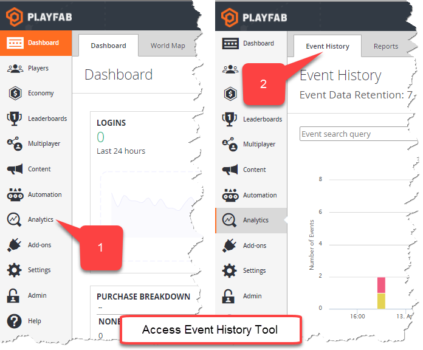
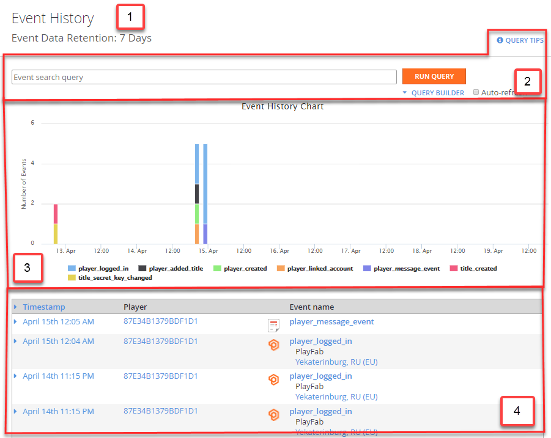
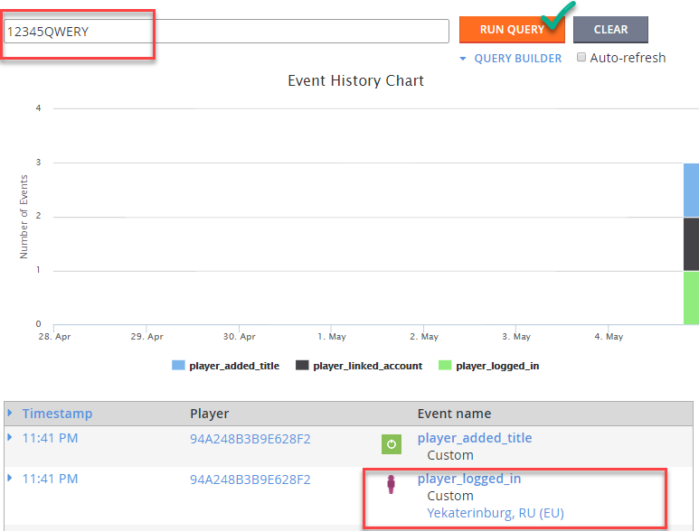
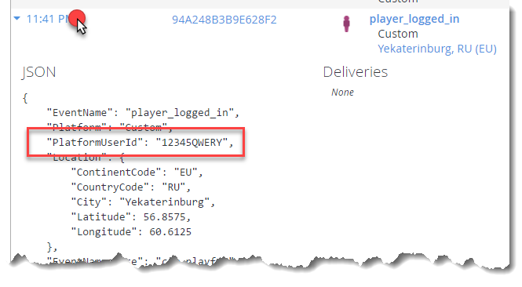
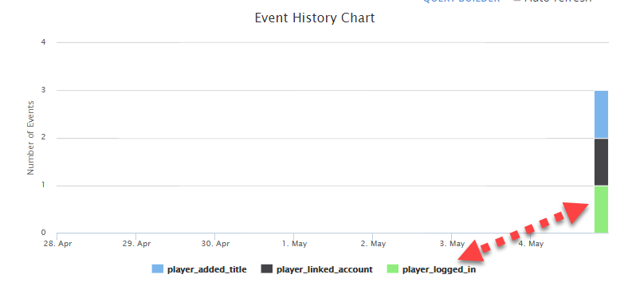
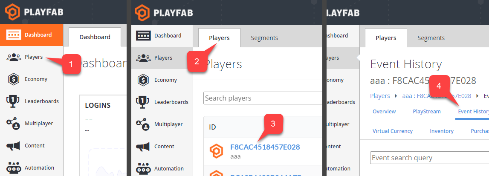

# Event history

This tutorial shows you how to access and utilize the event history in PlayFab.

## Access event history

1. Open the PlayFab Game Manager, and select **Analytics** from the navigation sidebar.
2. Locate and select the **Event History** tab.

  

## Event History page overview

1. The **Event Data Retention** area shows the time interval for the events. For example, when it says **7 Days**, only events that happened a week ago or later will be queried.
2. The [Event Search Query panel](../../analytics/metrics/real-time-analytics-event-search-query-panel.md) allows the changing of graph behavior, and the filtering of event flow by different event properties.
3. The [Event History Chart panel](../../analytics/metrics/real-time-analytics-event-history-chart-panel.md) displays a chart that shows the number and types of events happening in your title during the specified time interval.
4. The [Events Timeline panel](../../analytics/metrics/real-time-analytics-events-timeline-panel.md) is a list of events data sorted by time (starting with the most recent).

  

## Search and inspect events

In this section we have the following goals:

- Sign the player in and produce a `player_logged_in` event.
- Use the [Event Search Query Panel](../../analytics/metrics/real-time-analytics-event-search-query-panel.md) to find this event using search query.
- Inspect this event using the [Events Timeline Panel](../../analytics/metrics/real-time-analytics-events-timeline-panel.md).
- Observe how this event effects the [Event History Chart](../../analytics/metrics/real-time-analytics-event-history-chart-panel.md).

### Demonstration

We are going to use the `LoginWithCustomID` method, to sign the player in and produce a `player_logged_in` event.

- Execute the API call shown below.

```csharp
PlayFabClientAPI.LoginWithCustomID(new LoginWithCustomIDRequest()
{
    CreateAccount = true,
    CustomId = "12345QWERY"
},
result => Debug.Log("Logged in"),
error => Debug.LogError(error.GenerateErrorReport()));
```

- If no player is registered with the `CustomId` value of `12345QWERY`, the player will be generated thanks to the second parameter that we passed (see below).

```csharp
CreateAccount = true
```

We now have to locate the event.

- The easiest way to do this is by means of the [Event Search Query panel](../../analytics/metrics/real-time-analytics-event-search-query-panel.md). We know the `CustomId` value, so we can use it as a search query.

  

- Once you have located the event in the [Events Timeline panel](
../../analytics/metrics/real-time-analytics-events-timeline-panel.md), you can further inspect it by selecting the timestamp label, as shown below.



- Finally, you may analyze how this event effects the overall event flow using the [Event History Chart](
../../analytics/metrics/real-time-analytics-event-history-chart-panel.md).

  

The graph shows the **player_logged_in** event being a part of several events (that match the current query) produced on May 5th.

### How to inspect player events

It is possible to access the event history for a specific player (see below).

  

- Use the **Game Manager**, and navigate to **Players** in the menu to the left.
- Select the **Players** tab.
- Locate the player you want to inspect, and select the **Player ID** label.
- Select **Event History** from the toolbar.

You will be presented with an event history page where only events related to the inspected player are shown.
