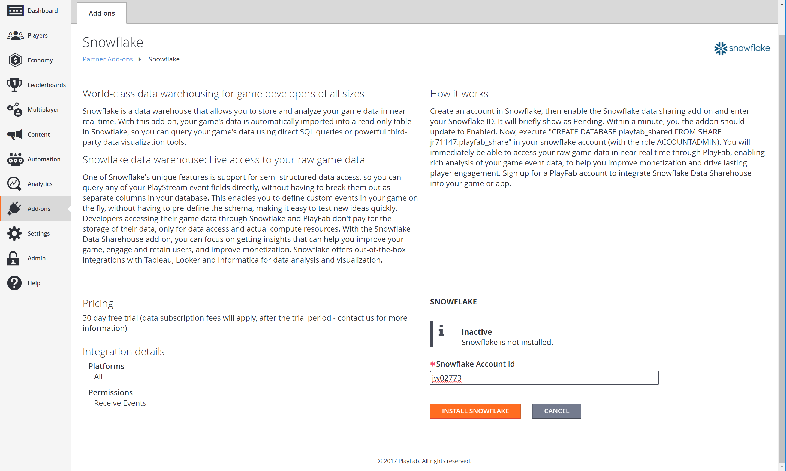
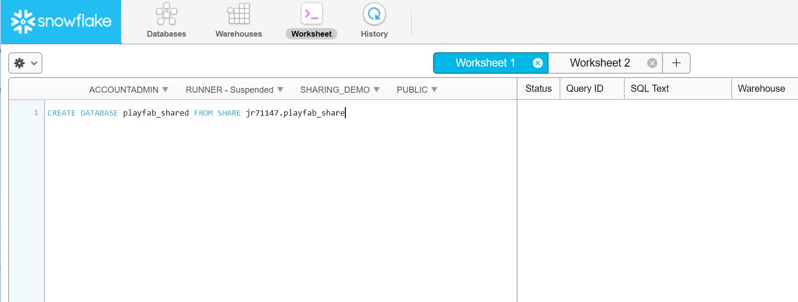
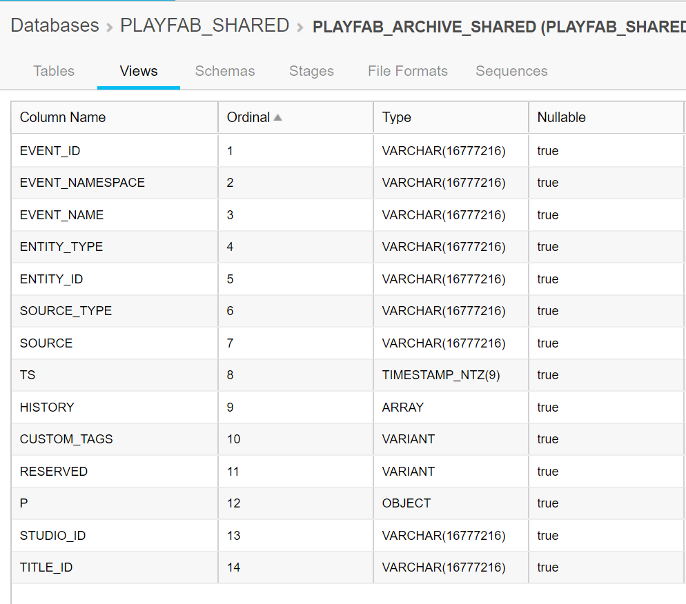
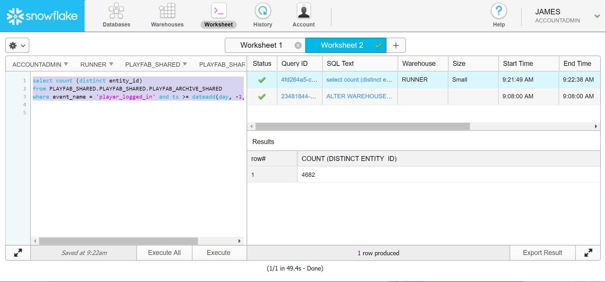
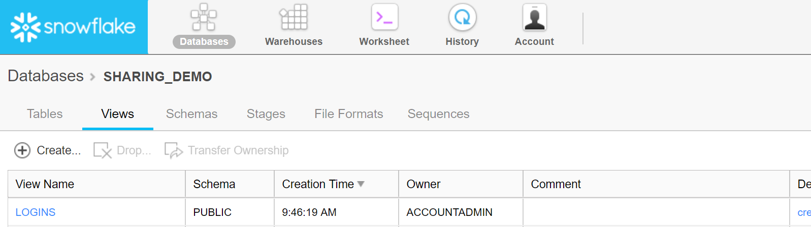
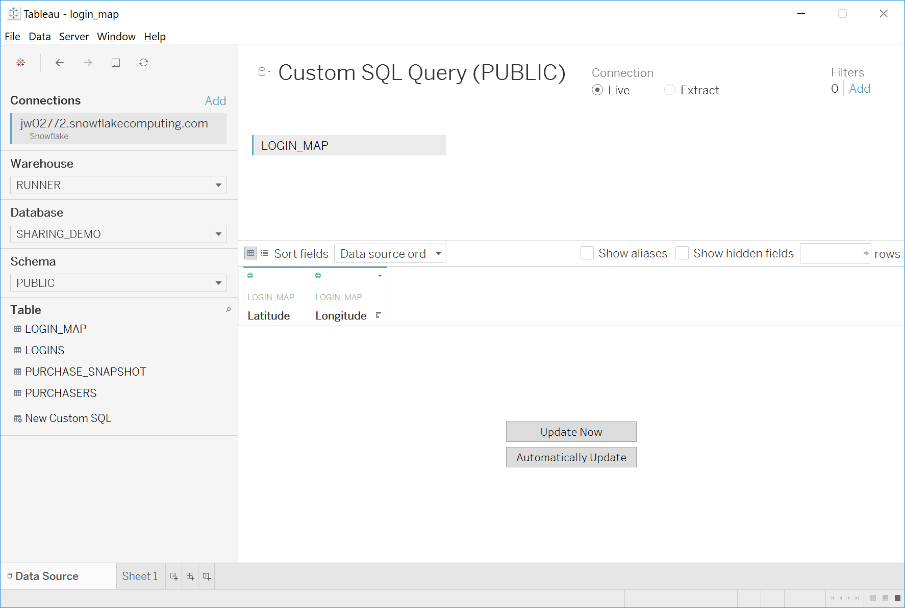
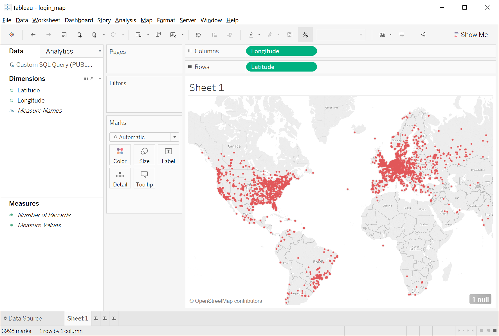

# Getting started with PlayFab and Snowflake

This tutorial describes how to enable the **Snowflake** add-on from PlayFab, and then provides some starter examples of queries you can do in **Snowflake** to show off the integration.

If you are looking for a high-level description of why **Snowflake** integration with PlayFab is *cool*, you may want to start with our introductory blog post first.

## Setting it up

The first step in using **Snowflake** with PlayFab is to create a **Snowflake** account. If you already have a **Snowflake** account, you can skip this step. Otherwise, you can [create a new Snowflake account](https://api.playfab.com/downloads/newSnowflake) for free with a trial period.

- Create a standard account in the US-West region. **Snowflake** provides a 30 day trial period, so you can evaluate **Snowflake** risk-free, though you may need to provide billing information.

- After your **Snowflake** account is set up, you can then enable the **Snowflake** add-on in PlayFab by providing your **Snowflake Account ID**.

You can find your **Account ID** in the **URL** you are given to log into **Snowflake**. It will look something like: **jw02773**.

  

- After you select the **Install Snowflake** button, the add-on will enter the *pending* state for about a minute.
- When complete, a *feed* of your data will have been created. The next step is to subscribe to that feed from your **Snowflake Account**.

- To subscribe, log into your **Snowflake Account**.
- In a worksheet, execute the **SQL** command shown below with the role **ACCOUNTADMIN**.

```sql
CREATE DATABASE playfab_shared FROM SHARE jr71147.playfab_share
```

  

That will create a new database in your **Snowflake** account, called **PLAYFAB_SHARED** which is a read-only view of your game's **PlayStream** data from PlayFab.

  

## The PlayFab_Shared database

Let's take a moment to discuss the contents of this database. It has one schema, called **playfab_shared**.

In this schema, there is *one* view. It is called **playfab_archive_shared**. In this view, you can see all of the events for all of the game titles that are linked to this **Snowflake** account.

### The playfab_archive_shared view

This view's schema deserves some explanation.

  

The most important **Column** is called **P** (for **Payload**). The type of this column is **OBJECT**, which is **Snowflake's** way of saying **JSON**.

> [!NOTE]
> To understand how this works, refer to later examples, or [their docs on semi-structured data](https://docs.snowflake.net/manuals/sql-reference/data-types-semistructured.html).

The other **Columns** are effectively for indexing purposes.

> [!NOTE]
> The **TS Column** is truncated to the hour for more effective indexing. If you need the *exact* time of an event for a query, access the raw timestamp from the payload using **to_timestamp(p:Timestamp)**.

### Running your first query

Now that you have verified that the **PLAYFAB_SHARED** database exists, you can run your first query.

Let's run a simple query to count how many unique players played your game in the last 24 hours (**DAU**).

- Enter the example shown below in a worksheet, select it, and select **Execute** (or press **ctrl-enter**).

```sql
select count (distinct entity_id)
from PLAYFAB_SHARED.PLAYFAB_SHARED.PLAYFAB_ARCHIVE_SHARED
where event_name = 'player_logged_in' and ts >= dateadd(day, -1, current_date)
and title_id = '<my title id goes here in all caps>'
```

This query may take a few minutes to run, depending on the size of your database instance, and how much data your game contains, but when done you'll see the answer in the results section.

  

For a more advanced query, examine the raw **JSON** of the **player_logged_in** event using the **PlayFab Analytics** tab.

  

Thanks to **Snowflake's** ability to parse any fields of a **JSON** object, you can access *any* of these fields.

Let's run a query to count how many players are coming from which countries. Enter and run the query shown below in your worksheet.

```sql
select
  p:Location.CountryCode as country,
  count(distinct entity_id) as players,
  count (*) as logins
from PLAYFAB_SHARED.PLAYFAB_SHARED.PLAYFAB_ARCHIVE_SHARED
where event_name = 'player_logged_in' and ts >= dateadd(day, -1, current_date)
and title_id = '<my title id goes here in all caps>'
group by country
order by players desc
```

Notice how this query is not just accessing an arbitrary field inside the **P Column**, but a sub-field inside an object (**Location.CountryCode**).

You can then export these results as a **CSV** file and load them into **Excel**, or some other tool, for easy visualization.

  

### Cross-database querying

So far these examples have used the **PlayFab_Shared** database directly - however, this database is *read only*.

You cannot modify this database, or create temp tables, something you will need to do to improve performance. Therefore for any serious work, you should *create your own database*, and reference the **PlayFab_Shared** database with a fully qualified name.

That is, **PLAYFAB_SHARED.PLAYFAB_SHARED.PLAYFAB_ARCHIVE_SHARED**.

**Snowflake** is perfectly capable of access tables across databases, you just have to *ask*.

### Making schema with views

As we've seen above, one of the *best* parts about **Snowflake** is its ability to parse **JSON** objects. But it is tiring (and error prone) to access the same values out of payloads with known schema. This is where views come in.

Views are great here because they act like tables in traditional **SQL** databases, enforcing schema on the data. But it's *way* easier to change a view than to migrate a table.

For example, we can create a logins view, based on the PlayFab login event, since that event has a known schema.

Internally, we use a view to parse out the bits and pieces we know we'll need.

Run this command shown below in your own database.

```sql
create view logins as
(
          select
          event_id,
          title_id,
          ts,
          to_timestamp(p:Timestamp) as exact_ts,
          entity_id,
          to_varchar(p:Platform) as platform,
          to_varchar(p:PlatformUserId) as platform_user_id
          from PLAYFAB_SHARED.PLAYFAB_SHARED.PLAYFAB_ARCHIVE_SHARED
          where event_namespace = 'com.playfab' and event_name = 'player_logged_in'
          and title_id = '<my title id goes here in all caps>'

)
```

When done, you will have a custom view in your database that can be used to access the login data directly.

  

There are a couple things to note:

- First of all, we used some of the fixed **Columns**, like **event_id** and **title_id**.
- We *also* picked some columns out of **P**, such as **p:Platform**. But properties chosen from inside **JSON** objects may be **JSON** objects *themselves*, so we need to tell **Snowflake** what *type* they really are. That's what **to_varchar** is doing.
- We recommend building these sort of views as you need them, as views like this are primarily a code factoring tool. They just let you forget the actual naming (and capitalization) of the properties in **P**.

Now you can run queries like the following, to get the **DAU** on **June 1st**.

```sql
select count(distinct entity_id) from logins where '2017-6-1' <= ts and ts <'2017-6-2'
```

With this view, we can also compute 30 day retention.

```sql
with logins_yesterday as
(
  select distinct entity_id
  from logins
  where dateadd(day, -1, current_date) <= ts and ts < current_date
),
logins_thirty_days_ago as
(
  select distinct entity_id
  from logins
  where dateadd(day, -30, current_date) <= ts and ts <dateadd(day, -29, current_date)
),
login_both as
(
  select * from logins_thirty_days_ago
  intersect
  select * from logins_yesterday
)
select
(select count(*) from logins_thirty_days_ago) as thirty_days_ago_dau,
(select count(*) from login_both) as retained,
retained / thirty_days_ago_dau as thirty_day_retention
```

### Performance considerations

Our table is designed so that query speeds should depend only on the size of the title's data you're querying. However, to reap this benefit you must include a **TitleId** filter in your own query.

This is true even if there is only *one* title data being shared. This is a consequence of the additional security that secure views provide.

When dealing with very large data sets (100s of millions of events), you will need to think about indexing as a way to speed up access for your queries.

If you find yourself running nasty queries (I.E. large joins, or full table scans), you should definitely read [Snowflake's docs on the matter](https://docs.snowflake.net/manuals/user-guide/tables-micro-partitions.html). You should *also* know how we have indexed our tables.

The **playfab_archive_view** is indexed by **TitleId**, then **TS**. **TitleId** is indexed *first* because the secure view always run the **title_id filter** first. We automatically apply a **title_id filter** for all queries.

However, we apply that filter *inside* the secure view, so it may not contribute to optimization. So it's important for *you* to also include a **title_id filter** in your query statements (where **title_id = '<your title id here>'**).

The **TS** index is important because queries often have a time range. We use a truncated timestamp because **Snowflake** can index better on a column with a relatively small number of values. A block of data - where each row has the same timestamp - is more efficient to scan, because it simply already knows the values in that column.

The efficiency boost is decent, and the raw timestamp is always available via **to_timestamp(p:Timestamp)**. Additionally, many of the most common queries (such as **DAU**, **MAU**), don't need more granularity than hour, anyway. In practice, we have found that we rarely need to access the *exact* timestamp.

If you are running a query without a timestamp filter, that is still ok. It may scan some extra data, but **Snowflake** is still pretty fast.

> [!NOTE]
> Creating a few temp tables for slow query results can go a *long way* to speeding up your process.

### Security and sharing

You might be concerned that everyone is using the same view.

In a traditional database, this would be a *gigantic* security risk. However **Snowflake** is *not* your average database. The **playfab_archive_shared** view is actually a [Secure View](https://docs.snowflake.net/manuals/user-guide/views-secure.html).

The main point is that other viewers are *guaranteed* to never know your data exists. (For those of you who are interested, it means the **TitleId "where"** clause runs un-optimized to thwart subtle attacks that take advantage of order of operations changes made by the **SQL** compiler).

This secure view knows what account it's running in, and we keep track of what titles are enabled for what accounts (via the add-on). So in effect, every account sees a *different* view.

Furthermore, all data in **Snowflake** is backed up, encrypted at rest, and everything else you would expect. Check out [Snowflake's security certifications](https://www.snowflake.net/product/data-warehouse-security/) for further reading about **Snowflake's** security.

### Data visualizations

**Tableau**, **Looker**, and many other visualizers have first-party support for **Snowflake**. Making your own partially rolled-up tables will dramatically improve your experience with visualization tools, so that it doesn't have to duplicate large computations.

For example, consider the query presented below to generate a latitude and longitude map of logins.

```sql
create or replace table login_map as
(
  select p:Location.Latitude as latitude, p:Location.Longitude as longitude
  from PLAYFAB_SHARED.PLAYFAB_SHARED.PLAYFAB_ARCHIVE_SHARED
  where event_name = 'player_logged_in' and ts >= dateadd(day, -1, current_date)
)
```

We can then tell **Tableau** to retrieve data from this table.

  

and then use the latitude and longitude data to generate a map.

  
