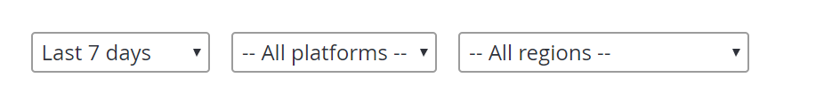
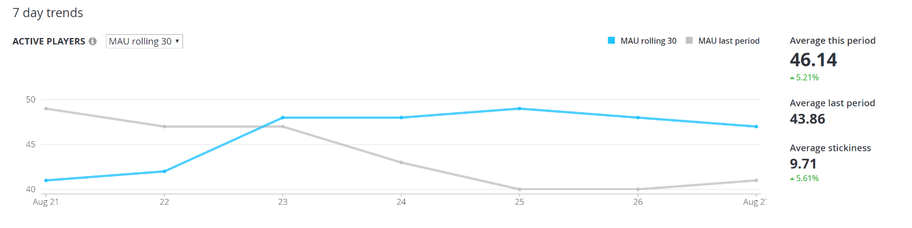
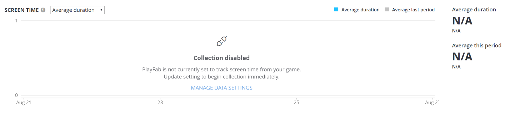

# Metrics quickstart

There are two primary ways to explore your metrics from PlayFab Game Manager:

1. **Trends** - A collection of graphs visualizing performance over time.

2. **Reports** - Data tables comparing. Covered in detail in the Reports Section.

## Trends tab

The Trends tab offers an easy way to view and analyze performance across eight key performance indicators:

1. MAU
2. DAU
3. New Players
4. Screen Time
5. Screen Frequency
6. Classic Retention
7. Revenue
8. Stickiness

The Trends tab is updated once daily at the close of the UTC day. For details on each metric, see [Metrics and terminology](metrics-and-terminology.md).

The Trends tab consists of three sections:

1. Filters
2. Spark Cards
3. Graphs

## Filters

At the top, there are three page-level filters that can be applied. Choosing any filter will update all Spark Cards and Graphs to match the current active selection:

- **Time:** Choose the time interval to explore, from seven days to six months.

- **Platform:** See only data for individual device types such as Android, iPhone, or Windows.

- **Region:** See only data from a specific geographic region.

> [!NOTE]
> Platform and Region filters are not currently supported for Revenue. This will be resolved in a future release.

## Spark Cards

The Spark Cards are designed to offer an at-a-glance view of what happened that particular day. Each Spark Card consists of:

- A trend line
- The actual value from the most recent UTC day
- The trend comparing the most recent value against the period start.

Definitions for each are obtained by hovering over the metric or by tapping, if using a mobile phone.

  

## Graphs

The Graphs provide trend data for each of the six metrics, through that day. In some cases, the drop-down over each graph can be used to toggle the active metric. For example, the Active Players graph can show either DAU or the Rolling 30-Day MAU.  

In the upper right-hand corner of each graph, individual lines can be toggled on and off. Doing so dynamically re-scales the y-axis.  Additionally, in the Retention Graph, D1 and D7 can be disabled to emphasize variations in D14 and D30.

Hover over any data point to display the actual value for the selected day. To the right of each graph, supporting metrics offer additional insights such as the average and/or total for the period.

## Data Collection

If your title is not collecting device information or sessions events, some components of the Trend Explorer will be unavailable. To enable these, change your settings in the Data Collection tab. See Data Collection for more details.
