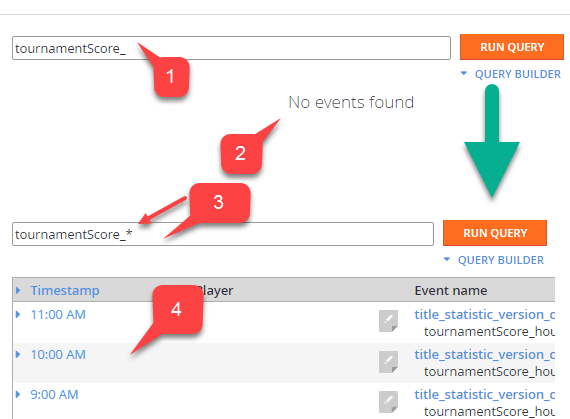

# Real Time Analytics - Event Queries

Several **PlayFab Real Time Analytics** tools support querying for a specific set of **Events**. Each **Query** is represented as a text expression and follows the rules described in this tutorial.

Consider the **Event** shown below.

```json
{
    "EventName": "title_statistic_version_changed",
    "StatisticName": "tournamentScore_hourly",
    "StatisticVersion": 1290,
    "ScheduledResetInterval": "Hour",
    "ScheduledResetTime": "2017-04-17T09:00:00Z",
    "EventNamespace": "com.playfab",
    "EntityType": "title",
    "Source": "PlayFab",
    "EventId": "a1883560c93b43f5b0543ade2d8cd093",
    "EntityId": "6EEA",
    "SourceType": "BackEnd",
    "Timestamp": "2017-04-17T09:00:22.4012656Z",
    "History": null,
    "CustomTags": null,
    "Reserved": null
}
```

In **PlayFab**, an **Event** is represented as an **Object** with a set of **Fields**. Each **Field** has a **Value**.

You can compose a **Query** expression to filter **Events** by specific **Values** on one or more **Fields**. **Query** expressions can be [simplistic](#simplistic-queries) or [complex](#complex-queries).

**PlayFab Free Tier** only allows searching by the default **Event Fields**. The **Paid Tier** enables searching by **Custom Event Fields**.

Please post on our [forums](https://community.playfab.com/questions/ask.html) to ask about **Paid Tiers** and enabling **PlayStream** history.

## Simplistic Queries

A **Simplistic Query** is just a **Value** you want to search for. **PlayFab** goes through each property of each **Event** looking for that specific **Value**.

For example, consider the aforementioned **Event** and its **Field** called **StatisticName**.
This **Field** has the **Value**: **tournamentScore_hourly**.

Let's begin a **Query**:

- Using the **Search Field** provided, enter **tournamentScore_hourly (1)**.
- Select the **Run Query** button **(2)**.
- The result will be rendered in the **Event Timeline** columns **(3)** and will contain the specified **Event**.

  

This occurs because **PlayFab** analyzed all the **Events** and found that *this particular one* has some property with the **Value** of **tournamentScore_hourly**.

> [!IMPORTANT]
> **PlayFab** supports wildcards and some of the regex expressions.

This means that you may search by part of the **Value**. In the example shown below:

- Querying **tournamentScore_** in the **Field (1)**.
- Results in no **Events** in the list **(2)**.
- Using a wildcard, we adjust the **Query** to **"tournamentScore_" (3)**.
- This results in displaying *all* **Events** that have a **Field** with the **Value** starting with **tournamentScore_** **(4)**.

  

Using this technique, you can quickly search for relevant **Events** with no need to build complex **Queries** or to use a **Query** builder.

## Complex Queries

To run a complex analysis, you will need **Complex Queries** with several conditions. A **Complex Query** consists of one or more **Query** expressions, separated by **AND/OR** operators.

A **filter expression** consists of 2 parts, and has the format shown below.

`object_property:value_descriptor`.

**object_property** points to a **Property** on your **Event** data (that you want to filter by), and generally looks like the following example.

 `eventData.propertyName<.otherPropertyName*>`.

The `eventData` part is absolutely necessary to point **PlayFab** to an **Event** object. You can then extract specific **Properties** using dot notation: `eventData.eventName`. You may also refer to nested **Properties** like this: `eventData.history.triggeredEvents`.

> [!IMPORTANT]
> Object **Property** requires **camelCase** parts starting with a lowercase letter. For example, each **Event** has a **Property** called *EventName*. However, to access this **Property** in a **Query** you have to adjust the first letter of the **Property** and use **eventData.eventName**.

**value_descriptor** is an expression that describes the **Value** of the **Field** you want to use to filter. The simplest form of **Value Descriptor** is the **Value** itself. The **Query** shown below will look for all **Events** with **Names** equal to **player_created**.

`eventData.eventName:player_created`

We can customize the **Value** descriptor by kicking in some regular expression elements, like wildcards.

> [!NOTE]
> By convention, *all* of **PlayFab Player**-oriented **Event Names** start with **player_ .**

  

The **Query** shown below will allow us to locate *all* such **Events**.

`eventData.eventName:player_*`

Another example of a complicated **Value** descriptor is the one for the **Date Property**. The following **Query** incorporates all the **Events** which have a timestamp between **April 1st** and **April 17th**.

`eventData.timestamp:[2017-04-01T00:00:00 TO 2017-04-17T00:00:00]`

Finally, we can combine *several* filter expressions using **AND/OR** operators and parenthesis for grouping.

The **Query** shown below will locate *all* of the **Events** that occurred from **April 1st** to **April 17th**, and have the following **Event Names**:

- **player_logged_in**
- **player_statistic_changed**.

`eventData.timestamp:[2017-04-01T00:00:00 TO 2017-04-17T00:00:00]  AND ( eventData.eventName:player_logged_in OR eventData.eventName:player_statistic_changed )`
