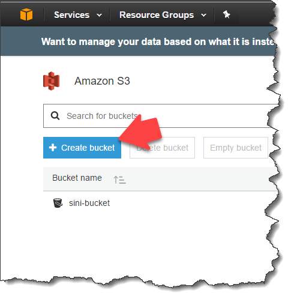
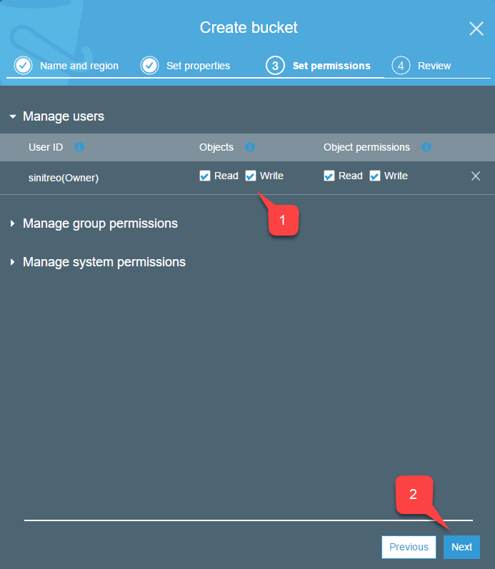
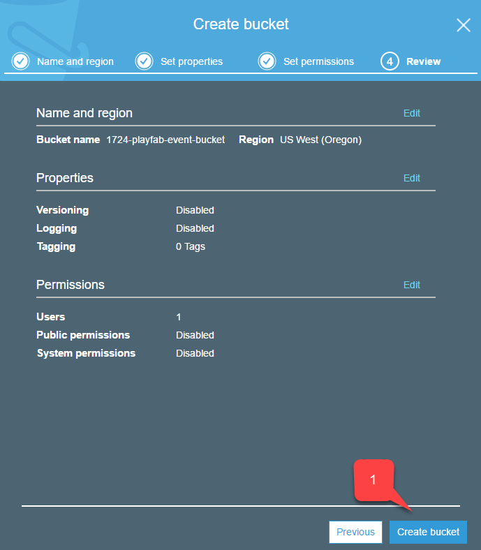
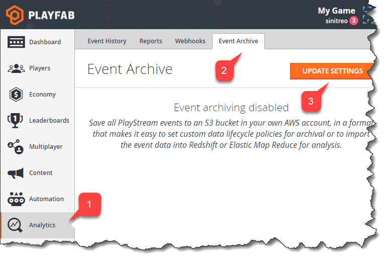
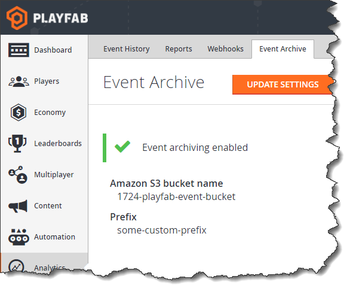

# S3 event archiving

PlayFab allows you to archive the entire event flow using the
 **Amazon S3** bucket. This tutorial shows you step-by-step how to configure event archiving from scratch.

## Configuring Amazon S3 bucket

Once you have created an **Amazon** account:

- Navigate to **Services (1)**.
- Select **S3 (2)**.

  

- On the **S3** page, you will have an overview of all your buckets.
- Notice the **Create bucket** button?  Use it to create a new bucket by selecting it.

  
To create your new S3 bucket, you must go though a 4-step wizard:

1. You must assign a unique, **DNS**-compliant **Bucket name** for your bucket. Make sure to have that name available somewhere for copying and pasting. We will need it when we configure PlayFab event archiving.
2. When you are done, select the **Next** button.

  

- This step offers you the option of adding **Versioning**, **Logging**, and **Tags** for your **Bucket**.
- Select the **Next** button when you are done **(1)**.

  

- During this step, make sure that you have **Read/Write** access **(1)** for objects.
 - Select the **Next** button **(2)** when you are done.

  

In this last step, double-check your settings and select the **Create bucket** button **(1)**.

  

## Configuring Amazon access

In order to archive events, you will need to give PlayFab access to the bucket on your behalf.

This is done by means of an access key.

- Double-check that you have your newly created bucket in the list of **S3** services **(1)**.
- Select your account **Name** in the top right corner **(2)**.
- Then select **My Security Credentials (3)**.

  

- Locate the **Access Key** list.
- Select the **Create New Access Key** button.

  

- Expand the **Access Key** data **(1)**.
- Save the **Access Key ID (2)** and **Secret Access Key (3)**.
- Make sure they are available for copy/paste. We will need them when we configure **PlayFab Event** archiving.
- Select the **Close** button **(4)**.

  

## Configuring PlayFab event archiving

When your **Amazon S3** bucket is ready, it's time to set up the PlayFab side of things.

We need to pass the access key data and bucket name to PlayFab to enable event archiving.

To access the PlayFab **Event Archive**:

- Select **Analytics** in the menu on the left **(1)**.
- Then select the **Event Archive** tab **(2)**.
- Finally, select the **Update Settings** button **(3)**.

  

The **Update Settings** page will offer you the following settings:

1. The **Amazon S3 bucket name** (use the one you created while configuring the **Amazon S3 Bucket**).
2. **Prefix** is the *root folder* under which PlayFab will store all the relevant data.
3. **Access key ID** (use the one you obtained while configuring access to the **Amazon Account**).
4. **Secret Key** (use the one you obtained while configuring access to the **Amazon** account).
5. Select the **Save Settings** button when everything is in place.

PlayFab should present you with a nice page indicating that event archiving is enabled.

  

Make sure to post some events and then check your bucket on the **Amazon** portal.

After a short period of time, you should see that new compressed **JSON** streams are appearing, nicely broken out by title, event name, year, month and day.

  
