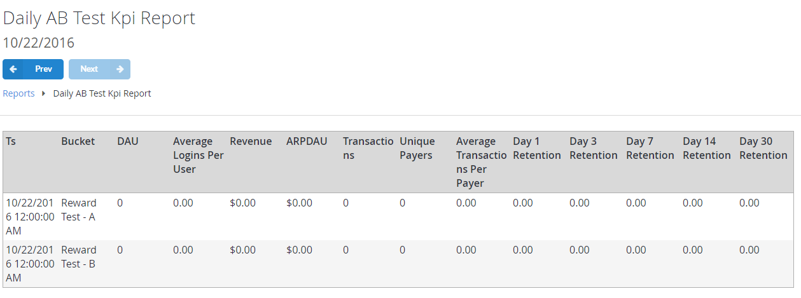
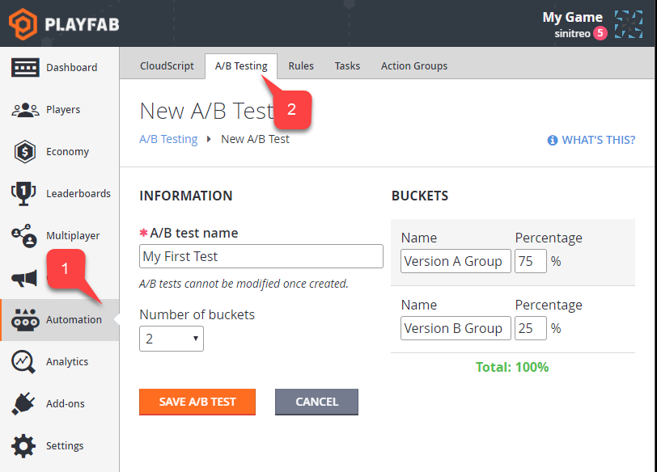

# Daily A/B Test KPI Report

## Overview

The **Daily A/B Test KPI** (**Key Performance Indicators**) **Report** shows the outcome of an **A/B Test**, broken down by **A** and **B Buckets**.

The **Key Performance Indicator**s for **A/B Tests** include:

- **DAU** (**Daily Active Users**)
- **Average Logins Per User**
- **ARPDAU** (**Average Revenue per Daily Active User**)
- **Total number of Transactions**
- **Total number of Unique Payers**
- **Average transactions per Payer**
- **Retention** for **Day 1**, **3**, **7**, **14** and **30**

## Populating the Report

The first step in setting up **A/B Testing**, is to create an **A/B Test** using the **PlayFab Game Manager**. To do this ;

- Select **Automation** from the menu to the left **(1)**.
- Select the **A/B Testing** tab **(2)**.
- Create a new **A/B Test**.
- Configure the **Test Name** and **User Buckets**.
>[!NOTE]
> You can have up to 5 **Buckets** with independent ratios (**%**).

Please refer to the [Customer Stores for Player Segments](../../commerce/stores/custom-stores-for-player-segments.md) tutorial for further information on **A/B Testing** with **Stores** that are available only to **Players** from defined **Player Segments**.
