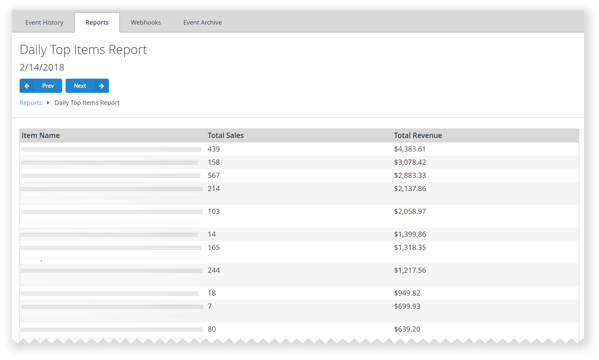
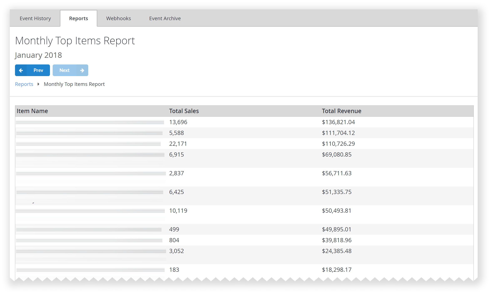

# Daily and Monthly Top Items Report

## Overview

  

  

The Daily and Monthly Top Items Report contains a list of top selling items or bundles in a given day or month. These tables, daily and monthly, include item names from your primary catalog, associated number of sales, and total revenue. This report can assist you in identifying trending items over time, which can be useful for planning future promotions or events.

## Populating the reports

Please refer to our tutorials for [Catalogs](../../commerce/items/catalogs.md), [Stores and Sales](../../commerce/stores/stores-and-sales.md), and [Non-receipt Payment Processing](../../commerce/economy/non-receipt-payment-processing.md) to learn about setting up in-game stores and conducting payments.
