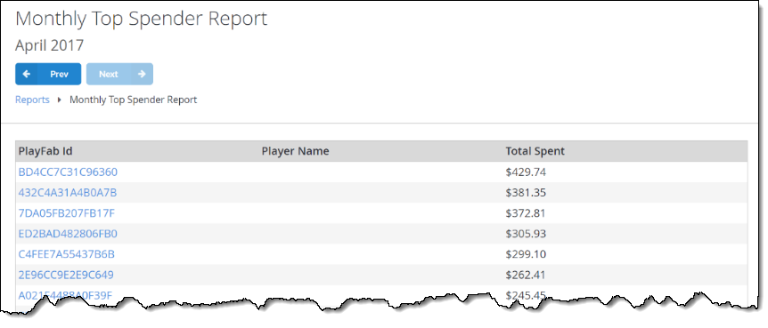

# Daily and Monthly Top Spender Report

## Overview

The **Daily** and **Monthly Top Spender Report** shows the list of **Players** who spent money in your game on a given day or month, sorted by the transaction amount.

You can select the **PlayFab Id** label to quickly navigate to the **Player's Details** page.

  

  

## Populating the reports

Please refer to [Non-receipt Payment Processing](../../commerce/economy/non-receipt-payment-processing.md) tutorial to learn how to conduct payments.
