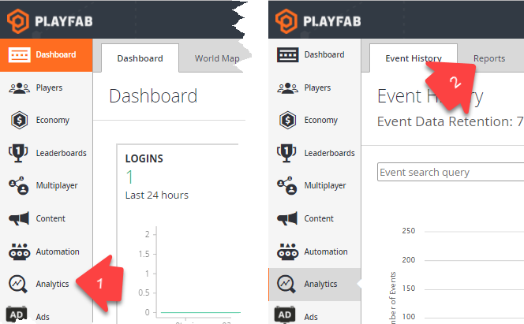
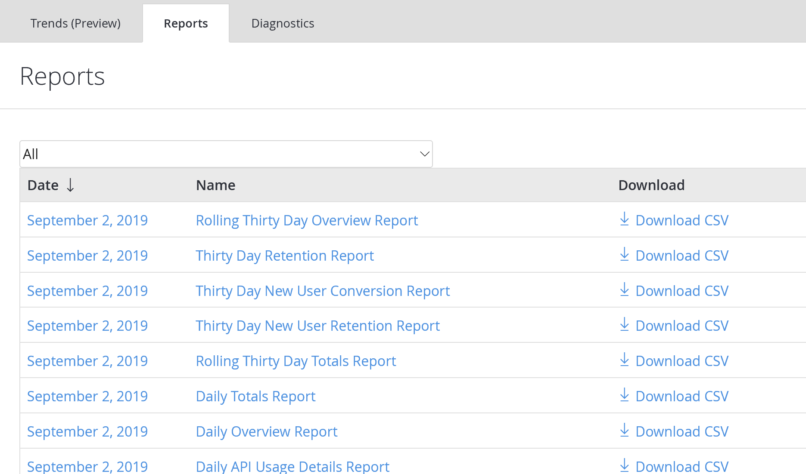

# Reports Quickstart

The Reports page gives you access to various reports composed from events, broken down by dates.

> [!IMPORTANT]
> Before using Reports, make sure you have already executed some API calls, that are captured by the report system.

## Access Reports

To **access** the Reports page, use the sidebar menu and navigate to "Analytics" **(1)**. Then use the tabs navigation bar and navigate to "Reports" **(2)**.

  

## Reports Overview

The following image shows an overview of the Reports page.

  

1. Filter selection allows you to **filter reports by type** (name).
2. **Report date** indicates the time interval for which the report was generated. You can click the date label to access report details for this specific date.
3. **Report name** identifies the report type uniquely. You can click the name label to access report details for the corresponding date **(2)**.
4. When report data is available, you can download a CSV representation of the data by clicking **Download CSV**.
5. When report data is not available for a given day (no events that day), the date and name labels will render black, not clickable, and downloading as CSV will not be available.

## Report Types

- [Daily, Monthly, and Rolling 30-Day Overview and Totals Reports](daily-monthly-and-rolling-30-day-overview-and-totals-reports.md)
  - Tracks hourly, daily, and monthly logins, revenue, and API usage.
- [Thirty Day Retention Report](thirty-day-retention-report.md)
  - Tracks the percentages of all active players who return to your game over 30 days.
- [Thirty Day New User Retention Report](thirty-day-new-user-retention-report.md) 
  - Tracks the percentages of new players who return to your game over the first 30 days.
- [Thirty Day New User Conversion Report](thirty-day-new-user-conversion-report.md) 
  - Tracks the percentages of new players who spend money within the first 30 days.
- [Daily and Monthly Top Spender Report](daily-and-monthly-top-spender-report.md)
  - Tracks the top 100 spenders in your game.
- [Daily and Monthly Top Items Report](daily-and-monthly-top-items-report.md) 
  - Tracks the top 100 items in your game.
- [Daily AB Test KPI Report](daily-ab-test-kpi-report.md)
  - Use this report to evaluate the effectiveness of your A/B Test experiments.
- [Daily API Usage Details Report](daily-api-usage-details-report.md) 
  - Tracks the PlayFab API calls used by your title.
- [Daily and Monthly CDN Usage Report](daily-and-monthly-cdn-usage-report.md)
  - Tracks Content Delivery Network (CDN) usage by your players.
- [Daily Abuse Reports History Report](daily-abuse-reports-history-report.md) 
  - This is the place for you to read player bug reporting, and/or to let players report each other for cheating.
  - > [!NOTE]
    > The name column is never clickable on this report, but the Download CSV column will still work if there is data present.
