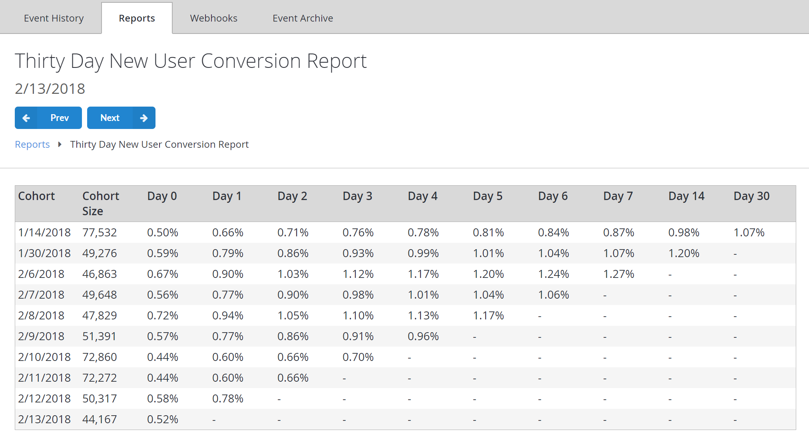

# Thirty Day New User Conversion Report

## Overview

The **Thirty Day New User Conversion Report** illustrates the percentage of **Players** in a given **Cohort**, who spent money in the game during their first 30 days.

A **Cohort** of **Players** is formed every day by grouping newly-registered **Players**. **Cohort** size indicates the number of **Players** in a **Cohort**.

> [!NOTE]
> Unlike **Retention Reports**, the **Conversion Report** tracks a cumulative total of **Players** who converted within a given time span.

  

The preceding example report was generated on **2/13/2018**:

- On **1/14/2018**, 77,532 new **Players** created accounts in the example **Title**.
- On **Day 0**, 0.50% of these **Players** made at least one transaction in the game.
- Since conversion reflects a *cumulative total* of **Players**, these percentage values *increase* along the time span and reach 1.07% on the 30th day, which corresponds to the report generation date, **2/13/2018**.

For additional details, see [Metrics and Terminology](../metrics/metrics-and-terminology.md).

## Populating the Report

To populate this **Report**, you must register a **New User** - log in, and then conduct purchases several days in a row.

This, however, will produce *trivial* results with user conversion at 100% for each day. Throwing in several **Users** and skipping some days will produce more interesting results.

The following **API** calls may be used to create **New User** accounts:

- [RegisterPlayFabUser](xref:titleid.playfabapi.com.client.authentication.registerplayfabuser)
- [RegisterWithWindowsHello](xref:titleid.playfabapi.com.client.authentication.registerwithwindowshello)

The following **API** calls will also create a **New User** account and log you in automatically, if the **CreateAccount** flag is present:

- [LoginWithAndroidDeviceID](xref:titleid.playfabapi.com.client.authentication.loginwithandroiddeviceid)
- [LoginWithCustomID](xref:titleid.playfabapi.com.client.authentication.loginwithcustomid)
- [LoginWithFacebook](xref:titleid.playfabapi.com.client.authentication.loginwithfacebook)
- [LoginWithGameCenter](xref:titleid.playfabapi.com.client.authentication.loginwithgamecenter)
- [LoginWithGoogleAccount](xref:titleid.playfabapi.com.client.authentication.loginwithgoogleaccount)
- [LoginWithIOSDeviceID](xref:titleid.playfabapi.com.client.authentication.loginwithiosdeviceid)
- [LoginWithKongregate](xref:titleid.playfabapi.com.client.authentication.loginwithkongregate)
- [LoginWithSteam](xref:titleid.playfabapi.com.client.authentication.loginwithsteam)
- [LoginWithTwitch](xref:titleid.playfabapi.com.client.authentication.loginwithtwitch)

Finally, you may use following **API** Calls to log in:

- [LoginWithAndroidDeviceID](xref:titleid.playfabapi.com.client.authentication.loginwithandroiddeviceid)
- [LoginWithCustomID](xref:titleid.playfabapi.com.client.authentication.loginwithcustomid)
- [LoginWithEmailAddress](xref:titleid.playfabapi.com.client.authentication.loginwithemailaddress)
- [LoginWithFacebook](xref:titleid.playfabapi.com.client.authentication.loginwithfacebook)
- [LoginWithGameCenter](xref:titleid.playfabapi.com.client.authentication.loginwithgamecenter)
- [LoginWithGoogleAccount](xref:titleid.playfabapi.com.client.authentication.loginwithgoogleaccount)
- [LoginWithIOSDeviceID](xref:titleid.playfabapi.com.client.authentication.loginwithiosdeviceid)
- [LoginWithKongregate](xref:titleid.playfabapi.com.client.authentication.loginwithkongregate)
- [LoginWithPlayFab](xref:titleid.playfabapi.com.client.authentication.loginwithplayfab)
- [LoginWithSteam](xref:titleid.playfabapi.com.client.authentication.loginwithsteam)
- [LoginWithTwitch](xref:titleid.playfabapi.com.client.authentication.loginwithtwitch)
- [LoginWithWindowsHello](xref:titleid.playfabapi.com.client.authentication.loginwithwindowshello)
