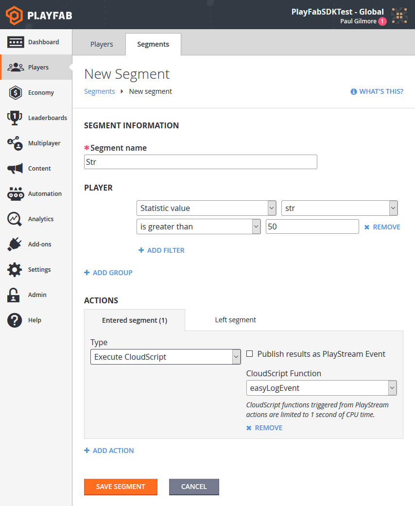

# Player segmentation

Player Segmentation is defined in [Game Manager](../../config/gamemanager/quickstart.md). Segments allow you to define useful or interesting groups of players, and perform exclusive actions on that group.

**Requirements:**

- Players with and without a distinctive characteristic defined in PlayFab.
- A defined [CloudScript PlayStream hook](../../automation/actions-rules/using-cloudscript-actions-with-playstream.md).

## Example Case: Run a custom CloudScript for every player who reaches an in-game goal

The "defining characteristic" of a player can be among: Login time, Linked device type, tags, real-world location, statistic values, virtual currency values, or real money purchases, and more. For this example, our distinctive characteristic will be a statistic, specifically players who achieve 50 "str". Statistics are one of many possible options, and only specifically required for this example. Feel free to replace the statistic requirement with another filter of your choice.

Our action will be to run a CloudScript function. CloudScript is by far the most flexible trigger option, granting you full control of the player and segmentation information at the time of segment-transition.

Game Manager: Navigate to your title -> Players -> Segments -> New Segment

Here is the example segment described above:

  

The most complex part of this example is the CloudScript. Utilize the second parameter, "context" in your [CloudScript handler](../../automation/actions-rules/using-cloudscript-actions-with-playstream.md) to identify the player, and segment transition. Afterwards, perform any action you wish on the player, such as granting [inventory items](../../data/playerdata/player-inventory.md), [virtual currency](../../commerce/economy/currencies.md), [player data](../../data/playerdata/quickstart.md), or [statistics](../../data/playerdata/using-player-statistics.md).

See also: [Best Practices for store segmentation](../../commerce/stores/best-practices-for-store-segmentation.md)
