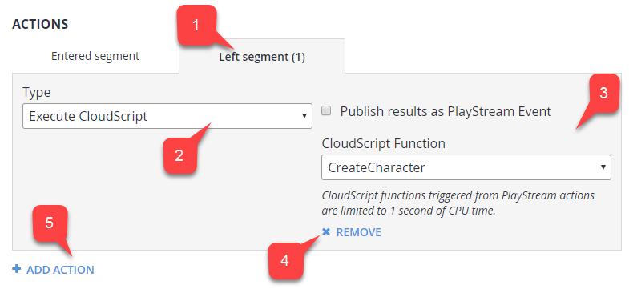

# Segment Configuration

The **Segment Configuration** page, accessed from the **Players** Tab in **Game Manager**, allows you to configure a new or existing segment by adjusting the name, defining filters, and assigning tasks. 

Each **Segment** allows you to define useful or interesting groups of **Players**, and perform exclusive actions on that group.

## How to create and access a Segment

To access **Segment Configuration**:

- Select **Players** from the menu on the left.
- Select the **Segments** sub-tab **(2)**.
- You may then choose to:

  - Use the **New Segment** button **(3)** to create and configure a new **Segment**.
  - Locate an *existing* **Segment** and select the name label **(4)** to configure the **Segment**.

  

## How to configure a Segment

**Prerequisites**:

To configure a **Segment** like the example in this tutorial, you will need the following:

- **Players** with and without a distinctive characteristic defined in **PlayFab**.
- A defined [CloudScript PlayStream Hook](../../automation/actions-rules/using-cloudscript-actions-with-playstream.md).

In this example we are going to:

1. Configure a **Segment** using the **defining characteristic**: *all players that come from Canada*.
2. Run a **CloudScript function helloWorld** for each **Player** that enters the **Segment**.

The **defining characteristic** of a **Player** can be such things as:

- Login time
- Linked device type
- Tags
- Real-world location
- Statistic values
- Virtual currency values
- Real money purchases, and more.

**Player country** is one of many possible options, and only specifically required for *this* example. Feel free to replace the **Country** requirement with another filter of your choice.

When a **Segment** is defined, you have a variety of action options to run when a **Player** enters or leaves the **Segment**. **CloudScript** is by far the most flexible action, granting you full control of the **Player** and segmentation information at the time of **Segment** transition.

Utilize the second parameter, **Context** in your **CloudScript** handler to identify the **Player**, and segment transition. Afterwards, perform any action you wish on the **Player**, such as granting **Inventory Items, Virtual Currency, Player Data**, or **Statistics**.

In this particular case, **Segment Configuration** requires 4 simple steps:

1. Assign an appropriate name for the **Segment** (it's a good idea to use a name that incorporates your **defining characteristic - Canada Players**).
2. Assign conditions that a **Player** has to meet to enter the **Segment**. In this case we want a **Country** filter with the strict value: **Canada**.
3. Add a **CloudScript** action for the **Entered Segment** trigger. Configure the action to run the function you want. In this example, we want: **helloWorld**.
4. Commit by selecting the **Save Segment** button.

  

## Advanced Segment Filtering

**Segment** filtering allows you to define what **Players** are included in the **Segment**. Formally speaking, a **Segment (1)** is a set of **Players** that belong to at least *one* group. **Group (2)** is a set of **Players** that meet all defined conditions (called **filters (3)**).

In other words, to be part of a **Segment**, a **Player** must be part of at least 1 **Group**. To be part of a **Group**, a **Player** must meet all conditions (filters).

This is denoted by the **OR/AND** operators: filters are combined using the **AND** operator, while groups are combined using the **OR** operator.

  

The previous screenshot illustrates how a **Segment** can be defined. This **Segment** consists of 2 **Groups**.

- The first **Group** is defined by 2 filters: a **Player** must be from **Canada** and must have **Apple Push Notifications** enabled.
- The second **Group** is also for **Player** from **Canada**, but they must have **Google Push Notifications** enabled. 

In the end, we have a **Segment** of **Players** from **Canada**, with either **Google** or **Apple Push Notifications**.

Each filter has unique configuration and purpose. As of 4/30/2017 the following filters are available:

- **All Players** filter - This filter has *no* configuration and is unique, because it allows you to create a segment of all **Players**. This comes in handy when you want to run automatic operations for every new **Player** (**Segment** actions are described in the [How to manage actions](#how-to-manage-actions) section, later in this tutorial).
- **First login (date)** filter - Allows you to filter, based on first login datetime. For example, **Players** that have first logged in after 1/1/2017.
- **First login (timespan)** filter - Allows you to filter, based on first login timespan relative to the current datetime. For example, **Players** that have first signed in 20 minutes ago (from now).
- **Last login (date)** filter - Allows you to filter, based on last login datetime. For example, **Players** that have not signed since 1/1/2017.
- **Last login (timespan)** filter - Allows you to filter, based on last login timespan relative to the current datetime. For example, **Players** that have not signed in for a week (from now).
- **Linked user account to** filter - Allows you to filter, based on users' linked accounts. For example, **Players** that have a **Steam** account linked with an email account.
- **Location (country)** filter - Allows you to filter, based on a **Player's** country. For example, **Players** from **Canada**.
- **Push notifications enabled with** filter - Allows you to filter, based on **Player** push settings and capabilities. For example, **Players** that have **Google** push notifications enabled.
- **Statistics value** filter - Allows you to filter, based on your own custom statistic attribute. For example, **Players** that inflicted 20000 damage in total.
- **Tag** filter - Allows you to filter, based on whether a **Player** has or doesn't have a certain tag. For example, **Players** that have a **Cheater** tag.
- **Total value to date in USD** filter - Allows you to filter, based on how much USD currency a **Player** has spent in your game. For example, **Players** that have spent over $30.
- **Value to date** filter - Allows you to filter, based on how much of a certain currency a **Player** has spent in your game. For example, **Players** that have spent 50 RUB.
- **User Origination** filter - Allows you to filter, based on the first authentication method that a **Player** used to start playing the game. 

> [!NOTE]
> The trick here is that a **Player** may start with authentication based on, say, an **iOS Device ID**, but later, the same **Player** may have a **GameCenter** account linked. In this case, **user origination** will be the **iOS Device ID**. For example, **Players** that first signed in using an **iOS Device ID**.
- **Virtual currency balance** filter - Allows you to filter, based on a **Player's** custom virtual currency deposit. For example, **Players** that have less than 50 Crystal.

## How to manage Actions

Each **Action** needs a **Trigger** in order to run. Some **Actions** are run manually, triggered right from the page.

Sometimes, though, you have to *select* a **Trigger** - an event that causes an **Action** to run. A **Trigger** defines the context of the **Action**.

For example, a **Player Entered Segment Trigger** passes you the context containing a reference to the **Player**. The general workflow for the **Action** panel is:

1. Select an **event condition**, also known as a **Trigger**.
2. Select an **action type**. **PlayFab** offers a variety of **Actions**. If, at any point, you need more a flexible **Action**, consider a **CloudScript Action**. This **Action** type allows you to run your own **CloudScript** function.
3. Configure the **Action** (specific for each **Action** type).
4. **Remove** the **Action** from the **Trigger**.
5. **Add Action** to the **Trigger**.

  

## How to inspect Player Segments

It is possible to look up what **Segments** a **Player** belongs to by means of the **Player Segments** page. To access the Player Segments page                     ;

- Select **Players** in the sidebar menu **(1)**. 
- Then select the **Player** tab **(2)**.
- Locate the **Player** you want to inspect and select the **ID** label **(3)**.
- Finally select **Segments** in the **Players** toolbar **(4)**.

  

On the **Players Segment** page, note the following:

1. The **Player ID** label identifies the **Player** you currently inspecting.
2. The **Segment** table contains a list of *all **Segments** a player belongs to*. Select the **Segment** name label to configure a **Segment**.

  
