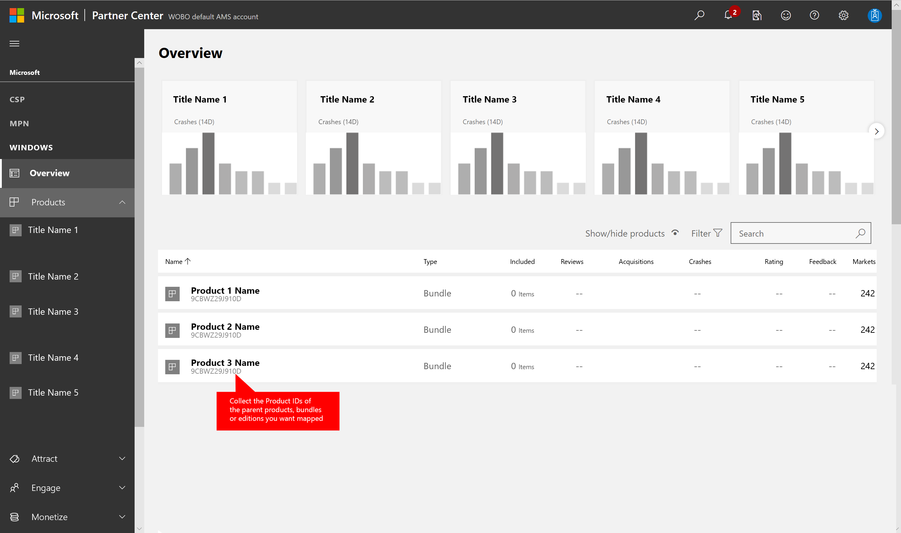

# Xbox Data Add-On quickstart

> [!IMPORTANT]
> This feature is currently in **Private Preview**.
> It is provided to give you an early look at an upcoming feature, and to allow you to provide feedback while it is still in development.
>
> Access to this feature is restricted to select titles. Customers in our Indie, Pro, and Enterprise tiers can request access by opening a ticket with our support team via the Contact Us tab in the PlayFab Game Manager.

The Xbox Data Add-On provides transaction-level usage and purchase data from Microsoft's Xbox and Store to your PlayFab Insights database/cluster. From here, you can run direct queries against the data. It is designed to benefit any Xbox developer, whether or not they use the PlayFab SDK.

> [!NOTE]
> Data will be accessible from the PlayFab Explorer feature. For information, visit the [PlayFab Explorer quickstart](../../Insights/explorer/quickstart.md).

## Step 1 - Create a PlayFab Account

To onboard to the Xbox Data Add-On:

- Sign up for a PlayFab account and create a title at [https://playfab.com](https://playfab.com).
- Follow the account creation flow to create a studio and at least *one* title you'd like to receive data for.

## Step 2 - Request to the PlayFab Insights Private Preview

- Email [pfgaminginsights@microsoft.com](mailto:pfgaminginsights@microsoft.com) to request access to both the Insights program and the Xbox Data Add-On.

## Step 3 - Map your Product IDs

- With the credentials used to publish your Xbox title, log into your [Microsoft Partner Center](https://partner.microsoft.com) account.
- Navigate to the dashboard, as shown below.

 

- From the dashboard, find each of the parent Product, Bundle, or Edition you want mapped, as illustrated below.

 

- Copy the Product ID using right-click, copy link, and paste into a document.
- Now copy the 12 digit Product ID and share the request in an email to [pfgaminginsights@microsoft.com](mailto:pfgaminginsights@microsoft.com).
- The mapping step is handled by a PlayFab team member.

## Step 4 - Access the Data

Once a PlayFab team member has mapped your product IDs, processing your new title's data takes will take approximately eight hours. When the data is ready:

- Visit [https://playfab.com](https://playfab.com)
- Sign in
- Select your mapped title.
- Choose **Analytics** from the left-hand menu.
- Select **Insights (Preview)** from the top navigation.
- Select **Open in Azure Data Explorer**.
- Once connected, find the following tables in your title's database:
  - Fact_Xbox_Purchase_ChargeBack
  - Fact_Xbox_Purchase_OrderCancellations
  - Fact_Xbox_Purchase_Orders
  - Fact_Xbox_Purchase_Refunds
  - Fact_Xbox_Usage
