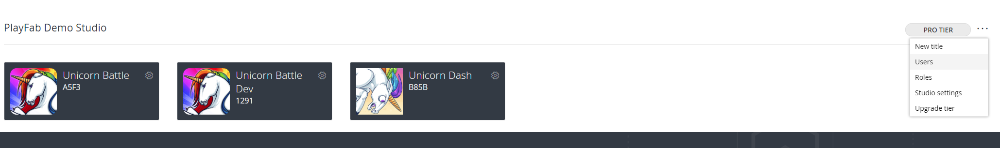
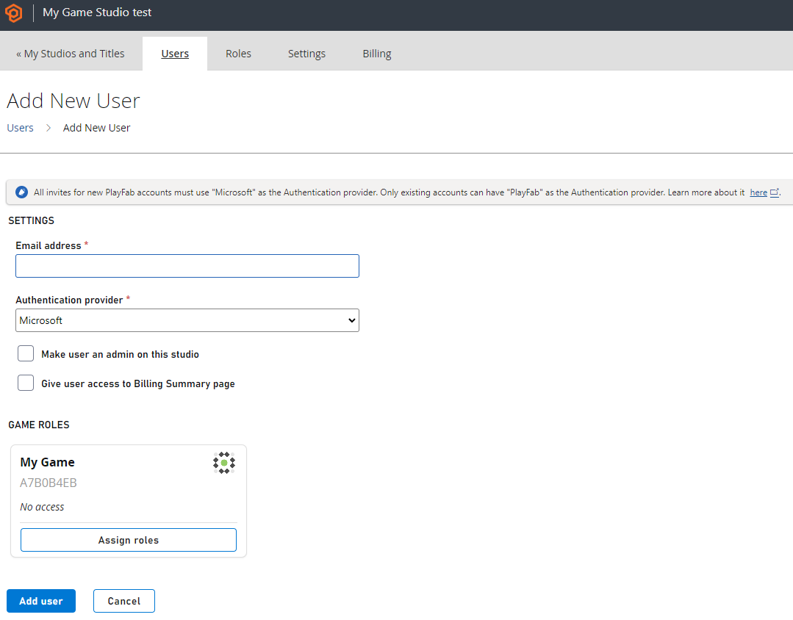
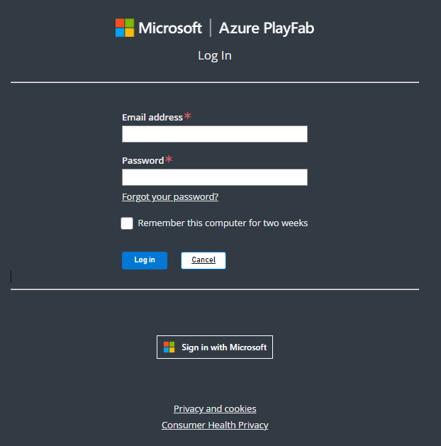

# Account Authentication for PlayFab Game Manager
> [!NOTE]
> All **New** PlayFab user accounts after July 27th 2024 must use a Microsoft authentication service.

PlayFab supports two methods for user authentication. The first is the original PlayFab user authentication system. The second and recommended is Microsoft's authentication services - Microsoft Account and Microsoft Entra ID (formerly known as Azure Active Directory). 

### Sign-up with a Microsoft Authenticated Account

You can create a new PlayFab account using an existing or new Microsoft Account. The PlayFab authentication system is no longer available for new accounts.

1. Navigate to [PlayFab's Signup page](https://developer.playfab.com/en-US/sign-up).
2. Select **Sign up with Microsoft** and follow the signup flow.

    

### To create a new Microsoft Authenticated user

1. Navigate to your studio's users section.

    

2. Select **Add User** in the top right 

3. Add the required details and configurations including selecting **Microsoft** as the authentication provider.

    

3. Select **Add user** when done to send an invite to the user. The user then registers via a Microsoft Account.

    

### Microsoft Account Limitations

Microsoft Account authentication is functional for individual users, including Microsoft Account token exchange for programmatic authentication. It doesn't support groups or graph.
