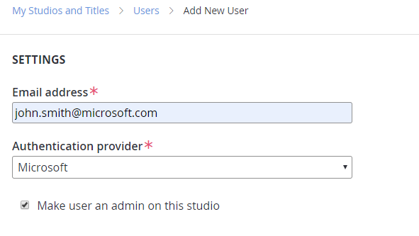
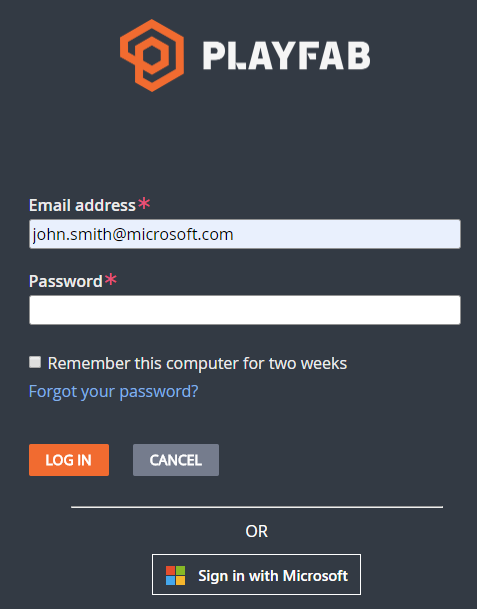

# Azure Active Directory Authentication for Playfab Game Manager

PlayFab now supports three methods of user authentication. The first two are the original PlayFab user authentication system and SAML. The third is now Azure Active Directory (Azure AD).

### To create a new Azure AD user

1. Navigate to your studio's users section.

    

2. Select **Add User** and select **Microsoft** as the authentication provider.

    

3. Assign roles as normal and send an invite. The user has the option to sign in via a Microsoft account.

    

### Sign-up with Azure AD

You can start a new PlayFab studio via Azure AD.

1. Navigate to [developer.microsoft.com](https://developer.playfab.com/en-US/sign-up).
2. Select **Sign in with Microsoft**.

### Azure AD Limitations

Azure AD authentication is functional for individual users, including Azure AD token exchange for programmatic authentication. It doesn't support groups or graph.
