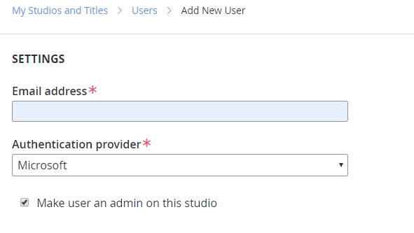

# Azure Active Directory Authentication for Playfab Game Manager

PlayFab now supports three methods of user authentication. The first two are the original PlayFab user authentication system and SAML. The third is now Azure Active Directory (AAD).

### To Create a New AAD User
1. Navigate to your studio's users section. 
2. Select **Add User** and select **Microsoft** as the authentication provider. 
3. Assign roles as normal and send invite. The user will have the option to login with microsoft. 

### Sign-Up with AAD
You can start a new PlayFab studio with AAD.
1. Navigate to https://developer.playfab.com/en-US/sign-up.
2. Select **Sign in with Microsoft**.

### PlayFab AAD Limitations
AAD authentication is functional for individual users, including AAD token exchange for programmatic authentication. It does not support groups or graph.
