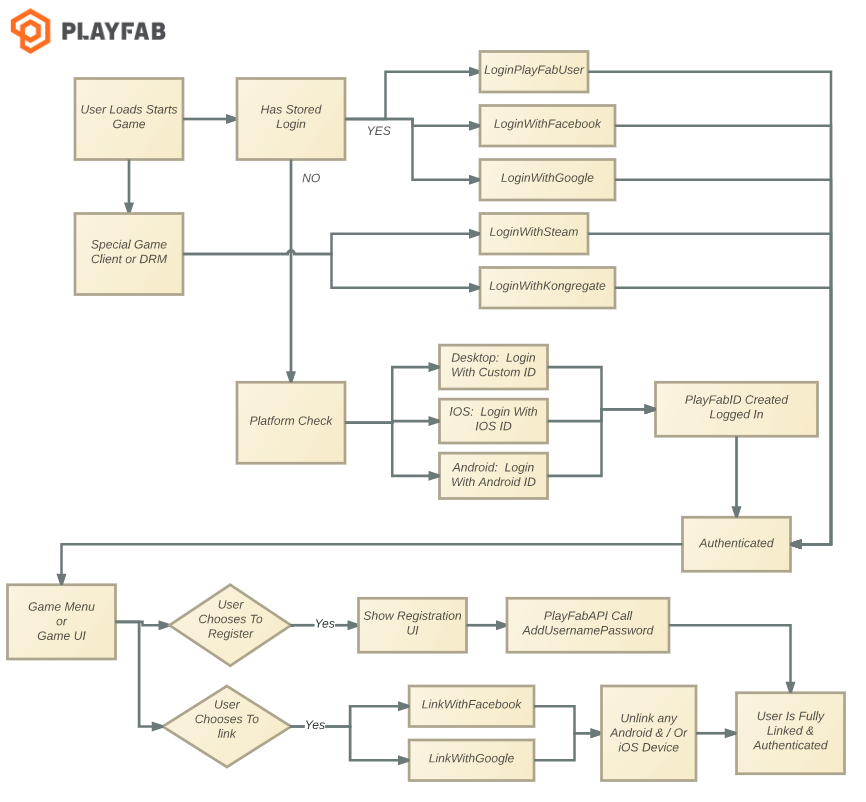

# Account linking quickstart

This Account linking quickstart demonstrates how to bind an account to multiple devices and login mechanisms.

 A single PlayFab account can be accessed by many devices and login credentials. As we discuss in our tutorial [Login basics and Best Practices](../login/login-basics-best-practices.md), there are two forms of user authentication:

1. **Anonymous**
2. **Recoverable**

## Adding a recoverable login to an existing anonymous account

It is very common for your first login to be an anonymous one. This gets your player into the game, friction-free.

But once a player becomes invested in your game, you should prompt them to add a recoverable login method, which makes their account *recoverable* in the case of device failure or other issues.

This section covers adding a recoverable login mechanism to an anonymous account.

> [!NOTE]
> An anonymous login is still relevant, and can continue to be the primary frictionless login for the player. Many players will *only* use these options again if they are attempting to recover their account, are using platform-specific features, or link a second Anonymous device.

  

The focus of this tutorial is at the bottom of the preceding image, with the cells: **AddUsernamePassword**, **LinkWithFacebook**, or **LinkWithGoogle**. These indicate a few of the larger set of options available for recoverable login mechanisms.

- [AddUsernamePassword](xref:titleid.playfabapi.com.client.accountmanagement.addusernamepassword) is used to enable either/both of: [LoginWithPlayFab](xref:titleid.playfabapi.com.client.authentication.loginwithplayfab) and [LoginWithEmailAddress](xref:titleid.playfabapi.com.client.authentication.loginwithemailaddress). These options store username/email/password credentials with PlayFab directly. In order for a player to recover their account, your game, website, or customer service can trigger:
  - [SendAccountRecoveryEmail](xref:titleid.playfabapi.com.admin.accountmanagement.sendaccountrecoveryemail) for that email address. If a player enters a bogus email address, you can *still* use the PlayFab Game Manager to update the email address for the player, though it's important to make sure your customer service representatives are trained to watch out for common social engineering tricks, so that they're only updating the email address of the actual owner of the account.

The third-party recoverable login mechanisms each involve prompting the user to log in via an appropriate SDK or third-party API call. Linking that account to PlayFab generally follows the same pattern:

1. First, prompt the user to log into that service (more details in [Login basics and Best Practices](../login/login-basics-best-practices.md)).
2. Once you have logged in, those services will provide some kind of token, which can be passed to PlayFab.
3. This allows PlayFab to safely link to that account without being aware of the user's credentials in that service.

> [!NOTE]
> Some services require that PlayFab have some additional information, such as an Application ID, in order to make the authentication call to that service for your game. Please be sure to check the **Add-on Marketplace** page for the service in question as part of setting up your title.

### Best practice

Use an anonymous login to create new players with zero friction. After a tutorial phase, gently encourage players to link your preferred choice of recoverable credentials to their account.

If you're using a third-party authentication system, retrieve the appropriate token from that service (via API calls or SDK functions), then call the appropriate PlayFab API to link the player's account from that service to their PlayFab account: [LinkFacebookAccount](xref:titleid.playfabapi.com.client.accountmanagement.linkfacebookaccount), [LinkGameCenterAccount](xref:titleid.playfabapi.com.client.accountmanagement.linkgamecenteraccount), [LinkGoogleAccount](xref:titleid.playfabapi.com.client.accountmanagement.linkgoogleaccount), [LinkKongregate](xref:titleid.playfabapi.com.client.accountmanagement.linkkongregate), [LinkSteamAccount](xref:titleid.playfabapi.com.client.accountmanagement.linksteamaccount), [LinkTwitch](xref:titleid.playfabapi.com.client.accountmanagement.linktwitch), `LinkWindowsHello`<!-- [LinkWindowsHello](xref:titleid.playfabapi.com.client.accountmanagement.linkwindowshello) -->.

### Best practice

- For user privacy, do *not* save or store any user credentials (this is also one of many steps required for COPPA compliance - and if that's a requirement for your title, please be sure to talk to your legal counsel to confirm your compliance).

- If you are using the PlayFab credentials, or calling a third-party API directly, you should clear their login information from memory as soon as possible. Generally, the third-party SDKs take care of this for you.

- Do not keep any identifiable or secure information in memory longer than you need it, and don't save it to a file or remote location. The PlayFab APIs are designed to utilize only the minimum required information.

## Add new devices to an existing recoverable account

PlayFab allows multiple logins and devices to access the same account. When set up properly, a player may play the game on any device, set that device down, pick up a new device (even a different type, brand, platform, or OS), and resume playing the same game, with all of their data intact.

### Requirement

The player must possess two devices:

- **Device1** - Set up with an account and recoverable credentials already properly set up. It is also ideal if the second device is *not* bound to an account. This process will orphan any account which only has the second device's ID as a login mechanism, making it irrecoverable. However, PlayFab has options to safely detect and warn against this case.
- All activity in this scenario takes place on **Device2** - To begin, the user login flow for the second device must be *reversed*. You must provide the user an option to log in via a recoverable mechanism, and *not* automatically log in with the device ID.

Failure to do this step will result in an awkward player experience, where they will be warned against losing an account they never intended to make.

So the flow for the various conditions is as follows - and note that in all cases, there's only *one* player account, which does have a recoverable account linked.

**Device1 State**: **Device ID** is bound to the player account.
**Device2 State**: **Device ID** is *not* bound to the player account.

- After signing into the player account on **Device2** (using the recoverable account credentials), make a call to [GetPlayerCombinedInfo](xref:titleid.playfabapi.com.client.accountmanagement.getplayercombinedinfo).
  - For each device type returned in that information, the most-recently signed in device ID is returned in the [result.InfoResultPayload.AccountInfo](xref:titleid.playfabapi.com.client.accountmanagement.getplayercombinedinfo#getplayercombinedinforesultpayload).

Since **Device2** has not yet been linked to this player account, the relevant device ID (**AccountInfo.IosDeviceInfo**, **AccountInfo.AndroidDeviceInfo**, etc.) will not match the **Device2 ID**.

**Device1 State**: **Device ID** is bound to the player account.
**Device2 State**: Logged in with recoverable credentials, but **Device ID** is *not* bound to the player account.

Now that we've verified that **Device2** is not bound to this account, we can try to bind it.

- Call the appropriate **LinkAndroidDeviceID**, **LinkIOSDeviceID**, or other device-specific API call.
- If successful, you're done, resume normal gameplay.
- But as with any API call, *be prepared to capture errors*. Specifically, look for an error return that the device is already linked to an account.
- Under this condition, prompt the player with a **Do you want to bind this device to this account** message.
- Be sure to provide information that the other account may be *lost* if they continue.
- If the player accepts this warning, re-send the link-request with the property **ForceLink** set to **True**.
- This will unlink the **Device2 ID** from the old account, potentially orphaning that account if no other login mechanisms are linked to it, and bind it to the new account.

### Best practice

Use CloudScript, or a PlayStream event to record information on abandoned accounts somewhere where your customer service reps might be able to recover it, if the player made a mistake.

> [!NOTE]
> Even something as simple as writing the PlayFabId to a Cloud-based log file may save an account for a dedicated player.

**Device1 State**: **Device ID** is bound to the player account.
**Device2 State**: **Device ID** is bound to the player account.

At this point, both devices now play on the same account, and both devices can use frictionless login safely.

## Bind a frictionless device ID to an existing recoverable account

This scenario is very similar to the situation above, except the account was created using Recoverable Credentials.

You can convert an existing game login screen into a frictionless login by binding an anonymous login after the fact. The steps here are nearly identical to the condition above, only with a *single* device (which is simply **Device2** in the flow above).

**Device State**: **Device ID** is *not* bound to the player account.

After performing a recoverable login with the device, call [GetPlayerCombinedInfo](xref:titleid.playfabapi.com.client.accountmanagement.getplayercombinedinfo). Again, determine whether the device ID matches the bound device ID, via the info returned in [result.InfoResultPayload.AccountInfo](xref:titleid.playfabapi.com.client.accountmanagement.getplayercombinedinfo#getplayercombinedinforesultpayload).

Since the device has never signed into the account, the relevant device ID (**AccountInfo.IosDeviceInfo**, **AccountInfo.AndroidDeviceInfo**, etc.) will not match the device ID.

**Device State**: Logged in with Recoverable Credentials, but the device ID is not bound to the player account.

Since the device is not bound to this account, we can try to bind it. Call the appropriate **LinkAndroidDeviceID**, **LinkIOSDeviceID**, or other device-specific API call.

If successful, you're done, resume normal gameplay.

But again - be prepared to capture errors. Specifically, look for an error return that the device is already linked to an account. Under this condition, prompt the player with a **Do you want to bind this device to this account** message.

Be sure to provide information that the other account may be lost if they continue. If the player accepts this warning, re-send the link-request with the property **ForceLink** set to **True**.

This will unlink the device ID from the old account, potentially orphaning that account if no other login mechanisms are linked to it, and bind it to the new account.

**Best Practice**:

Use CloudScript, or a PlayStream event to record information on abandoned accounts somewhere where your customer service reps might be able to recover it if the player made a mistake. Even something as simple as writing the PlayFabId to a cloud-based log file may save an account for a dedicated player.

**Device State**: Device ID is bound to the player account.

At this point, a frictionless login can be used with the device, instead of the recoverable credentials.

## Other best practices

The steps above involve prompting the user before logging in. Frictionless login involves logging in *without* asking the player first. You can find an ideal middle ground with the following suggestions:

Frictionless login APIs: Your frictionless logins all have a request parameter called **CreateAccount**.

Examples:

- [**AndroidRequest**](xref:titleid.playfabapi.com.client.authentication.loginwithandroiddeviceid)**.CreateAccount**
- [**IosRequest**](xref:titleid.playfabapi.com.client.authentication.loginwithiosdeviceid)**.CreateAccount**. Select **true** or **false** for this property with the following guidelines:

**On startup**:

- In your login scene, your game can immediately attempt a Frictionless login with **CreateAccount=false**. If this succeeds, this player has already logged into the game with this device, and they can safely skip directly into the game scene. Capture the error callback for this call, and have it display the first-time login options.

- **First Time Login Scene**: For any device with a frictionless login capability, this scene should include a **Play Now** button, along with buttons that let the player log into an existing account via Facebook, Twitch, Google, or other recoverable login options. The **Play Now** button should activate the frictionless login with **CreateAccount=true**.

- **Log Out**: Provide a **Log Out** button that returns to your first-time login scene, but does *not* automatically activate the frictionless login. This allows a user the option of abandoning their device-bound account by logging in with a **Recoverable** option, and then binding the device to that account.

With these suggestions, you can avoid *most* awkward scenarios, where users are asked to abandon an account when binding multiple devices to the same account.
