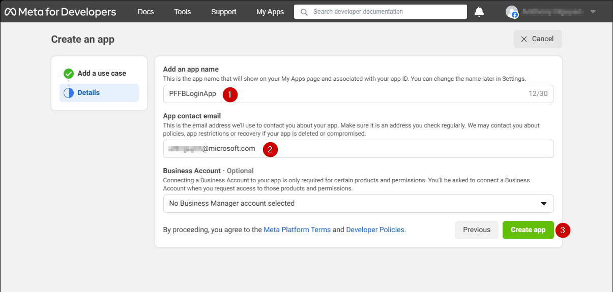
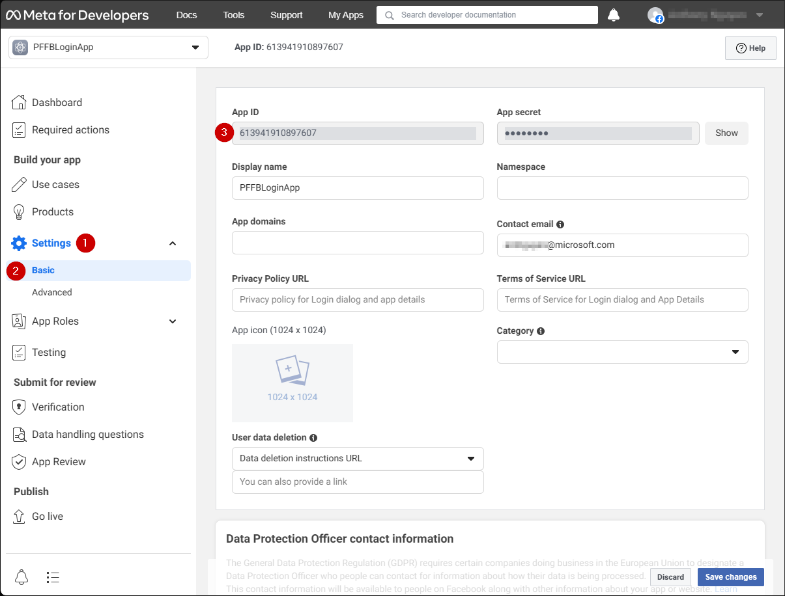
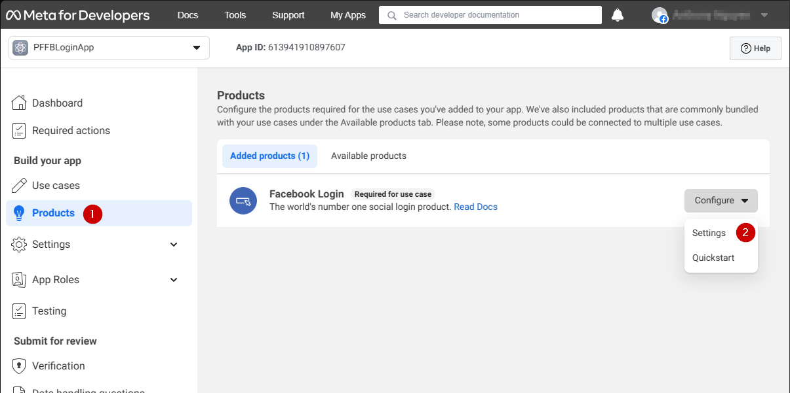
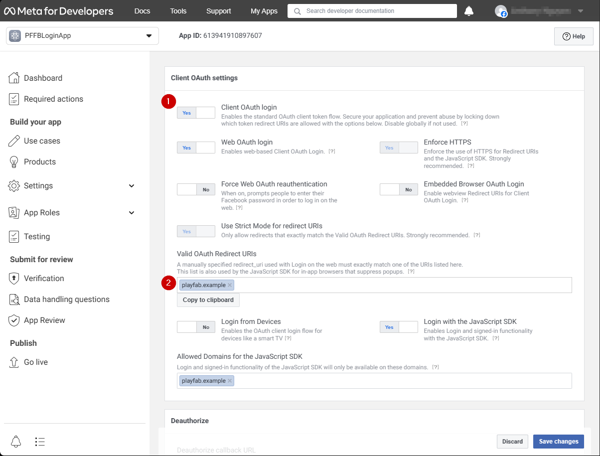
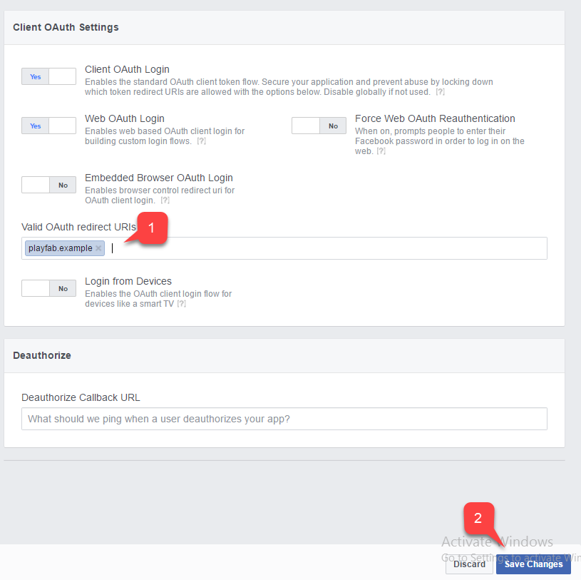
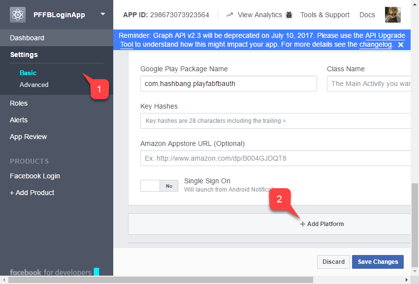
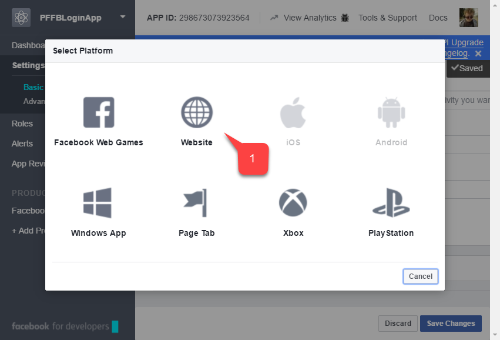
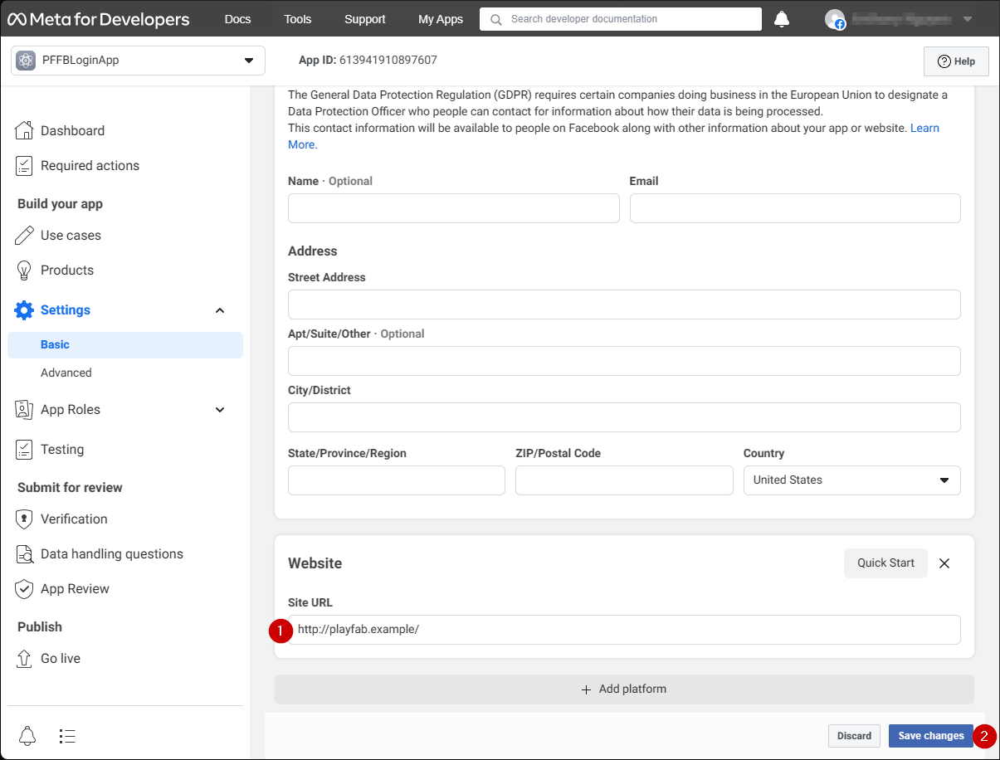
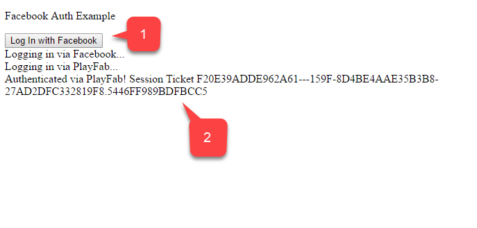

# Setting up PlayFab authentication using Facebook and HTML5

This tutorial is designed to guide you through PlayFab authentication using Facebook and HTML5/JavaScript.

## Requirements

- A [Facebook account](https://www.facebook.com/) for testing.
- A registered [PlayFab](https://playfab.com/) title.
- A familiarity with [sign-in basics and best practices](../../authentication/login/login-basics-best-practices.md).
- A minimal server, with a valid domain name to serve static HTML file.

> [!NOTE]
> If you are unsure if you have the proper requirements for this activity, please consult the [Running an HTTP server for testing](running-an-http-server-for-testing.md) tutorial.

## Server and domain

As part of the requirements to set up your PlayFab authentication,  you must have a server with a valid domain to follow. If you don't have a registered domain and remote web server yet, please follow our [Running an HTTP server for testing](running-an-http-server-for-testing.md) tutorial to run a local web server with a valid domain name.

Throughout this guide, we'll assume your domain is `['http://playfab.example'](http://playfab.example)`.

## Registering a Facebook application

Start by navigating to the [Facebook Developer Portal](https://developers.facebook.com/).

1. Select the **My Apps** button.

  

1. Select **Create App** to create a new app.

  

A new **Application** pop-up opens.

1. Enter a name for your **Application** in the field under **Add an app name**.
2. Enter a contact email address in the field under **App contact email**.
3. Select the **Create app** button to save.

> [!NOTE]
> Make sure to come up with your own unique application name and email, as shown in the example provided below.

  

1. Navigate to the **Settings** tab.
2. Select the **Basic** sub-tab.
3. Locate your **App ID**.

> [!NOTE]
> Copy your **App ID** to a safe place, we will use it later to set up the **Facebook SDK**.

  

1. Go to the menu on the left of your screen and select the **Products** item.
2. Locate **Configure** in the **Facebook Login** area and select **Settings** from the dropdown menu.

  

 The page should open to display the example shown below.

1. Verify that both the **Client OAuth** and **Web OAuth** are on (marked **Yes**).
2. Set the **Valid OAuth redirect URIs** to your own auth page **URI**.
> [!NOTE]
> This will be `playfab.example` in your case.


  

In the **Client OAuth Settings** screen:
1. Verify that **Login with the JavaScript SDK** is on (marked **Yes**)
2. Set the **Valid OAuth redirect URIs** to your own auth page **URI**.
> [!NOTE]
> This will be `playfab.example` in your case.
3. Select **Save Changes** to commit.


  

On the **Application Manager** page:

- Open **Settings/Basic (1)** in your menu.
- Select the **Add Platform (2)** button.

  

A pop-up appears on your screen:

1. Select the **Website icon**.
2. Then select **Next**.

  

The **Website** configuration panel should now appear.

1. In the **Site URL** field, enter your auth page **URL** (this is `playfab.example` in your case).
2. Select **Save changes** to commit.

  

## Testing

Use the following HTML file to test your PlayFab authentication using Facebook.

> [!NOTE]
> Make sure to replace **YOUR-APPLICATION-ID** and **YOUR-PLAYFAB-TITLE** with your own.

```html
<!DOCTYPE html>
<html>
<head>
   <script>
        // This function will be called when Facebook SDK is loaded
        window.fbAsyncInit = function() {

            // Make sure to use your own App ID for the configuration
            FB.init({
                appId      : 'YOUR-APPLICATION-ID',
                xfbml      : true,
                version    : 'v2.9'
            });

            // Record PageView event for analytics
            FB.AppEvents.logPageView();
        };

        // Facebook SDK loader. Creates a script entry to load the SDK
        (function(d, s, id){
            var js, fjs = d.getElementsByTagName(s)[0];
            if (d.getElementById(id)) {return;}
            js = d.createElement(s); js.id = id;
            js.src = "//connect.facebook.net/en_US/sdk.js";
            fjs.parentNode.insertBefore(js, fjs);
        }(document, 'script', 'facebook-jssdk'));
    </script>
    <script src="https://download.playfab.com/PlayFabClientApi.js"></script>
</head>
<body>
    <p>Facebook Auth Example</p>
    <button onclick="loginWithFacebook()">Log In with Facebook</button>
    <script>
        // This method is invoked when you press the button
        function loginWithFacebook() {
            logLine("Logging in via Facebook...");

            // Standard practice: make call to FB.login.
            // This will show Facebook popup window. To prevent browsers from locking it,
            // always make sure to call it from Button click event
            FB.login(function(response){
                if(!response.authResponse){
                    logLine("Problem authenticating via Facebook!");
                } else {
                    loginWithPlayfab(response.authResponse.accessToken);
                }
            });
        }

        function loginWithPlayfab(accessToken){

            logLine("Logging in via PlayFab...");

            // When given accessToken, make call to LoginWithFacebook API Call
            // Make sure to use your own PlayFab Title ID
            PlayFabClientSDK.LoginWithFacebook({
                AccessToken: accessToken,
                TitleId: "YOUR-PLAYFAB-TITLE",
                CreateAccount: true
            }, onPlayFabResponse);
        }

        // Handles response from playfab.
        function onPlayFabResponse(response, error) {
            if (response)
                logLine("Response: " + JSON.stringify(response));
            if (error)
                logLine("Error: " + JSON.stringify(error));
        }

        function logLine(message) {
            var textnode = document.createTextNode(message);
            document.body.appendChild(textnode);
            var br = document.createElement("br");
            document.body.appendChild(br);
        }
    </script>
</body>
</html>
```

Request the following file from your server using the domain you set up during **Facebook Application** configuration (`playfab.example` in our case).

1. Once the **Facebook Auth Example** page opens, select **Log In with Facebook** button.
2. Follow any Facebook instructions in the pop-up window.

Watch the output.

  

You'll obtain a PlayFab session ticket. At this point you have successfully configured PlayFab and Facebook authentication using HTML5 and JavaScript.
