# Setting up PlayFab authentication using Facebook and Unity

This tutorial guides you through an example of PlayFab authentication using **Facebook** and **Unity**.

## Requirements

- [Unity 5+](https://unity3d.com/) and a created project.
- [Facebook account](https://www.facebook.com/) for testing.
- [Facebook SDK](https://developers.facebook.com/docs/unity/) imported into the project.
- Registered [PlayFab](https://playfab.com/) title.
- [PlayFab SDK](https://api.playfab.com/downloads/unity-v2ap) imported into the project with a configured title reference.
- Familiarity with [Login basics and Best Practices](../../authentication/login/login-basics-best-practices.md).

## Implementation

### Registering a Facebook application

Start by navigating to the [Facebook Developer Portal](https://developers.facebook.com/):

- Move your mouse over the **My Apps** button **(1)**.
- Select **Add a New App (2)**, as shown on the picture below.

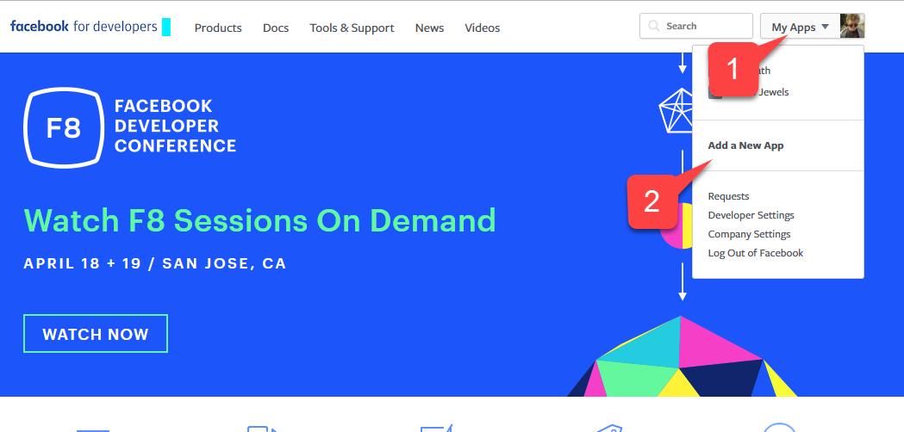  

A new **Application** pop-up will open.

- Enter a name for your **Application (1)**.
- Enter a **Contact Email (2)**.

> [!NOTE]
> Make sure to come up with your own *unique* **Application Name** and **Email**, as shown on the picture below.

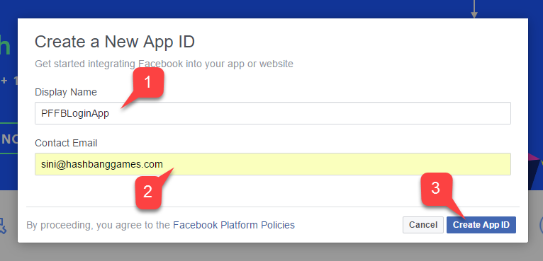  

- Navigate to the **Settings** tab **(1)**.
- Then move to the **Basic** sub-tab **(2)**.
- Locate your **Application ID (3)**.
- Copy it somewhere to a safe place that is easily accessed.
We will use it later to set up the **Facebook SDK**.

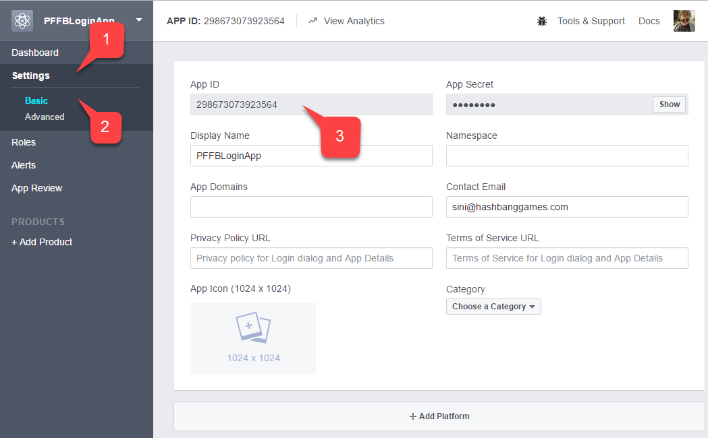  

- Navigate to the [Facebook Access Token Tool](https://developers.facebook.com/tools/accesstoken/).
- Locate your **App** in the list **(1)**.
- Verify that it has an assigned **User Token (2)**.

> [!NOTE]
> If you *do not* have an assigned user token, request one using the button to the right of your screen. Refer to this page whenever you need a fresh user token. If authorization fails during testing on a PC, token expiration may be the most likely reason. Refresh the page to get a new user token and test again.

  

- On your **Application Manager** page, navigate to **+ Add Products (1)**.
- Locate the **Facebook Login** entry and select **Get Started (2)**.

  

A page with **Login** product settings should open.

- Make sure that you have the **Login** product **Settings** page opened **(1)**.
- Verify that both **Client OAuth** and **Web OAuth** are on **(2)**.

  

### Setting up Facebook SDK

Open your **Unity Project**:

- Select **Facebook** in the file menu **(1)**.
- Then select **Edit Settings (2)**.

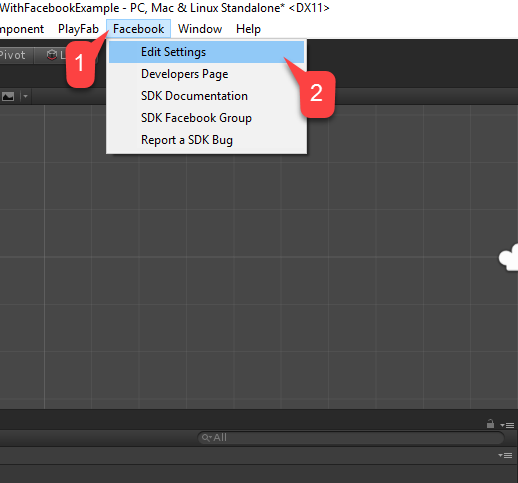  

The **Inspector** window will display the current **Facebook SDK** configuration.

- Enter your **Application ID** in the corresponding field, as shown in the following picture.

  

### Simple authentication script

Create a new **Game Object**, and rename it to **PlayfabFacebookAuthExample**, as shown in the following picture.

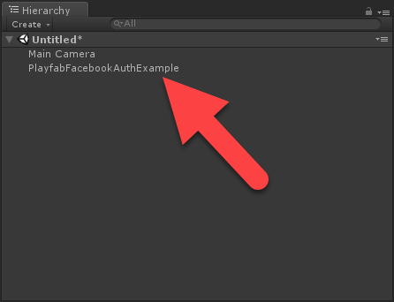  

Create a script called **PlayfabFacebookAuthExample.cs (1)**, and add it to the **Game Object (2)** as shown on the picture below.


Inside  **PlayfabFacebookAuthExample.cs** place the following code.

```csharp
// Import statements introduce all the necessary classes for this example.
using Facebook.Unity;
using PlayFab;
using PlayFab.ClientModels;
using UnityEngine;
using LoginResult = PlayFab.ClientModels.LoginResult;

public class PlayfabFacebookAuthExample : MonoBehaviour
{
    // holds the latest message to be displayed on the screen
    private string _message;

    public void Start()
    {
        SetMessage("Initializing Facebook..."); // logs the given message and displays it on the screen using OnGUI method

        // This call is required before any other calls to the Facebook API. We pass in the callback to be invoked once initialization is finished
        FB.Init(OnFacebookInitialized);  

    }

    private void OnFacebookInitialized()
    {
        SetMessage("Logging into Facebook...");

        // Once Facebook SDK is initialized, if we are logged in, we log out to demonstrate the entire authentication cycle.
        if (FB.IsLoggedIn)
            FB.LogOut();

        // We invoke basic login procedure and pass in the callback to process the result
        FB.LogInWithReadPermissions(null, OnFacebookLoggedIn);
    }

    private void OnFacebookLoggedIn(ILoginResult result)
    {
        // If result has no errors, it means we have authenticated in Facebook successfully
        if (result == null || string.IsNullOrEmpty(result.Error))
        {
            SetMessage("Facebook Auth Complete! Access Token: " + AccessToken.CurrentAccessToken.TokenString + "\nLogging into PlayFab...");

            /*
             * We proceed with making a call to PlayFab API. We pass in current Facebook AccessToken and let it create
             * and account using CreateAccount flag set to true. We also pass the callback for Success and Failure results
             */
            PlayFabClientAPI.LoginWithFacebook(new LoginWithFacebookRequest { CreateAccount = true, AccessToken = AccessToken.CurrentAccessToken.TokenString},
                OnPlayfabFacebookAuthComplete, OnPlayfabFacebookAuthFailed);
        }
        else
        {
            // If Facebook authentication failed, we stop the cycle with the message
            SetMessage("Facebook Auth Failed: " + result.Error + "\n" + result.RawResult, true);
        }
    }

    // When processing both results, we just set the message, explaining what's going on.
    private void OnPlayfabFacebookAuthComplete(LoginResult result)
    {
        SetMessage("PlayFab Facebook Auth Complete. Session ticket: " + result.SessionTicket);
    }

    private void OnPlayfabFacebookAuthFailed(PlayFabError error)
    {
        SetMessage("PlayFab Facebook Auth Failed: " + error.GenerateErrorReport(), true);
    }

    public void SetMessage(string message, bool error = false)
    {
        _message = message;
        if (error)
            Debug.LogError(_message);
        else
            Debug.Log(_message);
    }

    public void OnGUI()
    {
        var style = new GUIStyle { fontSize = 40, normal = new GUIStyleState { textColor = Color.white }, alignment = TextAnchor.MiddleCenter, wordWrap = true };
        var area = new Rect(0,0,Screen.width,Screen.height);
        GUI.Label(area, _message,style);
    }
}
```

## Testing

### Running the **Application** in the editor

- Select the **Play** button **(1)**.
- Once **Facebook** is initialized (and an authentication call is made), a **Facebook** authentication dialog will appear in your game view.
- Enter the **User Token (2)** and select the **Send Success** button **(3)**, as shown in the following picture.

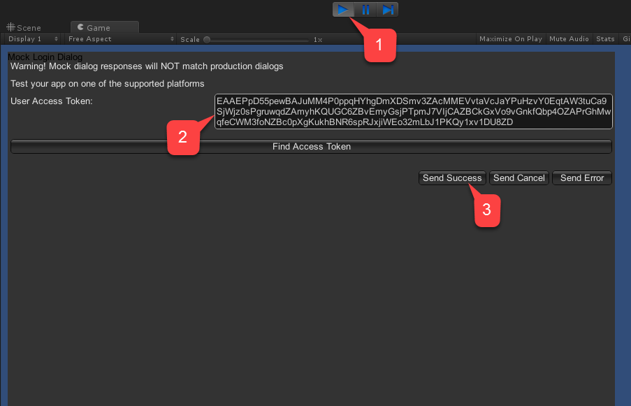  

- Check the console output. It should render our debug statements, as shown on the picture below.
- If you see no errors, this means that authentication was successful.

  

### Running the application on Android

Before launching the application on **Android**, you are required to perform additional configuration steps:

- First, you need to ensure you have the **Android** platform selected, and the unique **Package ID** set (as indicated in the example below.

> [!NOTE]
> Please make sure to create your own *unique* **Package ID**.

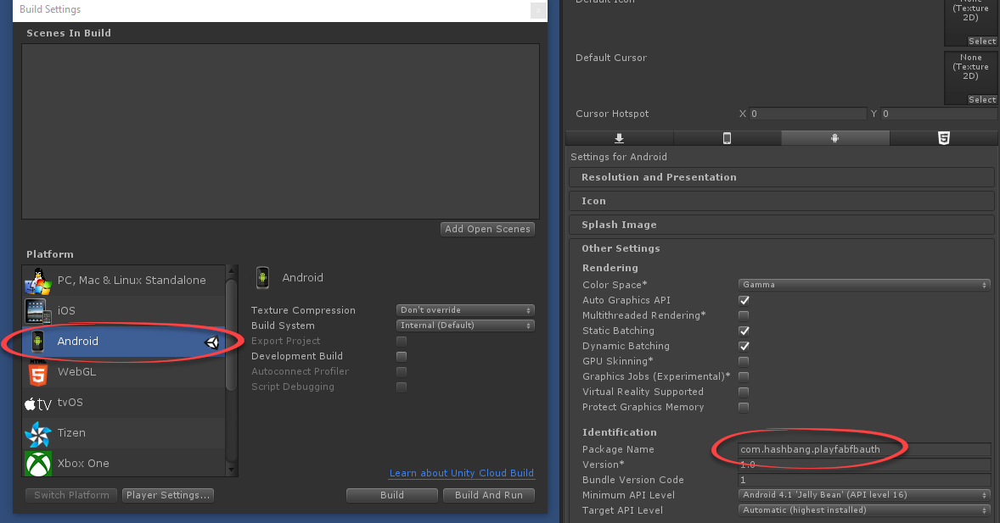  

> [!TIP]
> **Optional step**:  Install [Open SSL](https://wiki.openssl.org/index.php/Binaries) and add it to the **PATH** environment variable. If it is missing, **Unity** will produce a harmless error during the build. This error does *not* stop the build, or effect the execution.

Next, in your **Facebook Application** console:

- Navigate to **Basic** settings **(1)**.
- Select **+ Add Platform (2)**, as indicated in the example provided below.

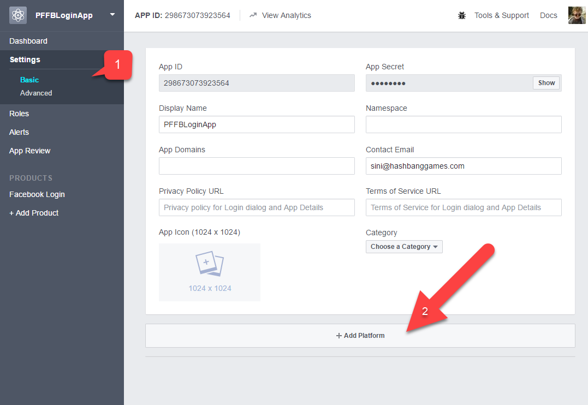  

- Then select **Android** from the list of available platforms.

  

A panel with platform-specific settings will appear.

- Fill in your **Package ID**.
- Select **Save** (the **Save** button is hidden in the bottom right corner of the page).


Build and run the **Application** normally on your **Android** Device.

- The **Application** should welcome you with a **Facebook** sign-in page.
- Once you sign in, watch the message on the screen as it changes.
- Finally, you should be presented with a message indicating successful authentication in PlayFab. The entire procedure is illustrated in the example provided below.

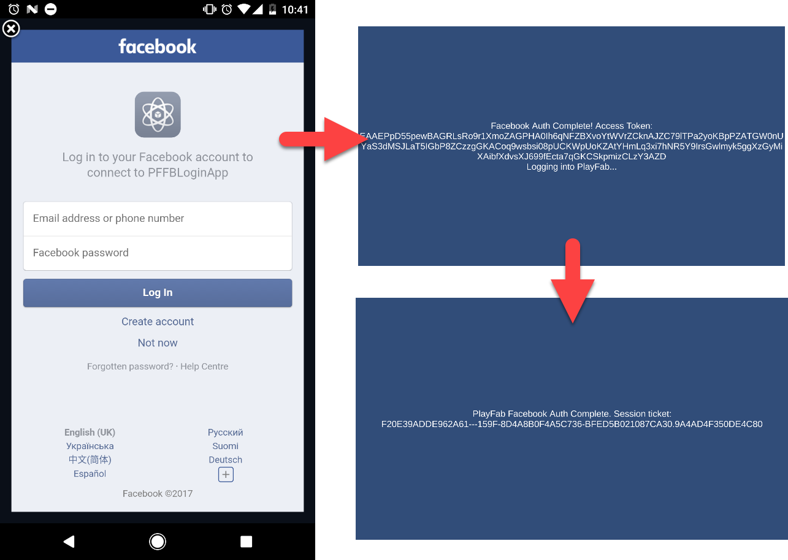

### Running the Application on iOS

Before launching the **Application** on **iOS**, you have to perform additional configuration steps.

- First, you must ensure you have the **iOS** platform selected **(1)**.
- And a unique **Bundle ID** set **(4)** as indicated in the example provided below.
- Please make sure to create your own *unique* **Package ID**.


Next, in your **Facebook Application Console**:

- Navigate to **Basic** settings **(1)**.
- Select **+ Add Platform (2)**, as indicated in the example provided below.

  

- Select **iOS** from the list of available platforms.

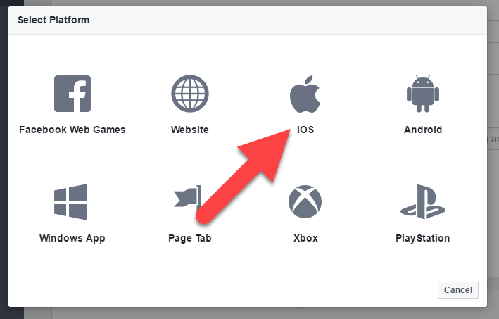  

A panel with platform-specific settings will appear.

- Fill in your **Package ID**.
- Select the **Save** button (the **Save** button is hidden in the bottom right corner of the page).

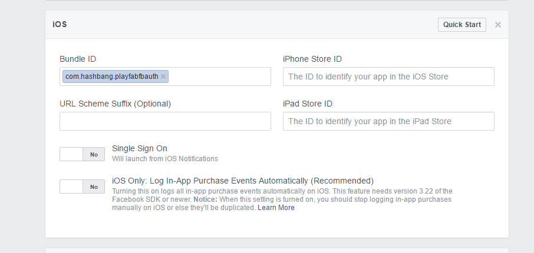

- Next, build the application as usual.
- Once this is done, open the **Project** using **XCode**.

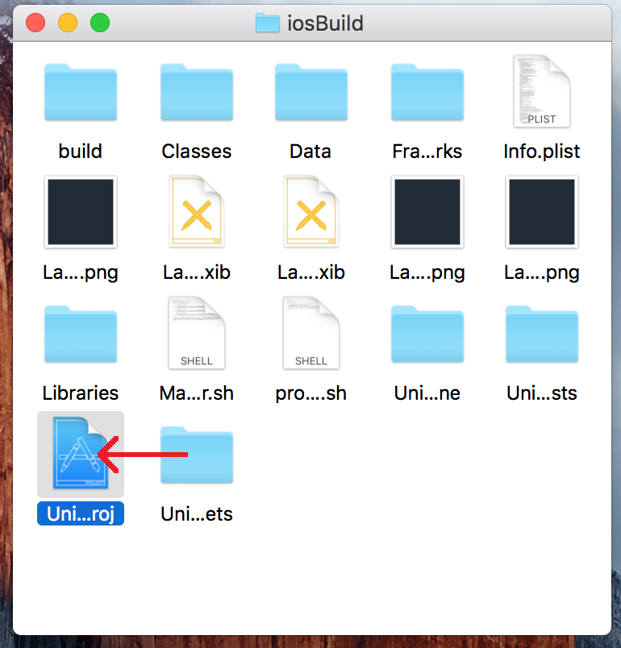

- Select the **Project** to open **Project Settings**.
- Verify that the **Bundle ID** matches your unique **Package ID**.

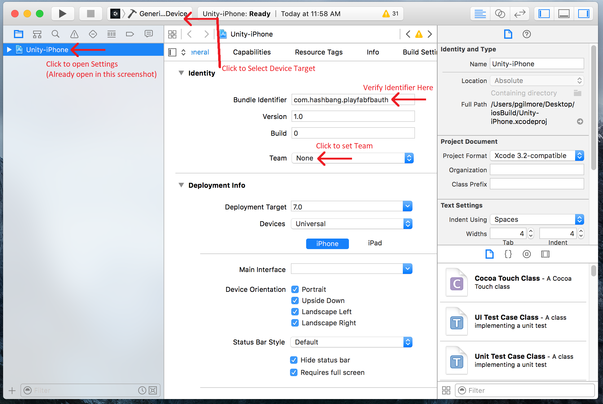

- Make sure to select the correct device.

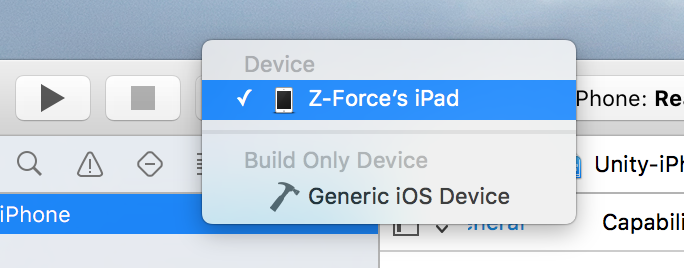

- And select the correct **Identity Team**.

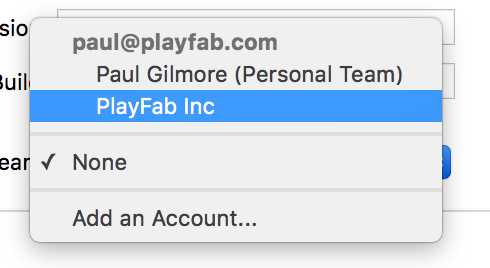

Finally, run the application as normal.

- Once started, the application will allow you to log in to **Facebook** using the web browser.
- Once done, PlayFab authentication will be invoked, and a message will indicate the result.


### Checking through PlayFab Game Manager

Open your **PlayFab** title in Game Manager.

- Navigate to the dashboard.
- Refer to the **PlayStream Debugger** panel to check for the latest events. You should see the **Facebook** authentication event as displayed in the following example.

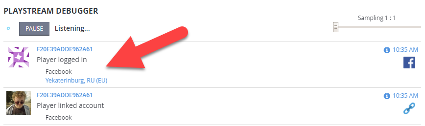

At this point you have successfully integrated **Facebook Authentication** for PlayFab.
