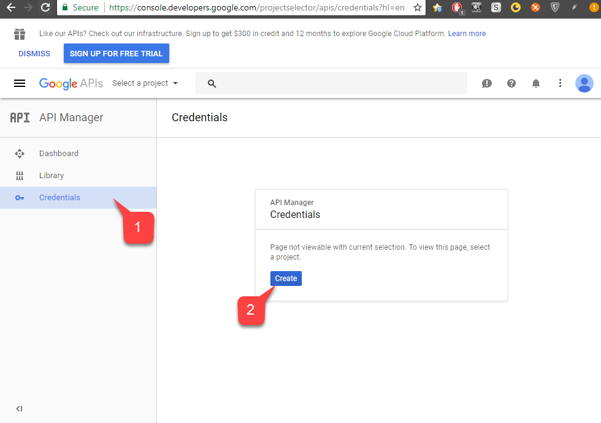
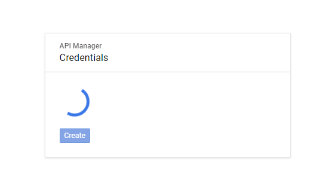

# Setting up PlayFab authentication using Google and HTML5

This tutorial guides you through the process of PlayFab authentication using Google and HTML5/JavaScript.

## Requirements

You will need:

- A [Google account](https://google.com/) for testing.
- A Registered `[PlayFab](https://playfab.com/)` title.
- Familiarity with [Login basics and Best Practices](../../authentication/login/login-basics-best-practices.md).
- At the minimum, a server with a valid domain name to act as a static HTML file. Consult the [Running an HTTP server for testing](running-an-http-server-for-testing.md) tutorial for information on how to set one up.

## Server and domain

This guide requires a server with a valid domain to follow. If you do not have a registered domain and remote web server yet, please follow our [Running an HTTP server for testing](running-an-http-server-for-testing.md) tutorial for information on how to set one to run a local web server with a valid domain name.

Throughout this guide, we will assume your domain is `[http://playfab.example](http://playfab.example)`.

## Registering a Google API project

Start by navigating to the [Google API Console](https://console.developers.google.com/):

1. Navigate to **Credentials** and select it.
2. In the **Credentials** panel to the right, select the **Create** button.

  

1. Fill in the field under **Project Name**.
2. Select the **Create** button.

  

> [!NOTE]
> It is normal for **API Manager** to take 10-20 seconds to generate the project.

  

Once the Project is created:

1. Navigate to the **OAuth consent screen**.
2. Make sure the correct email is selected.
3. Add a **Name** for your **Application**.
4. Select the **Save** button.

  

1. Next, navigate to **Credentials**.
2. Select **Create credentials**.
3. Then select **OAuth client ID**.

  

1. Select **Web Application** as your **Application type**.
2. Give your application a **Name**.
3. Add your domain to **Authorized JavaScript origins**  - `[PlayFab](http://playfab.example)` in our case.
4. Finally, select the **Create** button to commit your changes.

  

On the **OAuth client** screen shown below, the Google API Manager reveals two important pieces of information:

1. The **client ID**
2. The **client secret**.

> [!NOTE]
> Be sure to copy and save these values in a safe place that is easily accessible, as they will be used in the authorization process shown later in this tutorial.

  

Go to the PlayFab **Game Manager** page for your title.

1. Navigate to **Add-ons** in the menu.
2. Locate and open the **Google Add-on** icon/link.

  

1. Fill in the **Client ID**.
2. Fill in the **Client secret**.
3. Then select the **Install Google** button.

  

> [!NOTE]
> As of July 2017, **Google API Manager** has a bad habit of *not* hooking the **Allowed JS** origin domain properly. If you receive the following error:  
> **"idpiframe_initialization_failed", details: "Not a valid origin for the client: somedomain.com..."**  
> Please remove the credentials and recreate them. *There is no need to delete the entire project - just the credentials.*

## Testing using an access token

In this example, we show how to test using the classic access token approach. Use the HTML file provided below for your testing.

> [!NOTE]
> Please *make sure* to replace `YOUR_CLIENT_ID` and `YOUR_PLAYFAB_TITLE` with your own values.

```html
<!DOCTYPE html>
<html>
<head>
    <!-- Special meta tag allows you to pass Google Client ID. Replace the content attribute value with your own Client Id -->
    <meta name="google-signin-client_id" content="YOUR_CLIENT_ID"><!-- // TODO: PUT YOUR GOOGLE CLIENT_ID HERE! -->
    <!-- Load Google platform SDK-->
    <script src="https://apis.google.com/js/platform.js" async defer></script>
    <!-- Load PlayFab Client JavaScript SDK -->
    <script src="https://download.playfab.com/PlayFabClientApi.js"></script>
</head>
<body>
    <p>Google Access Token Auth Example</p>
    <!-- Neat Google button gets styled automatically when Google platform SDK is loaded -->
    <div class="g-signin2" data-onsuccess="onSignIn"></div>
    <script>
        // Invoked when user has signed in with Google
        function onSignIn() {
            // Retrieve access token
            var accessToken = gapi.auth2.getAuthInstance().currentUser.get().getAuthResponse(true).access_token;

            // Execute LoginWithGoogleAccount API call using the access token. Please replace TitleID with your own.
            logLine("Attempting PlayFab Sign-in");
            PlayFabClientSDK.LoginWithGoogleAccount({
                ServerAuthCode: accessToken,
                CreateAccount : true,
                TitleId: "YOUR_PLAYFAB_TITLE", // TODO: PUT YOUR TITLE ID HERE!
            }, onPlayFabResponse);
        }

        // Handles response from playfab.
        function onPlayFabResponse(response, error) {
            if (response)
                logLine("Response: " + JSON.stringify(response));
            if (error)
                logLine("Error: " + JSON.stringify(error));
        }

        function logLine(message) {
            var textnode = document.createTextNode(message);
            document.body.appendChild(textnode);
            var br = document.createElement("br");
            document.body.appendChild(br);
        }
    </script>
</body>
</html>
```

Remember to open this page using your web server, and make sure to access this page using the URL you specified, while configuring Google Project, (`[PlayFab](http://playfab.example)` in our case).

1. Once the page opens, select **G Signed In**, and follow the general Google authentication flow.
2. When this is finished, the script will try to authenticate on the PlayFab side and output the result.

  

> [!NOTE]
> If you *already have* a Google authentication session running, you will not have to select **G Signed In**. Everything will happen automatically.
