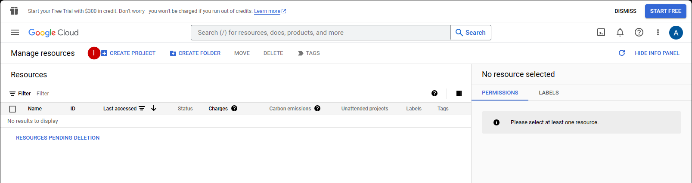
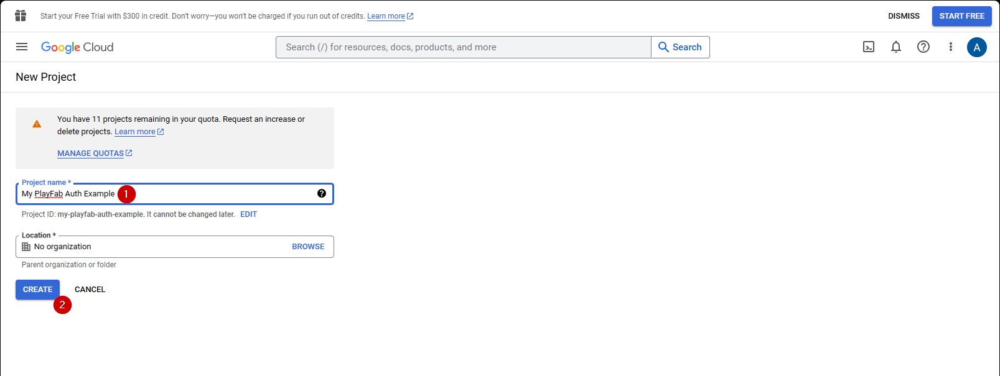
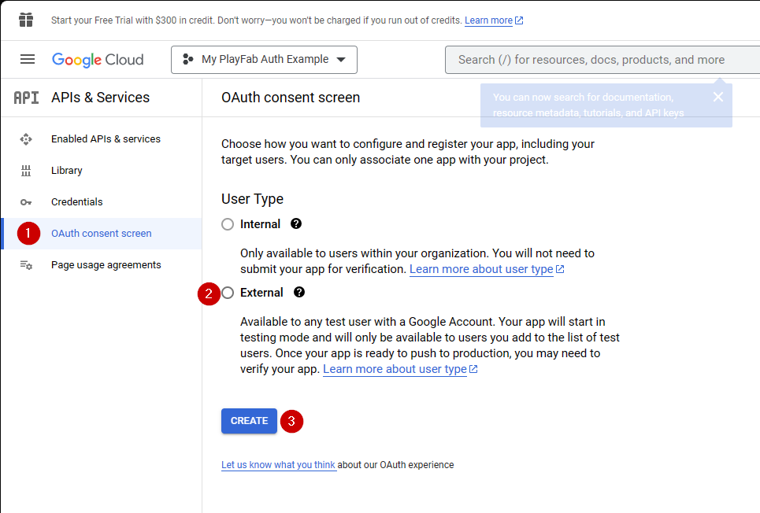
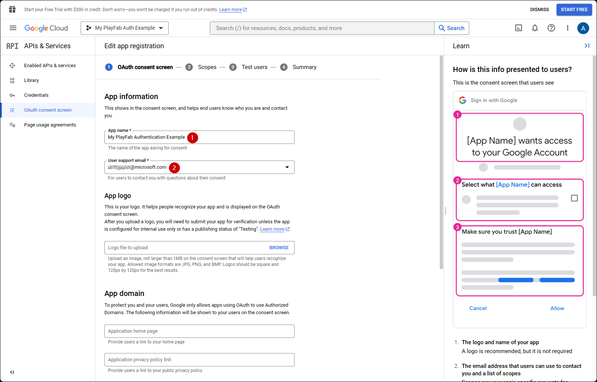
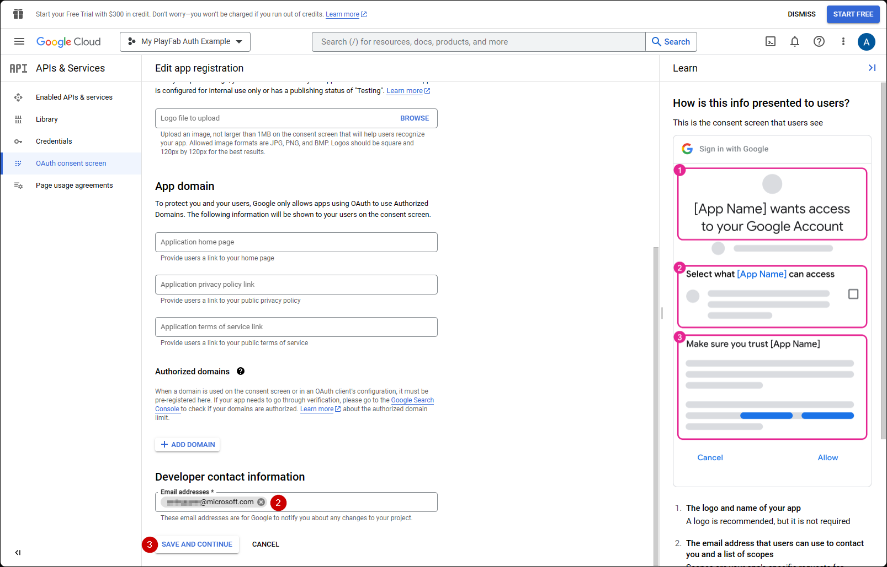
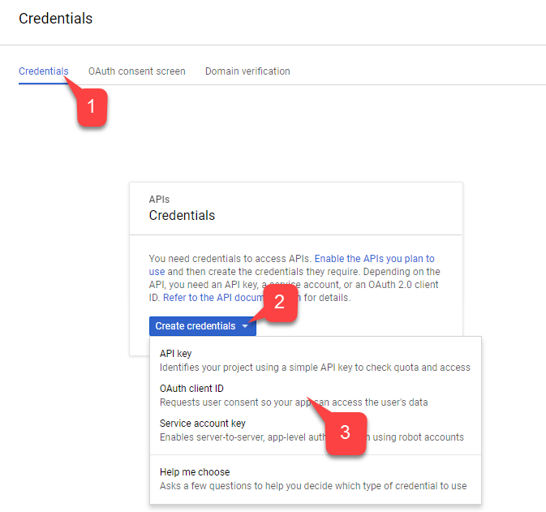
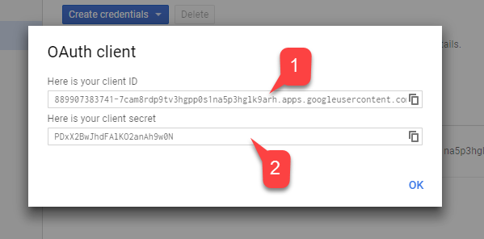
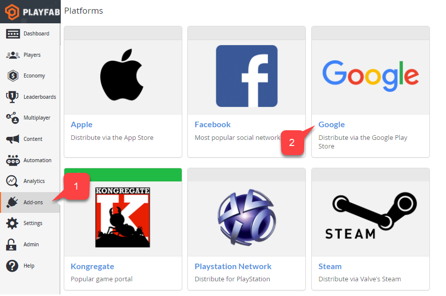
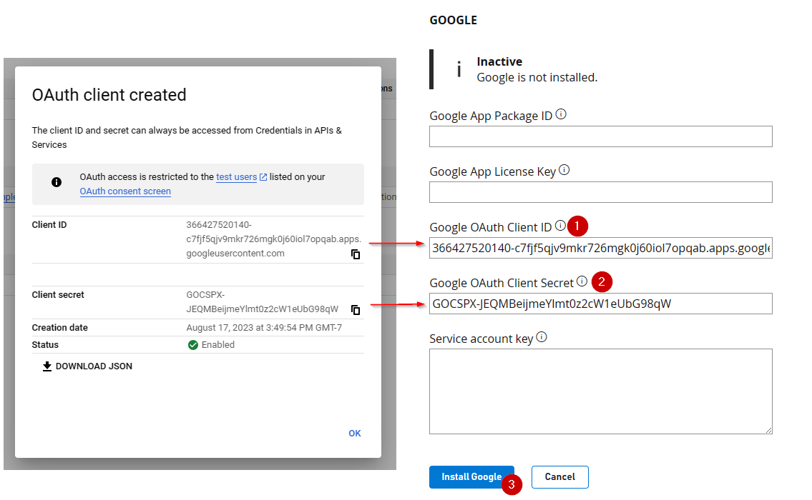
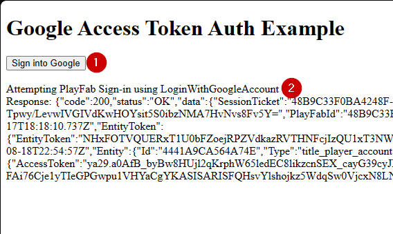

# Setting up PlayFab authentication using Google and HTML5

This tutorial guides you through the process of PlayFab authentication using Google and HTML5/JavaScript.

## Requirements

You will need:

- A [Google account](https://google.com/) for testing.
- A Registered `[PlayFab](https://playfab.com/)` title.
- Familiarity with [Login basics and Best Practices](../../authentication/login/login-basics-best-practices.md).
- At the minimum, a server with a valid domain name to act as a static HTML file. Consult the [Running an HTTP server for testing](running-an-http-server-for-testing.md) tutorial for information on how to set one up.

## Server and domain

This guide requires a server with a valid domain to follow. If you do not have a registered domain and remote web server yet, please follow our [Running an HTTP server for testing](running-an-http-server-for-testing.md) tutorial for information on how to set one to run a local web server with a valid domain name.

Throughout this guide, we will assume your domain is `[http://playfab.example](http://playfab.example)`.

## Registering a Google API project

Start by navigating to the [Google API Console](https://console.developers.google.com/):

1. Navigate to **CREATE PROJECT** and select it. 


  

1. Fill in the field under **Project Name**.
2. Select the **Create** button.

  

> [!NOTE]
> It is normal for **API Manager** to take 10-20 seconds to generate the project.


Once the Project is created:

1. Navigate to the **OAuth consent screen**.
2. Select **External** under User Type
3. Then select **Create**.

  

1. Fill out an App Name
2. Make sure there are emails for **user suport email** and **Developer Contact Email**
3. Then select **SAVE AND CONTINUE**




1. Next, navigate to **Credentials**.
2. Select **Create credentials**.
3. Then select **OAuth client ID**.

  

1. Select **Web Application** as your **Application type**.
2. Give your application a **Name**.
3. Add your domain to **Authorized JavaScript origins**  - `[PlayFab](http://playfab.example.com)` in our case.
4. Finally, select the **Create** button to commit your changes.

  

On the **OAuth client** screen shown below, the Google API Manager reveals two important pieces of information:

1. The **client ID**
2. The **client secret**.

> [!NOTE]
> Be sure to copy and save these values in a safe place that is easily accessible, as they will be used in the authorization process shown later in this tutorial.

  

Go to the PlayFab **Game Manager** page for your title.

1. Navigate to **Add-ons** in the menu.
2. Locate and open the **Google Add-on** icon/link.

  

1. Fill in the **Client ID**.
2. Fill in the **Client secret**.
3. Then select the **Install Google** button.

  

> [!NOTE]
> As of July 2017, **Google API Manager** has a bad habit of *not* hooking the **Allowed JS** origin domain properly. If you receive the following error:  
> **"idpiframe_initialization_failed", details: "Not a valid origin for the client: somedomain.com..."**  
> Please remove the credentials and recreate them. *There is no need to delete the entire project - just the credentials.*

## Testing using an access token

In this example, we show how to test the LoginWithGoogleAccount API using the classic access token approach. Use the HTML code provided below for your testing.

> [!NOTE]
> Please *make sure* to replace `YOUR_CLIENT_ID` and `YOUR_PLAYFAB_TITLE` with your own values.

> [!Note]
> the **AccessToken** param is missing in the **LoginWithGoogleAccountRequest** object in the TypeScript typings files. If you are using TypeScript with the Node SDK, you can create a custom type
>```
>interface LoginRequest extends PlayFabClientModels.LoginWithGoogleAccountRequest { AccessToken: string; }
>```
>and cast the type when using the API
>```
>PlayFabClient.LoginWithGoogleAccount( { AccessToken: accessToken, CreateAccount: true, } as LoginRequest, onPlayFabResponse);
>```
```html
<!DOCTYPE html>
<html>
  <head>
    <script src="https://accounts.google.com/gsi/client" onload="initClient()" async defer></script>
    <script src="https://download.playfab.com/PlayFabClientApi.js"></script>
  </head>
  <body>
    <script>
      var client;
      function initClient() {
          console.log("Initializing Google token client on page load");
          client = google.accounts.oauth2.initTokenClient({
              client_id: "YOUR_CLIENT_ID", // TODO: PUT YOUR GOOGLE CLIENT_ID HERE!
              callback: "onTokenResponse",
              scope: "https://www.googleapis.com/auth/userinfo.profile",
              callback: (tokenResponse) => {
                  access_token = tokenResponse.access_token;
                  onSignIn();
              }
          });
      }

      function getToken() {
        client.requestAccessToken();
      }

      // Invoked after user has signed in with Google
      function onSignIn() {
          // Execute LoginWithGoogleAccount API call using the Google access token. Please replace TitleId.
          logLine("Attempting PlayFab Sign-in using LoginWithGoogleAccount");
          PlayFabClientSDK.LoginWithGoogleAccount({
              AccessToken: access_token, // This access token is generated after a user has signed into Google
              CreateAccount: true,
              TitleId: "YOUR_PLAYFAB_TITLE", // TODO: PUT YOUR TITLE ID HERE!
          }, onPlayFabResponse);
      }

      // Handles response from PlayFab
      function onPlayFabResponse(response, error) {
          if (response)
              logLine("Response: " + JSON.stringify(response));
          if (error)
              logLine("Error: " + JSON.stringify(error));
      }

      function logLine(message) {
          var textnode = document.createTextNode(message);
          document.body.appendChild(textnode);
          var br = document.createElement("br");
          document.body.appendChild(br);
      }
    </script>
    <h1>Google Access Token Auth Example</h1>
    <!-- Clicking this button will prompt the user to sign into Google. Once they have signed into Google, LoginWithGoogleAccount is automatically called. -->
    <button onclick="getToken();">Sign into Google</button><br><br>
  </body>
</html>
```


<b>Testing using the (deprecated) Google Sign-in Platform library</b>
> [!NOTE]
>  The sample below uses the Google Sign-In platform library. **According to the [Google Identity public documentation site](https://developers.google.com/identity/gsi/web/guides/migration), the Google Sign-In JavaScript platform library for Web will be deprecated March 31, 2023**. This sample will not work for newly created Google clients moving forward - please refer to the prior code sample, which uses the newer Google Identity Services library!
    
```html
<!DOCTYPE html>
<html>
<head>
    <!-- Special meta tag allows you to pass Google Client ID. Replace the content attribute value with your own Client Id -->
    <meta name="google-signin-client_id" content="YOUR_CLIENT_ID"><!-- // TODO: PUT YOUR GOOGLE CLIENT_ID HERE! -->
    <!-- Load Google platform SDK-->
    <script src="https://apis.google.com/js/platform.js" async defer></script>
    <!-- Load PlayFab Client JavaScript SDK -->
    <script src="https://download.playfab.com/PlayFabClientApi.js"></script>
</head>
<body>
    <p>Google Access Token Auth Example</p>
    <!-- Neat Google button gets styled automatically when Google platform SDK is loaded -->
    <div class="g-signin2" data-onsuccess="onSignIn"></div>
    <script>
        // Invoked when user has signed in with Google
        function onSignIn() {
            // Retrieve access token
            var accessToken = gapi.auth2.getAuthInstance().currentUser.get().getAuthResponse(true).access_token;
            // Execute LoginWithGoogleAccount API call using the access token. Please replace TitleID with your own.
            logLine("Attempting PlayFab Sign-in using LoginWithGoogleAccount");
            PlayFabClientSDK.LoginWithGoogleAccount({
                ServerAuthCode: accessToken,
                CreateAccount : true,
                TitleId: "YOUR_PLAYFAB_TITLE", // TODO: PUT YOUR TITLE ID HERE!
            }, onPlayFabResponse);
        }

        // Handles response from PlayFab
        function onPlayFabResponse(response, error) {
            if (response)
                logLine("Response: " + JSON.stringify(response));
            if (error)
                logLine("Error: " + JSON.stringify(error));
        }

        function logLine(message) {
            var textnode = document.createTextNode(message);
            document.body.appendChild(textnode);
            var br = document.createElement("br");
            document.body.appendChild(br);
        }
    </script>
</body>
</html>
```

Remember to open this page using your web server, and make sure to access this page using the URL you specified, while configuring Google Project, (`[PlayFab](http://playfab.example)` in our case).

1. Once the page opens, select **G Signed In**, and follow the general Google authentication flow.
2. When this is finished, the script will try to authenticate on the PlayFab side and output the result.

  

> [!NOTE]
> If you *already have* a Google authentication session running, you will not have to select **G Signed In**. Everything will happen automatically.
