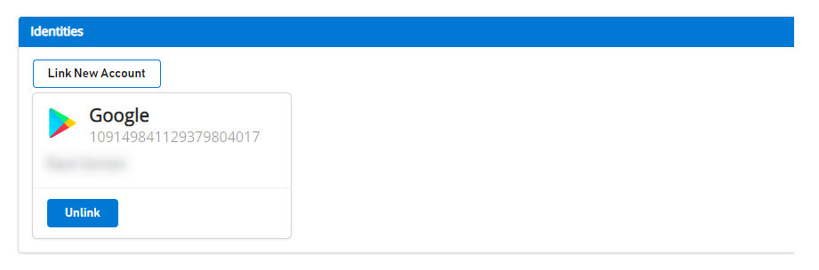
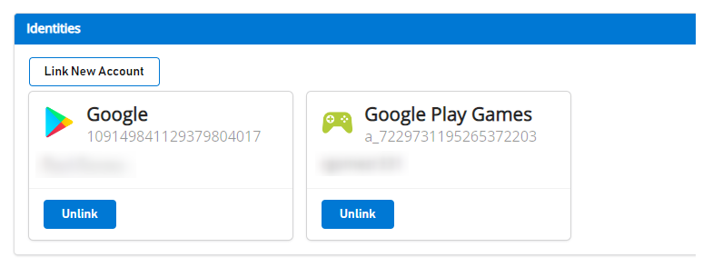
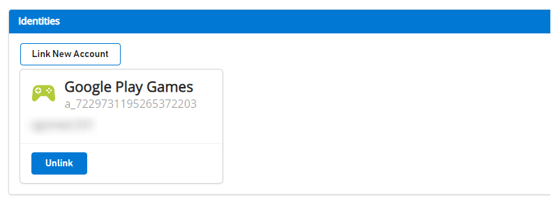

# LoginWithGooglePlayGamesServices API Migration Procedure

The migration consists of switching to LoginWithGooglePlayGamesServices since Google is encouraging developers to migrate to this way of authentication. After migrating the players, there will be no dependency on LoginWithGoogleAccount API and developers should be able to upgrade to the latest plugin version.

For more information, see [Google Official Documentation](https://developers.google.com/games/services/android/signin#migrate_to_play_games_services_sign_in_v2).

## High Level Steps

1. Choose the right version of "Play Games Plugin for Unity".
1. Initialize Play Games Platform and Authenticate user.
1. Login into PlayFab using LoginWithGoogleAccount.
1. Link your Google Play Games profile with PlayFab Player account.
1. Verify user can log in using LoginWithGooglePlayGamesServices API.
1. (Optional) Unlink your Google Account profile from the PlayFab Player account.

## Migration Steps

### Choose the right version of "Play Games Plugin for Unity"

 Newest versions of the plugin don't work for migration since Google isn't allowing to request extra scopes anymore, so PlayFab's LoginWithGoogleAccount API no longer works.

 These migration steps were tested and documented using version 0.10.14 of "Play Games Plugin for Unity", which can be found here: [playgameservices/play-games-plugin-for-unity at v10.14 (github.com)](https://github.com/playgameservices/play-games-plugin-for-unity/tree/v10.14)

 For plugin installation and configuration steps, refer to plugin's  [README](https://github.com/playgameservices/play-games-plugin-for-unity/blob/v10.14/README.md)

### Initialize Play Games Platform and Authenticate Player

 Refer to [Configuration & Initialization Play Games Services section from README](https://github.com/playgameservices/play-games-plugin-for-unity/blob/v10.14/README.md#configuration--initialization-play-game-services) and request "profile" scope as part of the PlayGamesClientConfiguration.

```csharp
 PlayGamesClientConfiguration config = new PlayGamesClientConfiguration.Builder()
     .AddOauthScope("profile")
     .RequestServerAuthCode(false)
     .Build();
 
 PlayGamesPlatform.InitializeInstance(config);
 // recommended for debugging:
 PlayGamesPlatform.DebugLogEnabled = true;
 // Activate the Google Play Games platform
 PlayGamesPlatform.Activate();
 
 // authenticate user:
 PlayGamesPlatform.Instance.Authenticate(SignInInteractivity.CanPromptOnce, (SignInStatus result) => {
     if (result == SignInStatus.Success)
     {
         Debug.Log("Authentication Succeeded.");
     }
     else
     {
         Debug.Log("Authentication Failed. SignInStatus: " + result);
     }
 });
```

### Login into PlayFab using LoginWithGoogleAccount

 Log in to existing Player's account using  [LoginWithGoogleAccount](https://learn.microsoft.com/rest/api/playfab/client/authentication/login-with-google-account?view=playfab-rest) Authentication API. In order to login successfully, you need to provide a Server Auth Token, which can be requested through GetServerAuthCode method.

```csharp
 public void PlayFabLoginWithGoogleAccount()
 {
     var serverAuthCode = PlayGamesPlatform.Instance.GetServerAuthCode();

     var request = new LoginWithGoogleAccountRequest
     {
         ServerAuthCode = serverAuthCode,
         TitleId = PlayFabSettings.TitleId
     };
 
     PlayFabClientAPI.LoginWithGoogleAccount(request, OnLoginWithGoogleAccountSuccess, OnLoginWithGoogleAccountFailure);
 }

 private void OnLoginWithGoogleAccountSuccess(LoginResult result)
 {
     Debug.Log("PlayFab LoginWithGoogleAccount Success.");
 }

 private void OnLoginWithGoogleAccountFailure(PlayFabError error)
 {
     Debug.Log("PlayFab LoginWithGoogleAccount Failure: " + error.GenerateErrorReport());
 }
```

 Before doing any migration, a user that is linked to the Google Account shows up like this on [Game Manager](https://developer.playfab.com):



### Link player's Google Play Games profile with PlayFab Player account

 In this step, you link the player's Google Play Games account with the existing player's PlayFab account that was previously linked only to the Google Account.

 ```csharp
 public void LinkGooglePlayGamesAccount()
 {
     PlayGamesPlatform.Instance.GetAnotherServerAuthCode(true, (serverAuthCode) => {
 
         var linkRequest = new LinkGooglePlayGamesServicesAccountRequest
         {
             ServerAuthCode = serverAuthCode
         };
 
         PlayFabClientAPI.LinkGooglePlayGamesServicesAccount(linkRequest, OnLinkGooglePlayGamesServicesAccountSuccess, OnLinkGooglePlayGamesServicesAccountFailure);
     });
 }
 
 private void OnLinkGooglePlayGamesServicesAccountSuccess(LinkGooglePlayGamesServicesAccountResult result)
 {
     Debug.Log("PlayFab LinkGooglePlayGamesServicesAccount Success");
 }
 
 private void OnLinkGooglePlayGamesServicesAccountFailure(PlayFabError error)
 {
     Debug.Log("PlayFab LinkGooglePlayGamesServicesAccount Failure: " + error.GenerateErrorReport());
 }
```

 After this step, the player should have both account profiles associated on PlayFab's end and should be able to start using [LoginWithGooglePlayGamesServices](https://learn.microsoft.com/rest/api/playfab/client/authentication/login-with-google-play-games-services?view=playfab-rest) authentication API from now on.

 If you navigate to [Game Manager](https://developer.playfab.com), you see both accounts associated to the player as shown:



### Verify player can log in using LoginWithGooglePlayGamesServices API

```csharp

 public void PFLoginWithGooglePlayGames()
 {
     PlayGamesPlatform.Instance.GetAnotherServerAuthCode(true, (serverAuthCode) => {

         var request = new LoginWithGooglePlayGamesServicesRequest
         {
             ServerAuthCode = serverAuthCode,
             CreateAccount = false,
             TitleId = PlayFabSettings.TitleId
         };
 
         PlayFabClientAPI.LoginWithGooglePlayGamesServices(request, OnLoginWithGooglePlayGamesServicesSuccess, OnLoginWithGooglePlayGamesServicesFailure);
     });
 }

 private void OnLoginWithGooglePlayGamesServicesSuccess(LoginResult result)
 {
     Debug.Log("PlayFab LoginWithGooglePlayGamesServices Success.");
 }

 private void OnLoginWithGooglePlayGamesServicesFailure(PlayFabError error)
 {
     Debug.Log("PlayFab LoginWithGooglePlayGamesServices Failure: " + error.GenerateErrorReport());
 }

```

### (Optional) Unlink your Google Account profile from the PlayFab Player account

 This step is optional. However, if you already confirmed that Google Play Games Services profile is linked to the player account and that it can successfully log in to PlayFab, then you probably want to unlink any previous Google Account profiles linked to the player's profile using [UnlinkGoogleAccount](https://learn.microsoft.com/rest/api/playfab/client/account-management/unlink-google-account?view=playfab-rest) API, and move to use only [LoginWithGooglePlayGamesServices](https://learn.microsoft.com/rest/api/playfab/client/authentication/login-with-google-play-games-services?view=playfab-rest) API.

```csharp
 public void UnlinkGoogleAccountFromPlayer()
 {
     PlayFabClientAPI.UnlinkGoogleAccount(new UnlinkGoogleAccountRequest(), OnUnlinkGoogleAccountSuccess, OnUnlinkGoogleAccountFailure);
 }
 
 private void OnUnlinkGoogleAccountSuccess(UnlinkGoogleAccountResult result)
 {
     Debug.Log("PlayFab UnlinkGoogleAccount Success.");
 }
 
 private void OnUnlinkGoogleAccountFailure(PlayFabError error)
 {
     Debug.Log("PlayFab UnlinkGoogleAccount Failure: " + error.GenerateErrorReport());
 }
```

After unlinking, you should only see Google Play Games Identity on [Game Manager](https://developer.playfab.com) for the player:


