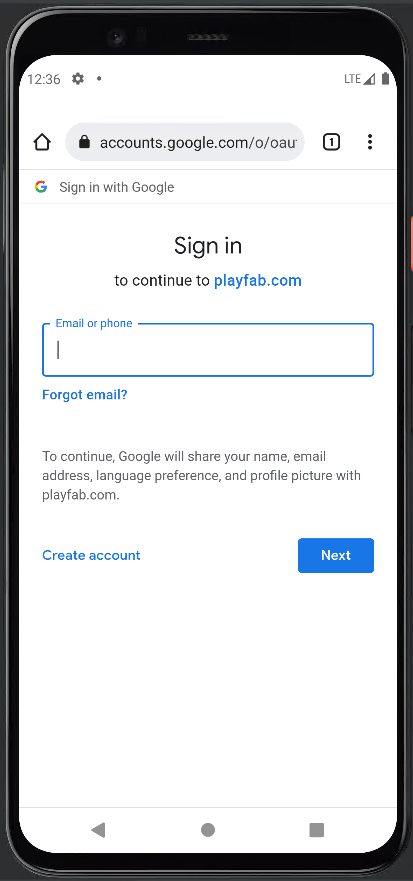
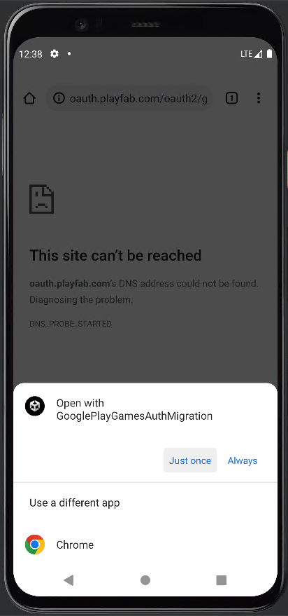
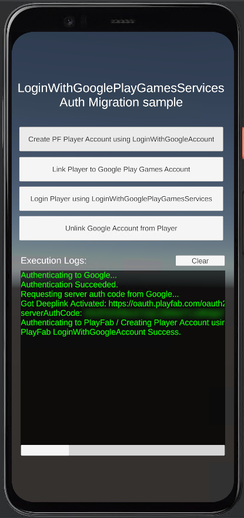

# Fix for using LoginWithGoogleAccount on Play Games Plugin for Unity v0.11.x

## Recommendation

While you're still using version 0.10.x of the plugin [migrate your users to use LoginWithGooglePlayGamesServices](google-play-games-sign-in-migration-details.md#migration-steps) API and use the following steps as a fallback method for the remainder of your players after upgrading to version 0.11.x or later of the plugin.

## Fix Steps

If you're currently using LoginWithGoogleAccount API on your title and are getting errors when calling it after upgrading to newest versions of the Play Games Plugin for Unity, the only way to request extra scopes for your game is by manually calling the Google OAuth2 APIs, perform the player's auth in a browser tab, and then get a redirection auth code back to the game.

1. Add Android intent to your Game using Deep Linking. (Steps adapted from [Unity - Manual: Deep linking on Android (unity3d.com)](https://docs.unity3d.com/2021.2/Documentation/Manual/deep-linking-android.html))

    a. In the Project window, go to **Assets > Plugins > Android**.

    b. Create a new file and call it **AndroidManifest.xml**. Unity automatically processes this file when you build your application.

    c. Copy the following code sample into the new file and save it.

    ```xml
    <?xml version="1.0" encoding="utf-8"?>
    <manifest xmlns:android="http://schemas.android.com/apk/res/android" xmlns:tools="http://schemas.android.com/tools">
        <application>
        <activity android:name="com.unity3d.player.UnityPlayerActivity" android:theme="@style/UnityThemeSelector">
            <intent-filter>
            <action android:name="android.intent.action.MAIN" />
            <category android:name="android.intent.category.LAUNCHER" />
            </intent-filter>
    
            <intent-filter android:autoVerify="true">
            <action android:name="android.intent.action.VIEW" />
    
            <category android:name="android.intent.category.DEFAULT" />
            <category android:name="android.intent.category.BROWSABLE" />
    
            <data
                android:scheme="https"
                android:host="oauth.playfab.com"
                android:path="/oauth2/google" />
            </intent-filter>
            
        </activity>
        </application>
    </manifest>
    ```

    d. Make sure the **autoVerify** property exists on the intent-filter tag and make sure that the data tag matches with **"https://oauth.playfab.com/oauth2/google"** since this is the expected and the only valid redirection URI on PlayFab.
 
2. Add Deep Linking processing to your Game. (Steps adapted from [Unity - Manual: Deep linking (unity3d.com)](https://docs.unity3d.com/2021.2/Documentation/Manual/deep-linking.html#using-deep-links)).

```csharp
using GooglePlayGames;
using GooglePlayGames.BasicApi;
using PlayFab;
using PlayFab.ClientModels;
using System;
using UnityEngine;
using UnityEngine.UI;

public class ProcessDeepLinkMngr : MonoBehaviour
{
    public static ProcessDeepLinkMngr Instance { get; private set; }

    private void Awake()
    {
        if (Instance == null)
        {
            Instance = this;
            Application.deepLinkActivated += onDeepLinkActivated;
            if (!string.IsNullOrEmpty(Application.absoluteURL))
            {
                // Cold start and Application.absoluteURL not null so process Deep Link.
                onDeepLinkActivated(Application.absoluteURL);
            }

            DontDestroyOnLoad(gameObject);
        }
        else
        {
            Destroy(gameObject);
        }
    }

    private void onDeepLinkActivated(string url)
    {
        Debug.Log("Got Deeplink Activated: " + url);

        // Decode the URL to extract auth code. 
        string queryParams = url.Split("?"[0])[1];
        string[] keyValuePairs = queryParams.Split("&");
        string authCode = string.Empty;

        foreach (string s in keyValuePairs)
        {
            if (s.StartsWith("code"))
            {
                authCode = s.Split("=")[1];
                break;
            }
        }
 
        if (!string.IsNullOrEmpty(authCode))
        {
            // Call the LoginWithGoogleAccount using the auth code
            Debug.Log("Authenticating to PlayFab using LoginWithGoogleAccount...");

            // Make sure to unescape string
            authCode = Uri.UnescapeDataString(authCode);

            var request = new LoginWithGoogleAccountRequest
            {
                ServerAuthCode = authCode,
                CreateAccount = true,
                TitleId = PlayFabSettings.TitleId
            };
 
            PlayFabClientAPI.LoginWithGoogleAccount(request,
                (LoginResult result) => {
                    Debug.Log("PlayFab LoginWithGoogleAccount Success.");
                },
                (PlayFabError error) => {
                    Debug.Log("PlayFab LoginWithGoogleAccount Failure: " + error.GenerateErrorReport());
                }
            );
        }
        else
        {
            Debug.Log("Error when getting Auth Code.");
        }
    }
}
```
 
3. Add some code to launch a browser to the Google OAuth2 API and let the player login via the browser. If the player is already logged in on their browser the transition will be seamless, otherwise they'll need to input their credentials.
 
```csharp
private string authorizationEndpoint = "https://accounts.google.com/o/oauth2/v2/auth";
private string redirectURI = "https://oauth.playfab.com/oauth2/google";
private object clientID = "[WEB-APPLICATION-CLIENT-ID]";
private string scopes = "profile";

private void LaunchBrowserAuth()
{
    string authorizationRequest = string.Format("{0}?response_type=code&scope={1}&redirect_uri={2}&client_id={3}",
            authorizationEndpoint,
            scopes,
            Uri.EscapeDataString(redirectURI),
            clientID);

    Application.OpenURL(authorizationRequest);
}
```
As you can observe, the redirection URI matches with the Android intent filter we added in step 1, this means that when the user finishes their authentication, the browser will navigate to that redirect URI and the browser should ask the user if they want to navigate back to the application.
 
4. Now, you should be ready to test this out. So, when you trigger the auth you'll get a browser open and user must log in accordingly. Unless browser data is deleted, this step should be a one-time process.
 
    
 
5. After completing the authentication, the browser will ask on which application should open the redirect URL.
 
    
 
6. This will navigate back to our application and we'll be able to get the code from the query parameters on the redirect URL and proceed to call LoginWithGoogleAccount.
 
    
 
7. Lastly, we recommend using this as a fallback alternative for any users that couldn't be migrated using the [migration steps](google-play-games-sign-in-migration-details.md#migration-steps).
 
***Please keep in mind that you should keep track of which users are already migrated to use LoginWithGooglePlayGamesServices and prefer to use the automatic login mechanism provided by the plugin and use this as a workaround for users who haven't been migrated over.***
