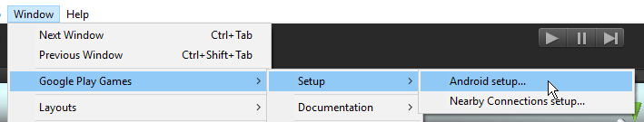
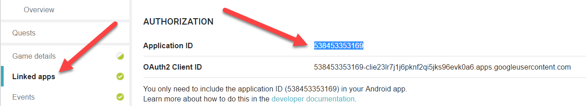
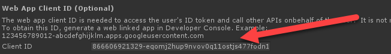
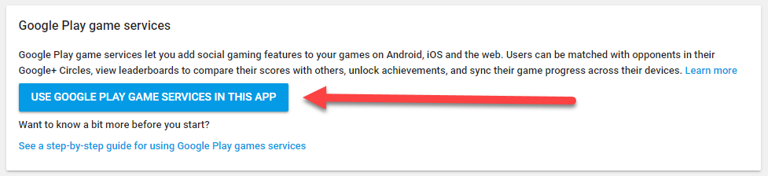
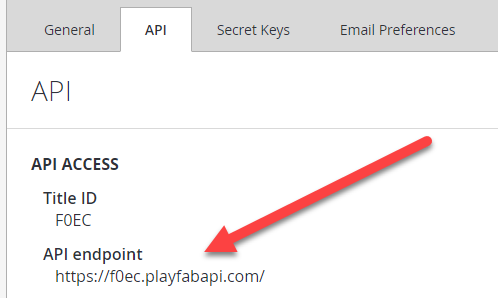
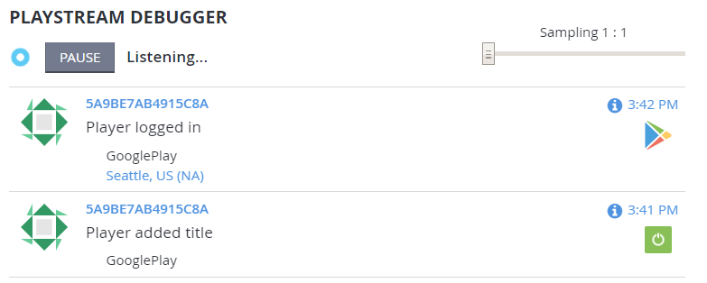

# Setting up PlayFab authentication using Google Play Games Sign-In in Unity

## Tutorial Video

> [!NOTE]
> The audio portion of the following video is currently unavailable. A new recording is pending and will be available in the immediate future.

[HowTo: Use Google SignIn (GPG) + PlayFab (Unity)](https://youtu.be/igup53sdmHg)

This tutorial illustrates the steps to successfully add **Google Play Games Sign-In** to your **PlayFab** games, built with the Unity SDK. Actually, this should be a fairly simple procedure once you know all the steps.

However, finding all the required information can be tricky. So we will try to centralize all the steps you need to get this feature working.

You can also download the sample for this tutorial [here](https://github.com/PlayFab/PlayFab-Samples/tree/master/Recipes/GoogleSignInSample).

## Prerequisites

- A **Project** built using the **Unity** game engine.
- A **Google** developer account.
- A **PlayFab** developer account which has access to a game **Title** in **PlayFab**.
- The [PlayFab Unity Editor Extensions & Unity SDK](../../../sdks/unity3d/quickstart.md).
- The [Google Play Games SDK](https://github.com/playgameservices/play-games-plugin-for-unity).
- Familiarity with [Login basics and Best Practices](../../authentication/platform-specific-authentication/login-basics-best-practices.md).

## Getting started

First, we will start by getting the basic things set up in **Google Play**. There are a few good guides on how to do this, so we are not going to reinvent the wheel.

1. Create an **Application** - If you have not done so already, you will need to create an **Application** in the [Google Play Developer Console](https://play.google.com/apps/publish).
2. Build your game **APK** and upload it as an **Alpha Build**.
    - Select **Manage Releases**.
    - Select **Manage Alpha**.
    - Select **Upload APK**.
3. [Setting Up Google Play Games Services](https://developers.google.com/games/services/console/enabling) - Watch the [YouTube video](https://youtu.be/BZRoBbUsfPE), as the Link here is dated, and does not reflect the latest UI of Google Play Games Services.
4. Download the [Google Play Games SDK](https://github.com/playgameservices/play-games-plugin-for-unity) (if you have not done so already) and install it.
5. Install the **PlayFab Unity SDK** (if you do not know how to do this, follow the [Unity3D quickstart guide](../../../sdks/unity3d/quickstart.md)).

## Configuring Google Play Games

You can configure **Google Play Games** from the toolset that is installed with the **Google Play Games SDK**. You can get to these tools by:

- Going to the **Window** tab.
- Selecting **Google Play Games**.
- Going to **Setup**.
- Then accessing **Android Setup**.

  

- Copy your **Application ID** from the **Linked apps** section of **Game Services** in the [Google Play Developer Console](https://play.google.com/apps/publish), as shown in the example provided below.

  

- Then, populate your **app_id** and **package_name** in the resource definition.

```xml
<?xml version="1.0" encoding="utf-8"?>
<resources>
<string name="app_id">[your app_id]</string>
<string name="package_name">[package name]</string>
</resources>
```

> [!NOTE]
> The **Client ID** that is generated for you when you link the **App** (shown in this image) is **NOT** the correct one!

  

In order to get the **Google Sign-In** working with **PlayFab**, you need to use a **Web Client ID**. To obtain your **Web Client ID**, you must link a **Web Application** in the **Game Services** section of the **Google Play Console** under the **Services and API** section.

  

Then configure your **App** for the **Web**.

  

From here, you enter your **API Endpoint** which can be found in **PlayFab**:

- Look under **Settings**.
- Select the **API** tab.
- Go to the **API Endpoint** field.

  

- Enter this endpoint -  **https://[titleid].playfabapi.com** - in the **Launch URL** field.
- Select the **Save** button.
- This will provide you with the proper **Client ID**.

To obtain your **Secret Key**, follow the link to your **API Console**.

  

- Select your **Web Application** (**Type**).
- The **Client Secret** is at the top.

> [!IMPORTANT]
> You must change the default callback for **Authorized redirect URIs**. The proper **URI** is [https://oauth.playfab.com/oauth2/google](https://oauth.playfab.com/oauth2/google).
> If you do not do this step you will get a **mismatch redirect_uri** error.

## PlayFab Google Sign-In setup

**PlayFab** has its own process for setting up **Google Sign-In**. You can do this in your **PlayFab** developer account. If you don't have one, you can [sign-up here](https://developer.playfab.com/en-us/sign-up). 

To set up **Google** in **PlayFab**:
- Navigate to the **Add-ons** section in your dashboard.
- Go to the **Google Add-On**. 
- From there, select the **Install Add-on** button.

There are a few things you need to enter into this form:

- The **Google App Package ID** - This is the name of your **Android** package. For example, our sample uses **com.playfab.gpgexample**.
- The **Google App License Key** - While this is a required field, it is not related to the **Google Sign-In**. This field is for setting up a **Receipt Validation** using our **Receipt Validation APIs**.

> [!NOTE]
> You can get this **License Key** from the [Google Developer Console](https://play.google.com/apps/publish) under the **Services & APIs** section. Look for a section entitled **YOUR LICENSE KEY FOR THIS APPLICATION**. Copy and paste the Base64-encoded **RSA Public Key** into this field.
- The **Google OAuth Client ID** - This is the **Web Client ID** that you used in the **Google Play Games SDK** setup in **Unity**.
- The **Google OAuth Client Secret** - This is the **Secret Key** that you obtained in the last step.

> [!TIP]
> Be sure to **Save Settings**!

## Adding Google Sign-In to your Unity Game

The code to get **Google Sign-In** working is fairly minimal. There is the initialization code, which you will put in your **Start** (or anywhere you are initializing or starting up your **App**).

This can be in different places, depending on the architecture and framework of your game or **App**. In any case, the code below will initialize **Google Play Game**s.

> [!NOTE]
> Make *sure* that you don't forget the **Using** statements, so that you can use the **Google Play Games SDK**.

```csharp
// These using statements are required.
using GooglePlayGames;
using GooglePlayGames.BasicApi;
```

```csharp
// The following grants profile access to the Google Play Games SDK.
// Note: If you also want to capture the player's Google email, be sure to add
// .RequestEmail() to the PlayGamesClientConfiguration
PlayGamesClientConfiguration config = new PlayGamesClientConfiguration.Builder()
.AddOauthScope("profile")
.RequestServerAuthCode(false)
.Build();
PlayGamesPlatform.InitializeInstance(config);

// recommended for debugging:
PlayGamesPlatform.DebugLogEnabled = true;

// Activate the Google Play Games platform
PlayGamesPlatform.Activate();
```

The next set of code, the **OnSignInButtonClicked()** function shown in the example provided below, is bound to a **Sign In** button in the **UI** in our example.

  

```csharp
    private void OnSignInButtonClicked()
    {
        Social.localUser.Authenticate((bool success) => {

            if (success)
            {

                GoogleStatusText.text = "Google Signed In";
                var serverAuthCode = PlayGamesPlatform.Instance.GetServerAuthCode();
                Debug.Log("Server Auth Code: " + serverAuthCode);

                PlayFabClientAPI.LoginWithGoogleAccount(new LoginWithGoogleAccountRequest()
                {
                    TitleId = PlayFabSettings.TitleId,
                    ServerAuthCode = serverAuthCode,
                    CreateAccount = true
                }, (result) =>
                {
                    GoogleStatusText.text = "Signed In as " + result.PlayFabId;

                }, OnPlayFabError);
            }
            else
            {
                GoogleStatusText.text = "Google Failed to Authroize your login";
            }

        });

    }
```

The **OnSignInButtonClicked()** code can be a bit overwhelming, so let's break down exactly what is happening:

- First, we log in with **Social.localUser.Authenticate** - This will return a boolean if we are able to successfully login. Be aware that if you have not added your test account to your **App**, this will *always* return **false** when testing.
- When this happens - important step here - [add your test account](https://developers.google.com/games/services/console/testpub).
- The link will take you to instructions on adding testers to your **Google** application.

> [!NOTE]
> This is what will trigger the **Google Play Games** sign-in dialog to pop-up.

- Next, if we have a successful login, we make a call to **PlayGamesPlatform.Instance.GetServerAuthCode** and store it in a variable.
- Lastly, we make the **LoginWithGoogleAccount** call and pass the **AuthCode** we just got from **Google** in as the **ServerAuthCode** parameter.

There is a callback which will have the results of your login to **PlayFab**. At this point, you should see a successful login in your dashboard!

  

Hopefully, this guide has helped you. But if you have questions, feel free to ask them in our [community forums](https://community.playfab.com/).

You can download the sample for this tutorial [here](https://s3-us-west-2.amazonaws.com/api-playfab-com-craft-files/FileAssets/GooglePlayGamesSignInExample.zip).
