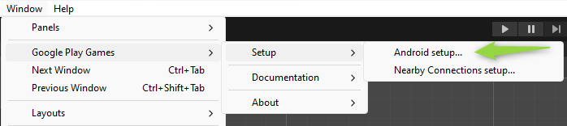
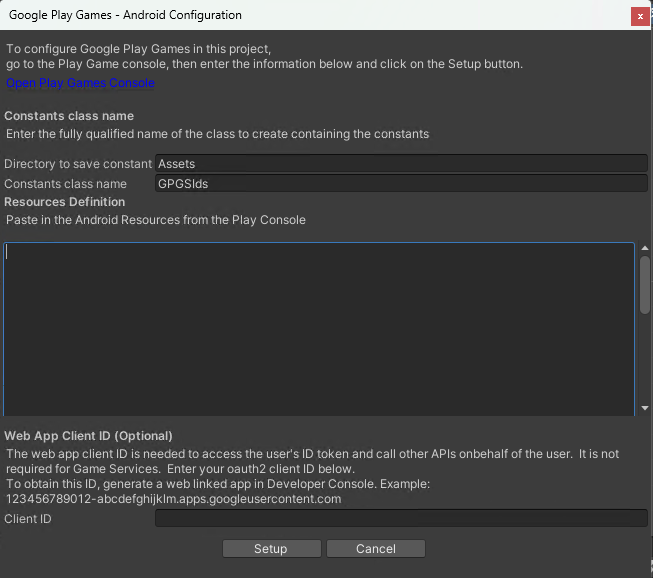
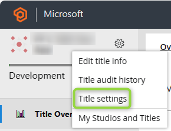
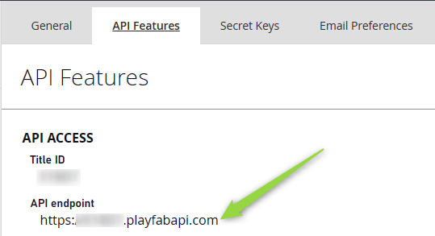
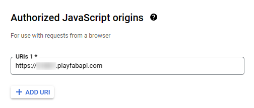
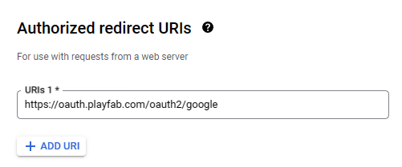
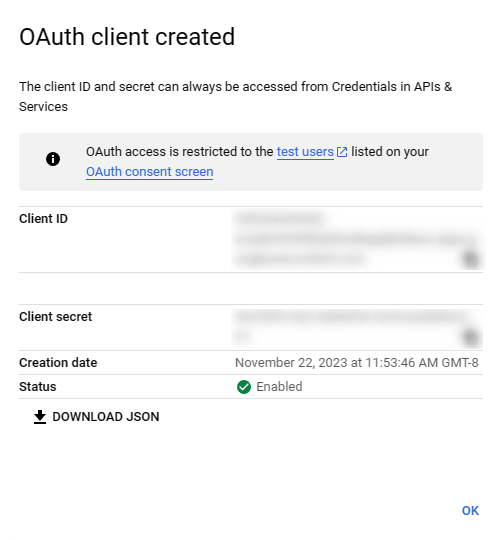
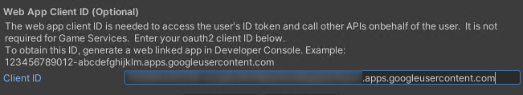
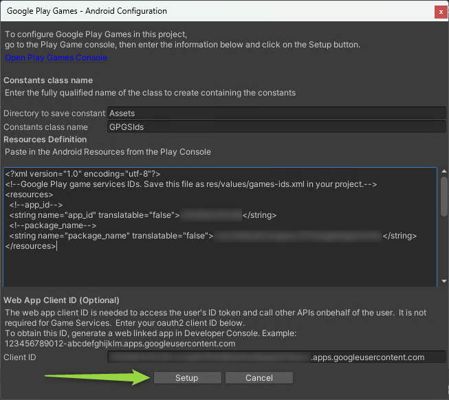
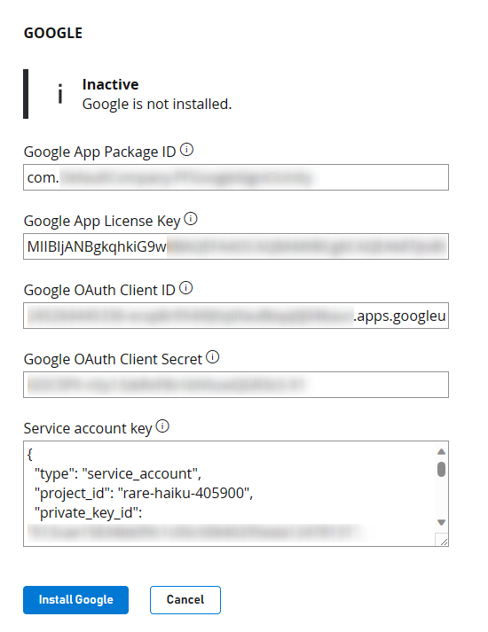

# Setting up PlayFab authentication using Google Play games sign-in in Unity

## Prerequisites

- A project built using the Unity game engine.
- A Google developer account.
- A PlayFab developer account that has access to a game title in PlayFab.
- The [PlayFab Unity Editor Extensions & Unity SDK](../../../sdks/unity3d/quickstart.md).
- The [Google Play Games SDK](https://github.com/playgameservices/play-games-plugin-for-unity).
- Familiarity with [Login basics and Best Practices](../../authentication/login/login-basics-best-practices.md).

## Getting started

First, we start by setting up some basic things in Google Play. There are a few good guides on how to achieve some of these tasks, so we aren't going to reinvent the wheel.

1. Create an **Application** - If you don't have an application created, you need to do that in the [Google Play Developer Console](https://play.google.com/apps/publish).

2. Build your game AAB, and upload it for internal testing. You can follow [this](https://support.google.com/googleplay/android-developer/answer/9859348?visit_id=638373214207471441-2235763004&rd=1) guide on how to release your app to **Internal testing** track. During the signing process consider that for your app bundle you have to use your own keystore for this purpose. Refer to [this](https://docs.unity3d.com/Manual/android-keystore-create.html) doc on how to create a keystore.

3. Set up Google Play Games services following the instructions on this page: [Setting Up Google Play Games Services](https://developers.google.com/games/services/console/enabling).

4. Download the [Google Play Games SDK](https://github.com/playgameservices/play-games-plugin-for-unity) and install it.

5. Install the PlayFab Unity SDK (if you don't know how to do this task, follow the [Unity3D quickstart guide](../../../sdks/unity3d/quickstart.md)).

## Configuring Google Play Games

You can configure Google Play Games from the toolset that is installed with the Google Play Games SDK. You can get to these tools by:

- Going to the **Window** tab.
- Selecting **Google Play Games**.
- Going to **Setup**.
- Then accessing **Android Setup**.

      
- The Android configuration window shows up, we need to input the Resources Definition and the Web App Client ID on this screen.

      

### Getting Resources Definition

- Follow [these](https://developer.android.com/games/pgs/unity/unity-start#get-android-resources) steps to get your Android Resources definition.

### Getting Web App Client ID

In order to get the Google Sign-In working with PlayFab, you need to use a Web Client ID that you can get by creating an OAuth Client ID credential for "Web application" type.

Before creating the OAuth Client ID you need to know your PlayFab **API Endpoint**, which you can found following these steps:

- Log in to [Game Manager](https://developer.playfab.com/).
- Select your title.
- Go to your title settings by clicking on the **gear icon** next to the title name and select **Title Settings**.

      

- Select the **API Features** tab.
- Copy to the **API endpoint** field.

    

Now that you know your title API Endpoint, follow the steps outlined [here](https://developers.google.com/workspace/guides/create-credentials#web-application) for creating the OAuth Client ID Credential.

- When creating the Client ID, you need to add the API endpoint as an **Authorized JavaScript origin** for your Client ID.

     

- Also, make sure to add `https://oauth.playfab.com/oauth2/google` as an **Authorized Redirect URI**. If you don't do this step, you get a **mismatch redirect_uri** error.

     

After creating the Client ID, you'll get a screen similar to the following one, where you'll get the Client ID string generated and a Client Secret.

 

Now, you can go back to the Android Configuration window in Unity and paste the client ID in the **Client ID** textbox:

 

Now that both values are populated, you can select **Setup**:

 

## PlayFab Google Sign in setup

PlayFab has its own process for setting up a Google sign-in. You can do this set up in your PlayFab developer account. If you don't have one, you can [sign up for a free developer account](https://developer.playfab.com).

To set up Google in PlayFab:

- Navigate to the **Add-ons** section in your dashboard.
- Go to the **Google Add-On**.
- From there, select the **Install Google** button.

There are a few things you need to enter into this form:

- The **Google App Package ID** - This field is the name of your Android package. For example, our sample uses `com.playfab.gpgexample`.
- The **Google App License Key** - While this field is required, it isn't related to the Google Sign-In. This field is for setting up a Receipt Validation using our **Receipt Validation APIs**.

> [!NOTE]
> You can get this License Key from the [Google Developer Console](https://play.google.com/apps/publish), navigate to your app,  under the **Monetize** section. Click on a section entitled **Monetization Setup**. In here, scroll down until you see a **Licensing** text box, copy and paste the Base64-encoded RSA Public Key into this field.

- The **Google OAuth Client ID** -The Web Client ID that you used in the **Google Play Games SDK** setup in Unity.
- The **Google OAuth Client Secret** - The Secret Key that you obtained when creating the OAuth Client ID.
- The **Service Account Key** - This field expects a service account key JSON string, you need to create a service account key following [these](https://developers.google.com/workspace/guides/create-credentials#create_a_service_account) steps. Then, create credentials for that service account following the steps [here](https://developers.google.com/workspace/guides/create-credentials#create_credentials_for_a_service_account). After you get the credentials JSON file, paste the whole JSON content in this field.

The add-on configuration should look like this before saving:

 


> [!TIP]
> Be sure to **Save Settings**!

## Adding Google sign-in to your Unity Game

The code to get Google sign-in working is fairly minimal. There's the initialization code, which you put in your Start (or anywhere you're initializing or starting up your app).

This code can be in different places, depending on the architecture and framework of your game or app. In any case, the following code initializes Google Play Games.

> [!NOTE]
> Make *sure* that you don't forget the **using** statements, so that you can use the Google Play Games SDK.

```csharp
using GooglePlayGames;
using GooglePlayGames.BasicApi;
using PlayFab;
using PlayFab.ClientModels;
using UnityEngine;

public class PFGoogleSignInUnity : MonoBehaviour
{
    void Start()
    {
        PlayGamesPlatform.Instance.Authenticate(ProcessAuthentication);
    }

    internal void ProcessAuthentication(SignInStatus status)
    {
        if (status == SignInStatus.Success)
        {
            PlayGamesPlatform.Instance.RequestServerSideAccess(false, ProcessServerAuthCode);
        }
    }

    private void ProcessServerAuthCode(string serverAuthCode)
    {
        Debug.Log("Server Auth Code: " + serverAuthCode);

        var request = new LoginWithGooglePlayGamesServicesRequest
        {
            ServerAuthCode = serverAuthCode,
            CreateAccount = true,
            TitleId = PlayFabSettings.TitleId
        };

        PlayFabClientAPI.LoginWithGooglePlayGamesServices(request, OnLoginWithGooglePlayGamesServicesSuccess, OnLoginWithGooglePlayGamesServicesFailure);
    }

    private void OnLoginWithGooglePlayGamesServicesSuccess(LoginResult result)
    {
        Debug.Log("PF Login Success LoginWithGooglePlayGamesServices");
    }

    private void OnLoginWithGooglePlayGamesServicesFailure(PlayFabError error)
    {
        Debug.Log("PF Login Failure LoginWithGooglePlayGamesServices: " + error.GenerateErrorReport());
    }
}
```

Let's break down exactly what is happening:

- First, we log in with `PlayGamesPlatform.Instance.Authenticate` - This function receives a callback function as a parameter that handles the result, and lets us know if the user was able to successfully login based on the *SignInStatus* received. 
- If you don't add your test account to your app, the callback *SignInStatus* result is always *Canceled* when testing. In case this issue happens, follow the steps on [this](https://developers.google.com/games/services/console/testpub) guide to add testers to your Google application.

> [!NOTE]
> The call to `PlayGamesPlatform.Instance.Authenticate` is what will trigger the **Google Play Games** sign-in dialog to pop-up.

- Next, if we have a successful login, we make a call to `PlayGamesPlatform.Instance.RequestServerSideAccess`, which receives another callback and returns the ServerAuthCode string.
- Then, we make the `PlayFabClientAPI.LoginWithGooglePlayGamesServices` call, and pass the `AuthCode` we just got from Google in as the `ServerAuthCode` parameter.

- Lastly, depending on the result of `LoginWithGooglePlayGamesServices` call, either `OnLoginWithGooglePlayGamesServicesSuccess` or `OnLoginWithGooglePlayGamesServicesFailure` is called, these callbacks are the ones that handle your login operation result to PlayFab. At this point, you should see a successful login in your dashboard!

Hopefully, this guide helped you. But if you have questions, feel free to ask them in our [community forums](https://community.playfab.com/).
