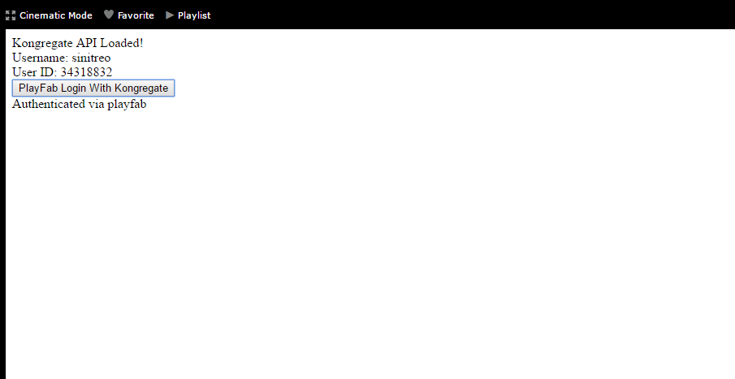

# Setting up PlayFab authentication using Kongregate and HTML5

This tutorial shows you the minimal setup required to authenticate your players in PlayFab using Kongregate and HTML5/JavaScript.

## Requirements

- A registered [Kongregate](https://www.kongregate.com/) account.
- Familiarity with the [Kongregate Developers Guide](https://www.kongregate.com/developer_center/docs/en/kongregate-api).
- A registered PlayFab title.
- Familiarity with [Login basics and Best Practices](../../authentication/login/login-basics-best-practices.md).

## Setting up a Kongregate app

Kongregate requires you to upload a preview version of the app, before you gain access to the necessary API information.

To do this, we need to prepare an `index.html` file with the following content.

```html
<!doctype html>
<html lang="en-us">
<head></head>
<body>
 <h1>Placeholder</h1>
</body>
</html>
```

Navigate to the [Kongregate website](https://www.kongregate.com/):

1. Select the **Games** tab.
2. Then select the **Upload your game** button.

  

A page to set up for a new application will open.

1. Enter the **Application Name** in the **Title** field.
2. Then enter a **Game Description** in the field provided.
3. Select a **Category**.
4. Submit the new app by selecting the **Continue** button, as indicated in the example provided below.

  

You will be moved to the **Application Upload** page.

As a *very* important first step, make sure to save the **URL** from your **Web Address Bar**. This will save you a lot of time trying to restore access to the application once you close the page.

1. Once this is done, select the prepared **index.html** file as your **Game File**.
2. Then set up the screen size.
3. Make sure to accept all the required licenses.
4. Upload your application by selecting the **Upload** button, as shown in the example provided below.


- Once the preview opens, ignore the content and open the **api information** link.


> [!NOTE]
> When the **API Information** page opens, locate the **API Key** and save it in a safe and easily accessible place for later use.


## Configuring PlayFab title

In your PlayFab title Game Manager:

1. Navigate to **Add-ons**.
2. Then locate and select **Kongregate**, as shown in the example provided below.


A new page will open, allowing you to set up **Kongregate** integration.

1. Enter the **API Key** you acquired in the previous section.
2. Select the **Install Kongregate** button.


If you receive no error message, then you have configured PlayFab title integration with your Kongregate application.

## Preparing some code

Use the example code shown below to populate the `index.html` for your game.

```html
<!DOCTYPE html PUBLIC "-//W3C//DTD XHTML 1.0 Transitional//EN"
  "http://www.w3.org/TR/xhtml1/DTD/xhtml1-transitional.dtd">
<html xmlns='http://www.w3.org/1999/xhtml'>
<head>
  <title>Kongregate Javascript API example</title>
  <!-- Import PlayFab API -->
  <script src='https://download.playfab.com/PlayFabClientApi.js'></script>
  <!-- Import JQuery, required specifically by this example, does not effect either API -->
  <script src='https://ajax.googleapis.com/ajax/libs/jquery/2.2.0/jquery.min.js'></script>
  <!-- Import Kongregate API -->
  <script src='https://cdn1.kongregate.com/javascripts/kongregate_api.js'></script>
</head>

<!-- Define elements with IDs to show current state of things and a couple of buttons -->
<body style='background-color:white'>
  <span id='init'>Initializing...</span>
  <div id='content' style='display:none'>
    <div>Kongregate API Loaded!</div>
    <div id='username'></div>
    <div id='user_id'></div>
    <!-- This button will invoke Kongregate Auth Box -->
    <button id='login' style='display:none'
      onclick='kongregate.services.showRegistrationBox()'>Sign in/register</button>
    <!-- This button will invoke PlayFab authentication process -->
    <button id='login'
       onclick='loginInUsingPlayFab()'>PlayFab Login With Kongregate</button>
  </div>

  <script type='text/javascript'>

    // This function just updates UI, nothing else
    function updateFields() {
      $('#init').hide();
      $('#content').show();

      // Visualize Kongregate Auth Data
      $('#username').text('Username: ' + kongregate.services.getUsername());
      $('#user_id').text('User ID: ' + kongregate.services.getUserId());

      // If not authenticated in Kongregate, allow to use Login button
      if(kongregate.services.isGuest()) {
        $('#login').show();
      } else {
        $('#login').hide();
      }
    }

    // The function prepares and triggers PlayFab LoginWithKongregate API call
    function loginInUsingPlayFab() {
      // Setting up playfab title ID
      PlayFab.settings.titleId = "159F";

      // forming request
      var request = {
        TitleId: PlayFab.settings.titleId,
        AuthTicket: kongregate.services.getGameAuthToken(),
        KongregateId : kongregate.services.getUserId(),
        CreateAccount: true
      };

      console.log('logging in');
      // Invoke LoginWithKongregate API call and visualize both results (success or failure)
      PlayFabClientSDK.LoginWithKongregate(request,
      function(result){
        $('<div></div>').html('Authenticated via playfab').appendTo('#content')
        console.log("success");
      },
      function(err){
        $('<div></div>').html('Problem occurred: ' + PlayFab.GenerateErrorReport(err)).appendTo('#content')
        console.log("failure");
      });
    }

    // The entry point for Kongregate initialization
    kongregateAPI.loadAPI(function(){
      window.kongregate = kongregateAPI.getAPI();
      updateFields();
      kongregate.services.addEventListener('login', function(){
        updateFields();
      });
    });
  </script>
</body>
</html>
```

## Testing

Remember that URL we asked you to save in a safe and accessible place a little earlier?  Use it now to access your **Application Upload** page.

1. Select **index.html** as your **Game File**.
2. Set up the screen size.
3. Make sure to accept all the required licenses.
4. Upload your application by selecting the **Upload** button.


Once the preview loads, wait for the Application to obtain the **Kongregate User ID** and **Username**.

- When that has happened, select the **PlayFab Login With Kongregate** button.
- After a brief pause, you should receive an **Authenticated via PlayFab** message.
- At this point you have successfully logged in using PlayFab and Kongregate!


