# Setting up PlayFab authentication using Kongregate and Unity

This tutorial shows you the minimal setup required to authenticate your players in PlayFab, using Kongregate and Unity.

## Requirements

- A registered [Kongregate](https://www.kongregate.com/) account.
- Familiarity with the [Kongregate Developers Guide](https://www.kongregate.com/developer_center/docs/en/kongregate-api).
- A registered PlayFab title.
- A Unity project with PlayFab configured for your title.
- Unity WebGL support installed.
- Familiarity with [Login basics and Best Practices](../../authentication/login/login-basics-best-practices.md).

## Setting up a Kongregate app

Kongregate requires you to upload a preview version of the app, before you gain access to the necessary app information. Our first step is to prepare an **index.html** file with the content shown below.

```html
<!doctype html>
<html lang="en-us">
<head></head>
<body>
 <h1>Placeholder</h1>
</body>
</html>
```

Navigate to the [Kongregate website](https://www.kongregate.com/).

1. Select the **Games** tab.
2. Then select the **Upload your game** button.

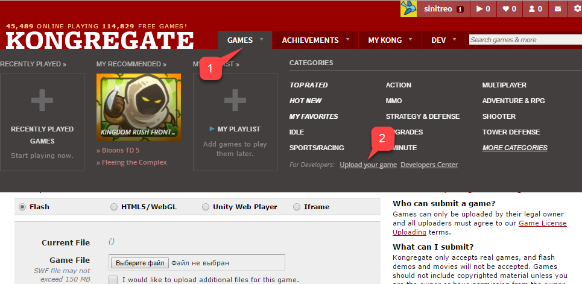  

A page to set up a new application will open.

1. Make sure to enter the **Application Name**.
2. Enter a **Game Description**.
3. Then select a **Category**.
4. Submit the new app by selecting the **Continue** button.

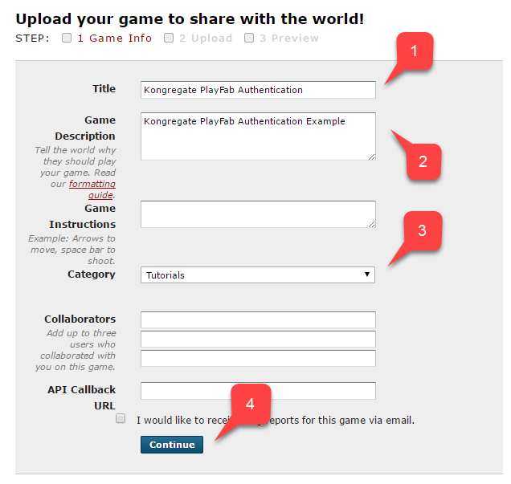  

You will be transferred to the **Application Upload** page.

First - *and most importantly* - make sure to save the URL from your **Web Address Bar** in a safe and easily accessible place. *This will save you a lot of time restoring access to the application once you close the page*.

1. Once this is done, select the prepared **index.html** file as your **Game File**.
2. Then set up the screen size.
3. Make sure to accept all the required licenses.
4. Finally, upload your application by selecting the **Upload** button.

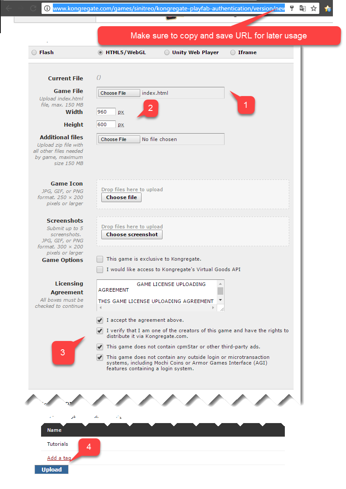

Once the preview opens, ignore the content and open the **api information** link.

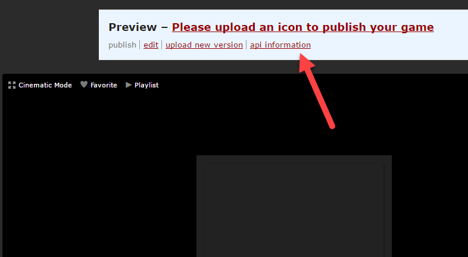

When the **API Information** page opens, locate the **API Key** and keep it in a safe place that is easily accessible for later use.

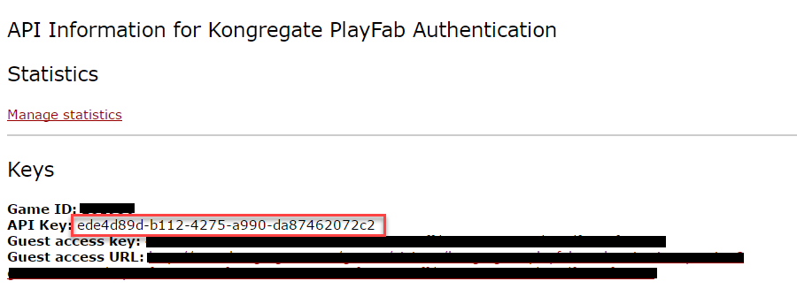

## Configuring PlayFab title

In your PlayFab title Game Manager:

1. Select **Add-ons** from the menu on the left.
2. Locate and select the **Kongregate** icon.

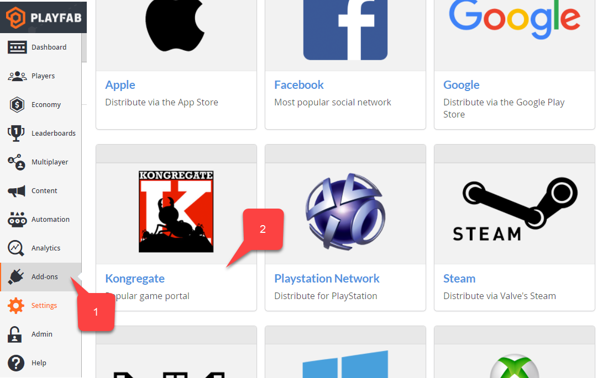

A new page will open, allowing you to set up **Kongregate** integration:

1. Enter the **API Key** you acquired in the previous section.
2. Select the **Install Kongregate** button.


At ths point, if you do not receive an error message, you have configured PlayFab title integration with your Kongregate application properly.

## Setting up a Unity project

Use this Unity setup checklist:

- [OPTIONAL] Install the [PlayFab Editor Extensions](https://aka.ms/playfabunityextension).
  - Set up your `TitleId` in the `PlayFabSharedSettings` Scriptable Object.
- For Unity 5.6+, download the [Kongregate Preloader WebGL Template](https://github.com/kongregate/webgl-preloader), and place it inside the `Assets/WebGLTemplates` folder **(2)**.
- For Unity < 5.6, download the [Kongregate Preloader WebGL Template 5.5 and below](https://github.com/kongregate/webgl-preloader/tree/unity-5.5-and-below), and place it inside the `Assets/WebGLTemplates` folder **(2)**.

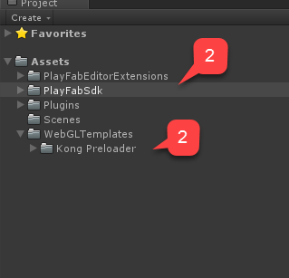

Now let's create your working scene.

1. For testing purposes, use a screen-scaling canvas with a couple of text labels.

> [!NOTE]
> We will only need *one* text label to display debug messages.

2. Create an empty **GameObject**, and rename it to **Kongregate**.

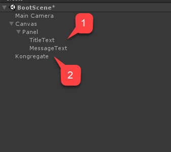

This `GameObject` will contain a `KongregateHandler` component with a wired text label for debug messages.

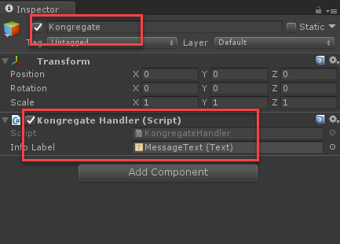

The code for the `KongregateHandler` component is provided below.

```csharp
// We are specifically interested in importing PlayFab related namespaces
using PlayFab;
using PlayFab.ClientModels;
using UnityEngine;
using UnityEngine.UI;

public class KongregateHandler : MonoBehaviour
{
  
    // Standard unity callback, executed once for the script to start
    public void Start()
    {
        // Utility: show feedback
        SetMessage("Loading kongregate api...");

        /*
         * Important: execute Javascript in the external context to initialize
         * Kongregate API, Unity Support and set up callback GameObject and Method.
         * In this case, callback is set to a GameObject called Kongregate and a
         * method called OnKongregateAPILoaded, which we define later in this class.
         * Once Kongregate API is initialized, Unity will locate this object by name
         * ("Kongregate") and execute a method "OnKongregateAPILoaded" passing in user
         * info string as an argument.
         */
        Application.ExternalEval(
          "if(typeof(kongregateUnitySupport) != 'undefined'){" +
          " kongregateUnitySupport.initAPI('Kongregate', 'OnKongregateAPILoaded');" +
          "} else {" +
          " console.error('No unity support!');" +
          "};"
        );
    }

    /*
     * Executed once Kongregate API is ready. This method is invoked by KongregateAPI
     * and receives a structured text with multiple pieces of data you must parse manually.
     * The userInfo string parameter has the following structure: 'user_identifier|user_name|auth_token'
     */
    public void OnKongregateAPILoaded(string userInfo)
    {
        SetMessage("Received user info! Logging though playfab...");

        // We split userInfo string using '|' character to acquire auth token and Kongregate ID.
        var userInfoArray = userInfo.Split('|');
        var authTicket = userInfoArray[2];
        var kongregateId = userInfoArray[0];

        LogToBrowser("Auth Token: " + authTicket);
        LogToBrowser("Kongregate Id: " + kongregateId);

        /*
         * We then execute PlayFab API call called LoginWithKongregate.
         * LoginWithKongregate requires KongregateID and AuthTicket.
         * We also pass CreateAccount flag, to automatically create player account.
         */
        PlayFabClientAPI.LoginWithKongregate(new LoginWithKongregateRequest
        {
            KongregateId = kongregateId,
            AuthTicket = authTicket,
            CreateAccount = true
        }, OnLoggedIn, OnFailed);
    }


    /*
     * The rest of the code serves as a utility to process results, log debug statements
     * and display them using Text message label.
     */

    private void OnLoggedIn(LoginResult obj)
    {
        SetMessage("Logged in through PlayFab!");
    }
    private void OnFailed(PlayFabError error)
    {
        SetMessage("Failed to login in with PlayFab: " + error.GenerateErrorReport());
    }

    private void SetMessage(string message)
    {
        InfoLabel.text = message;
    }

    private void LogToBrowser(string message)
    {
        Application.ExternalEval(string.Format("console.log('{0}')", message));
    }

    public Text InfoLabel;
}
```

## Testing

The only way you can truly test the integration is by uploading your prototype to Kongregate.

1. Open the **Build** window and make sure **WebGL** is selected from your menu.
2. Then open the **Player Settings** by selecting the button.

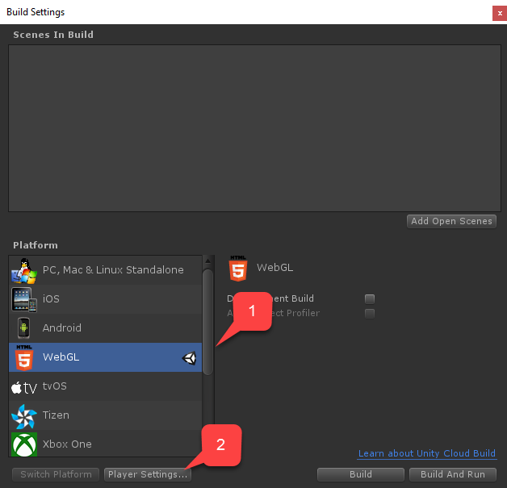

Inside the **Player Settings** screen, locate the **Settings for WebGL** build:

1. Verify that you have the size set up correctly.
2. Then select the **Kongregate Preloader Template**.

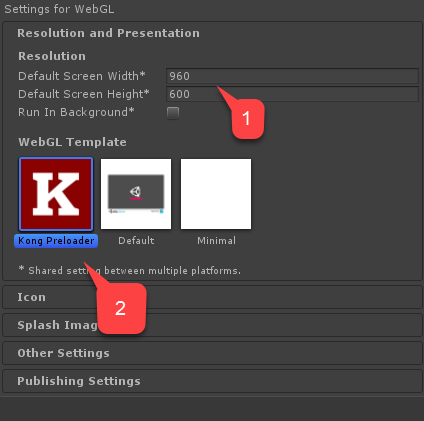

Build the application and open the **Build** folder.

- You will end up with **index.html** and a bunch of other files (depending on Unity version).
- Take all the files except **index.html** and place them inside a zip archive, as shown in the example provided below.

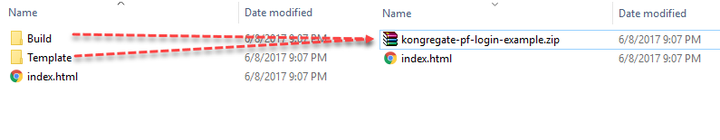

Use the URL you saved earlier to access your **Application Upload** page.

1. Select **index.html** as your **Game File**.
2. Then select the zip archive as **Additional files**.
    - Accept the licenses and upload.


Once the preview opens, you should be able to see your game live as the message changes.

At completion, the message should indicate successful login through PlayFab.

At this point, you have successfully integrated PlayFab and Kongregate.
