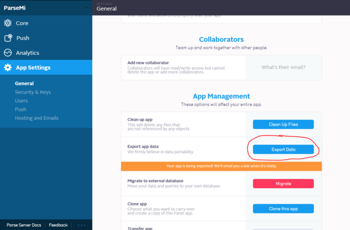
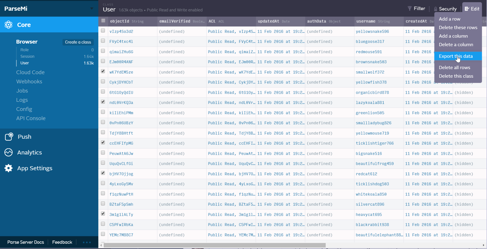
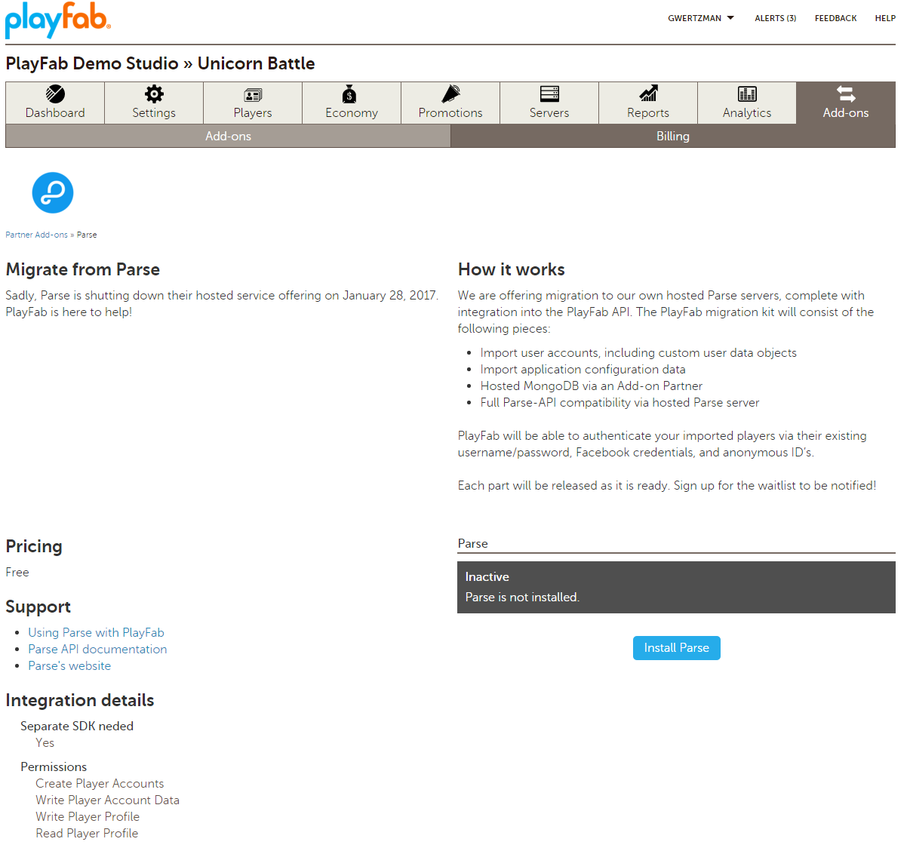
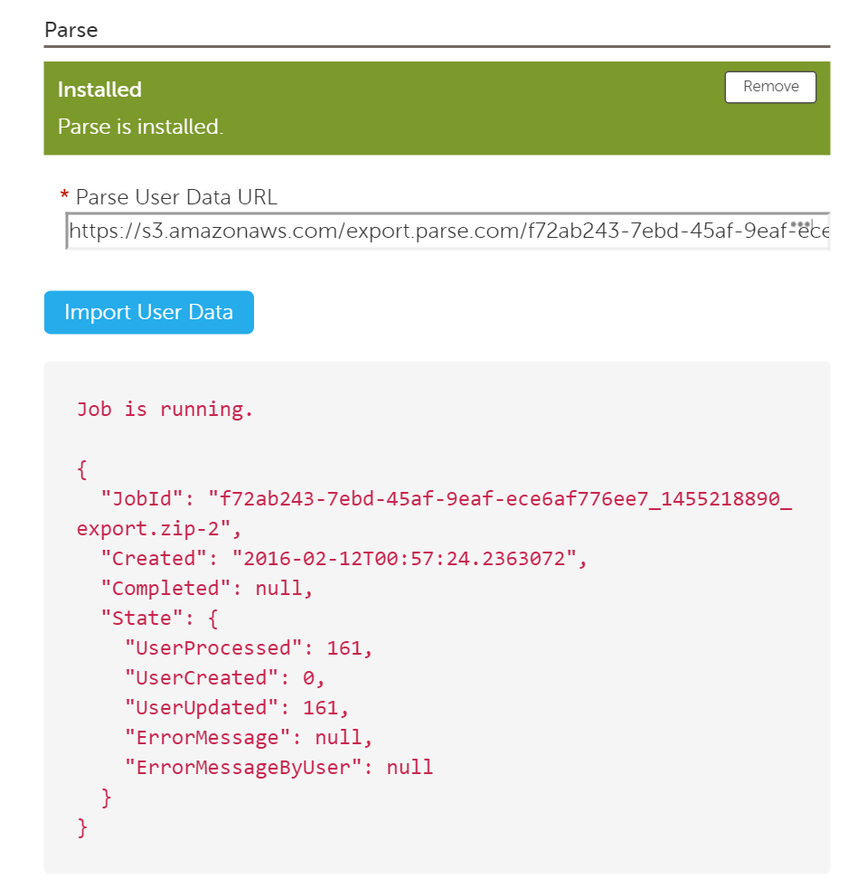

# Migrating from Parse to PlayFab

## How does PlayFab compare to Parse?

Both PlayFab and **Parse** provide back-end tools and services for building and operating your game, but there are several differences. Understanding these differences is important for planning a migration from **Parse** to PlayFab.

The most important difference is that **Parse** is a *general purpose mobile back-end*, with very few game-specific features.

With **Parse**, you need to write and test game-specific systems *yourself*, using the basic building blocks that **Parse** provides.

PlayFab, however, is *specifically designed* for games, and includes a large number of game-specific systems that you can *immediately* start using *without* writing any custom code.

Most developers tell us that building their game on PlayFab is much faster than building their game on **Parse**, but it is less flexible. There may be tasks that you could do in **Parse** that you cannot easily do in PlayFab - at least, not without writing some custom code yourself.

This migration tutorial assumes that you have *already* familiarized yourself with PlayFab’s features.

### Storing files and data

Both PlayFab and **Parse** provide systems for storing files and data for your game and players, but they do it differently.

**Parse** uses **MongoDB** and loosely-typed objects to allow clients to store whatever information they would like in whatever format is convenient.

Games can write arbitrary **SQL** queries to retrieve data for the game. This is very flexible, but it’s *also easy* to make mistakes that impact your game’s performance. It’s also *hard to scale* -- if your game suddenly takes off, you may need to shard your database to keep up with growth.

PlayFab takes a different approach...

PlayFab *also* stores data in an underlying database, but the raw database is hidden from the developer. *Instead*, all data is accessed via a set of game and player-specific **APIs**. This is *slightly* less flexible - *but much more scalable*.

In fact, using the PlayFab **APIs**, you *don’t have to worry about growth*. Whether you have 100 players each day or 10,000,000 - PlayFab will handle it.

With PlayFab, custom data is stored in these places:

- **Game Title data**: Game-wide data which can be accessed by all players and game clients. This data is typically used for game content or configuration, such as level maps, upcoming events, or current promotions.

  > [!NOTE]
  > For more information on this subject, see the [Title Data quickstart](../../config/titledata/quickstart.md).

- **Files**: PlayFab provides support for uploading files, and then delivering them via an integrated **CDN**.

  > [!NOTE]
  > For more information on this subject, see [How to use PlayFab's Content Management API](https://playfab.com/blog/how-use-playfabs-content-management-api/).

- **Catalog data**: Every item in the catalog can have custom properties associated with it, such as **rate-of-fire** for a weapon, or **mana** points for a collectible card.

  > [!NOTE]
  > For more information on this subject, see [Catalogs](../../commerce/items/catalogs.md).
  
- **Inventory data**: Every item in a player’s inventory can have custom properties associated with it, such as item hit-points, or config data for procedurally generated items.
- **Group data**: Data is shared among a specific group of players, such as a guild or lobby. Examples include a guild name or message of the day. Players can be added and removed from a shared group, and all members in the group can read or write shared group data.
- **Player data**: Data is stored per player account, like **Parse *Keyed User Data***.

  > [!NOTE]
  > For more information on this subject, see our quickstart [Player Data](../../data/playerdata/quickstart.md).
 
  Data can be:

  - **Private** (accessed only by the players).
  - **Public** (accessed by other players).
  - Scoped at:
    - The **Publisher-level** (shared across games by the same publisher).
    - The **Game-level**
    - The **Character-level** (tied to one of several characters the player controls in the game).
  - **Read/write** from the client.
  - **Read-only** from the client.
  - **invisible** to the client.

  > [!NOTE]
  > Player data is always read/write from the server.
  
- **Player Stats**. Stats are a special type of player data. They must be integers, and they have special properties:
  - **Leaderboards** - Any stat can be used to define a leaderboard (see social features).
  - **Segmentation** - Stats can be used to define player segmentation rules.
  - **Match-making** - Stats can be used as part of the match-making logic (e.g., find a match based on player’s level or weapon rating).

One limitation of the **+** approach is that it is not possible to write your own **SQL** queries directly against data stored in PlayFab.

But with PlayFab you *can* segment players into different groups, based on player stats and other properties. You can *then* trigger actions automatically, as players enter and exit these segments, and soon you will be able to execute batch actions across an entire segment (e.g., give a gift, or send a message).

Also on our short-term road map is searching for specific players, based on their properties for match-making or challenges.

### Cloud code

Both **Parse** and PlayFab provide server-side **JavaScript** for writing custom game code.

With PlayFab, it’s called [CloudScript](../../automation/cloudscript/quickstart.md). Today **Parse** has better tools for debugging **Cloud** code, but this is on the PlayFab road map.

PlayFab *does provide* **GitHub** integration for managing **CloudScript**, and it is *very* easy to call any of the powerful and trusted PlayFab server **API** functions from **CloudScript**.

### User management and authentication

Like **Parse**, PlayFab provides rich support for creating and managing player profiles. player accounts can be linked to multiple different authentication mechanisms, such as [Facebook](xref:titleid.playfabapi.com.client.authentication.loginwithfacebook), [Steam](xref:titleid.playfabapi.com.client.authentication.loginwithsteam), an [email/password](xref:titleid.playfabapi.com.client.authentication.loginwithemailaddress), an [iOS](xref:titleid.playfabapi.com.client.authentication.loginwithiosdeviceid) or [Android](xref:titleid.playfabapi.com.client.authentication.loginwithandroiddeviceid) device ID, or your own [custom identifiers](xref:titleid.playfabapi.com.client.authentication.loginwithcustomid), in order to make it easy to share a single player profile across multiple devices or platforms.

PlayFab’s Game Manager tool also provides a powerful set of tools for viewing and managing player profiles - ideal for debugging a game in production, or providing customer support for a game post-launch.

Using the Game Manager you can:

- View a player’s login history.
- View and modify all player data and stats.
- View and modify player inventory, virtual currency balances, and purchase history.
- See a history of the player’s multiplayer matches.
- Reset a player’s password, or unlink an authentication type.
- Temporarily or permanently ban a player.

### Push notifications

PlayFab has native support for sending push notifications to players, but this feature is primarily aimed at sending personalized messages directly to *specific* players.

For sending *bulk* messages to many or *all* of your players, we have partnered with **OneSignal**, and have a **OneSignal** add-on coming soon in our marketplace.

For now, you can integrate the **OneSignal SDK** directly in your game. Once the add-on is complete, **OneSignal** will be integrated directly with PlayFab player segmentation.

### Analytics and reporting

PlayFab has basic support for analytics and reporting built into the Game Manager. More advanced analytics providers are available through the PlayFab Add-on Marketplace, including segment, **Appuri**, and **Omniata** (coming soon).

Many analytics events are generated for your game *automatically* (for example, player logged in, player stat changed).

Games can also log custom events using the client [WritePlayerEvent](xref:titleid.playfabapi.com.client.analytics.writeplayerevent) or server [WritePlayerEvent](xref:titleid.playfabapi.com.server.analytics.writeplayerevent) methods.

All events are automatically forwarded to any analytics providers installed via the Marketplace.

### Receipt validation

Like **Parse**, PlayFab can validate in-app purchase receipts from **Apple** and **Google**.

> [!NOTE]
> To learn more on this subject, use this link [Receipt Validation](https://playfab.com/blog/show-me-money-receipt-validation-ios-and-android/).

## Importing Parse users to PlayFab

PlayFab’s user import tool imports **Parse User** objects directly into PlayFab player profiles. If your title was primarily just using the **Parse User** object to store player properties, then your migration may be simple:

- Just export your users from **Parse**.
- Import them into PlayFab.
- Swap **SDKs** in your game.
- And modify your authentication and player profile storage calls.

There is *no* risk to experimenting with our **Parse Player** import, since the process does not affect your live game or data.

Also, you can re-run the *import* process as often as necessary during the migration process for your game, in order to ensure that no users are left behind!

### Importing a user

- Generate a **Parse** migration **URL** from within the **Parse UI** by selecting the **Export Data** option in your **Parse Application Settings**.
- Then select the **General** tab (see the following).

     

   Alternatively, if you would like to export only a handful of users for testing:

- Select **Browse**, and then **User**.
- Filter/choose users as needed.
- Then select **Export the Data** (see below).

     

- Sign up for a PlayFab developer account and [create your Game](../../config/gamemanager/quickstart.md).
- In the **Game Manager**:
  - Select your **Title**.
  - Then select the **Add-ons** tab.

     

- Select the **Parse Migration** Add-on.

     

- Select the **Install Parse** button.
- Paste in the exported data **URL** from the email sent by **Parse**.
- Select **Import User Data**.

  - Migration will proceed in the background. There is no need to leave **Game Manager** open.
  - Existing **Users** will be updated with fresh information from the import.
  - If no **User** already exists, one will be created.

        

- You may check back periodically to get the most recent status of the migration, and see any errors that might have been encountered.
- Once migration is completed, review the provided log for any errors and to confirm the count of migrated users. Potential errors include:
  - An invalid URL.
  - An invalid data **JSON** format.
  - conflicting user name or email addresses.
- Each error message will describe *which* users experienced the error, so you can take appropriate action.

- Select the **Players** tab in the **Game Manager**.
- Review some of your imported players for general correctness.
- Download the PlayFab **SDK** and update your **Game Client** to point to PlayFab for your user functions.
- In particular, the following **APIs** will prove useful:
    - [Client/LoginWithFacebook](xref:titleid.playfabapi.com.client.authentication.loginwithfacebook)
    - [Client/LoginWithEmailAddress](xref:titleid.playfabapi.com.client.authentication.loginwithemailaddress)
    - [Client/GetUserData](xref:titleid.playfabapi.com.client.playerdatamanagement.getuserdata)
    - [Client/UpdateUserData](xref:titleid.playfabapi.com.client.playerdatamanagement.updateuserdata)

### Migrating other Parse functionality

If your game is storing more custom data than just user objects, we can *still* help!

Please contact us on our [support forum](https://community.playfab.com/) for customized instructions based upon your specific **Parse** utilization, and we will help you migrate as painlessly as possible.
