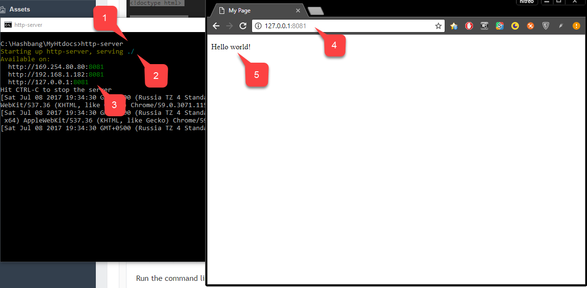
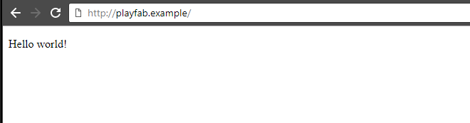

# Running an HTTP server for testing

In some scenarios, you may need to run a local HTTP server for test purposes. For example, if you're following our tutorials for setting up PlayFab authentication using [Facebook and HTML5](../../authentication/platform-specific-authentication/facebook-html5.md), [Google and HTML5](../../authentication/platform-specific-authentication/google-html5.md), or [Twitch and HTML5](../../authentication/platform-specific-authentication/twitch-html5.md), and you don't have a remote server with a domain, you may find this tutorial useful.

## Prerequisites

- Installed [Node.JS](https://nodejs.org/en/)

## Installing HTTP server using npm

Run the command line/terminal on your system (it doesn't matter which directory you're currently in).

Execute `npm install -g http-server`. Once npm finishes, you have the tiny HTTP-server installed. That's it.

## Serving files

Create a new folder on your system from where you want to serve your static files. There are no specific restrictions for path on Windows.

On macOS, you may want to check for access on the folder. Inside of the newly created folder, create a file called **index.html**.

Fill the file with the content provided below.

```html
<!doctype html>

<html lang="en">
<head>
  <meta charset="utf-8">
  <title>My Page</title>
</head>

<body>
 <p>Hello world!</p>
</body>
</html>
```

Run the **command line/terminal** and cd to the folder with your **index.html** file, then:

1. Execute **http-server**.
2. **HTTP-server** will start serving files from your current directory.
3. It will also print all the **IP** endpoints that the server is listening for.
4. Use one of them to reach your web-server through the browser.
5. Observe your page being loaded.

  

You can optionally specify a port to run the server on.

- **Example**: Execute `http-server -p 80` to run your server on **port 80**. If a port is occupied, you'll have to find what application is using this port and shut it down before you attempt to run the HTTP server again.

### Serving files with a custom domain name

When testing different SDKs, for example, [Google](../../authentication/platform-specific-authentication/google-html5.md) or [Facebook](../../authentication/platform-specific-authentication/facebook-html5.md), you'll notice that some services can only be configured with a certain valid domain name.

For instance, they don't accept a plain IP address + port. Certain services use such a configuration to ensure that your browser fetches your code from a specific, secure domain.

They also often use this configuration to ensure that a user can only log into your application from your domain, and that nobody else can fake it and steal user data.

> [!NOTE]
> While this is an important and useful security restriction, it may produce complications when trying to locally test your code.

If you run your server on Port 80, and your use-case is simple enough, you can utilize the HOSTS file on your operating system to access your HTTP server through a valid domain name.

The HOSTS file is a special file available on both Windows and macOS. It allows you to override certain domain names with custom endpoints. Schematically, the HOSTS file looks like this:

```cmd
IP_ADDRESS_1 DOMAIN_NAME_1
IP_ADDRESS_2 DOMAIN_NAME_2
IP_ADDRESS_3 DOMAIN_NAME_3

# This is comment
# IP_ADDRESS_4 DOMAIN_NAME_4 <- this entry is commented out and is inactive
...
```

Each line represents exactly *one* entry. When you try to reach `DOMAIN_NAME_1`, your browser directs your request to `IP_ADDRESS_1`.

The same applies for *each* entry in the HOSTS file. In the preceding example, entry number `4` starts with `#`. This is a syntax for comment.

By *commenting* out certain entries you may disable them, without necessarily removing them from the HOSTS file.

`playfab.example` is a valid domain name, but it's unlikely that your browser will reach any website with it. By adding the following entry to your HOSTS file, you'll be able to reach your local HTTP server with that domain name.

```cmd
127.0.0.1 playfab.example
```

> [!NOTE]
> If you are using a port other than 80, you will need to add the port that was created when the local server started (such as port 8080) to the end of the URL (`<playfab.example:8080>`)

  

On Windows OS, the HOSTS file is normally located at:

 `C:\Windows\System32\drivers\etc\hosts`.

On macOS, the HOSTS file is normally located at:

 `/private/etc/hosts`.

> [!WARNING]
> When entering your domain name in your browser address bar, always make sure to include the schema: `<http://playfab.example>`.
