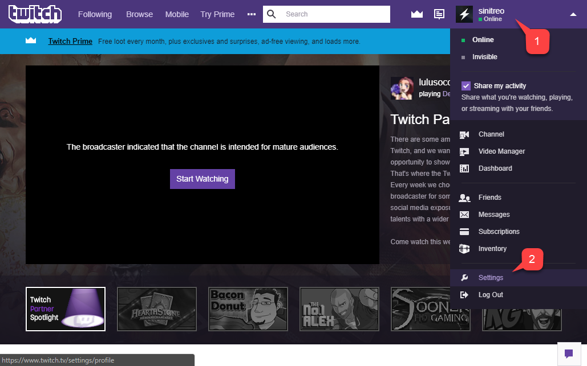
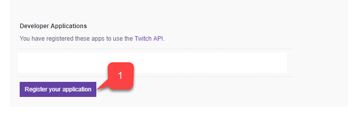
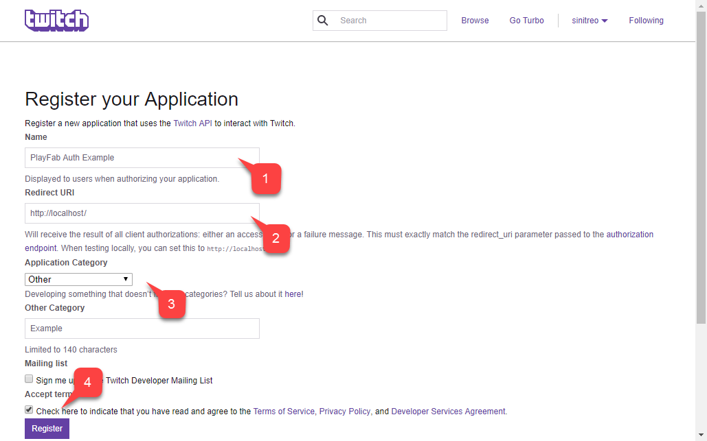
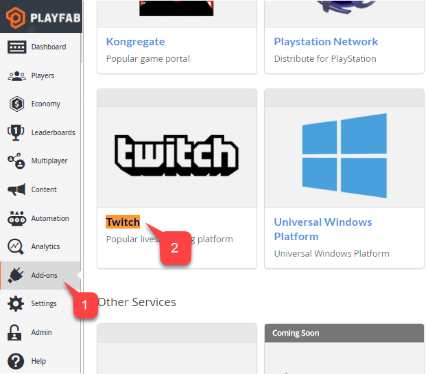
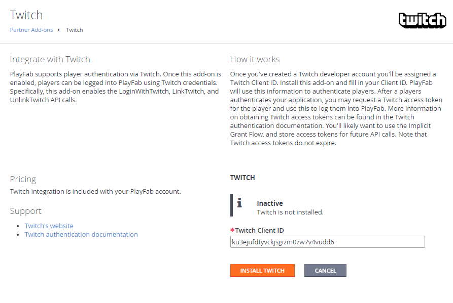

# Setting up PlayFab authentication using Twitch and HTML5

This tutorial has been designed to guide you through the process of PlayFab authentication, using Twitch and HTML5/JavaScript.

## Requirements

Prior to beginning, you should have:

- A [Twitch Account](https://www.twitch.tv/) for testing.
- A Registered [PlayFab](https://playfab.com/) title.
- Familiarity with [Login basics and Best Practices](../../authentication/login/login-basics-best-practices.md).
- At the minimum, a server with a valid domain name to serve static HTML files.

> [!NOTE]
> Consult the [Running an HTTP server for testing](running-an-http-server-for-testing.md) tutorial for information on how to set up a server with a valid domain name.

## Server and domain

This tutorial requires a web server, in order to follow the instructions. If you do not have a registered remote web server yet, please follow our [Running an HTTP server for testing](running-an-http-server-for-testing.md) tutorial, for information on how to run a local web server.

>[!NOTE]
> Throughout this tutorial, we will assume your domain is `[http://localhost/](http://localhost/)`.

## Registering a Twitch application

Start by navigating to the [Twitch website](https://www.twitch.tv/), and verifying that you are logged in.

1. Navigate to the **Account** drop-down.
2. Select **Settings** from the menu provided.

  

On the **Settings** page, select **Connections (1)**, as shown below.

  

At the very bottom of the page, select the **Register your application (1)** button, as shown below.

  

A page will open that lets you configure a new app.

1. Fill in the **Name** of the **Application**.
2. Enter the **Redirect URL**.
3. Enter the **Application Category**.
4. Then agree to the **Twitch** terms, and select the **Register**  button.

  

> [!IMPORTANT]  
> When testing using a local web server, Twitch allows you to use `**<http://localhost>**` as a redirect URL. Make sure to include the leading slash **/**. Without a leading slash, Twitch will fail to recognize the localhost URL.

Once the application is registered, the page will be updated and reveal the Client ID for your application.

> [!NOTE]
> Keep this Client ID in a safe and easily accessible place, as you will be using it later to configure your PlayFab title.

  

## Configuring a PlayFab title

Once you acquire your Twitch Client ID, you may enable and configure a Twitch Add-on for your PlayFab title.

1. On your **PlayFab Title** screen, go to the menu and select the **Add-ons** item.
2. Then select the **Twitch** icon link.

  

On the **Twitch** page:

- A **Settings** page will open for the **Twitch Add-on**.
- Enter your **Twitch Client ID**.
- Select the **Install Twitch** button.

  

Take a moment to verify that the add-on was installed, and that no errors have occurred. This concludes configuring the PlayFab title.

## Testing

Use the following HTML file to test PlayFab authentication using Twitch.

Make sure to replace `TWITCH_CLIENT_ID_GOES_HERE` and `PLAYFAB_TITLE_ID_GOES_HERE` with your own values.

```html
<!DOCTYPE html>
<html>
<head>
    <!-- Include JQuery - dependency of Twitch JS SDK -->
    <script src="//code.jquery.com/jquery.min.js"></script>
    <!-- Include Twitch SDK -->
    <script src="https://ttv-api.s3.amazonaws.com/twitch.min.js"></script>
    <!-- Include PlayFab SDK -->
    <script src="https://download.playfab.com/PlayFabClientApi.js"></script>
</head>
<body>
    <p>Twitch Auth Example</p>
    <button onclick="login()">Login With Twitch</button>
    <script>
        // Establish Twitch Auth Callback (invoked when logged in with Twitch)
        Twitch.events.addListener('auth.login', function() {
            logLine("Logged in with Twitch!");
            // Invoke login with PlayFab code and pass the token
            loginWithPlayFab(Twitch.getToken());
        });

        // Run Twitch SDK initialization
        Twitch.init({clientId: 'TWITCH_CLIENT_ID_GOES_HERE'}, function(error, status) {
            logLine("Twitch SDK Initialized");
        });

        // This method is invoked when you press the button

        function login() {
            logLine("Logging in via Twitch...");
            Twitch.login({
                scope: ['user_read', 'channel_read']
            });
        }

        function loginWithPlayFab(accessToken){
            logLine("Logging in via PlayFab...");

            // When given accessToken, make call to LoginWithTwitch API Call
            // Make sure to use your own PlayFab Title ID
            PlayFabClientSDK.LoginWithTwitch({
                AccessToken: accessToken,
                TitleId: "PLAYFAB_TITLE_ID_GOES_HERE",
                CreateAccount: true
            }, onPlayFabResponse);
        }

        // Handles response from playfab.
        function onPlayFabResponse(response, error) {
            if (response)
                logLine("Response: " + JSON.stringify(response));
            if (error)
                logLine("Error: " + JSON.stringify(error));
        }

        function logLine(message) {
        console.log(message);
            var textnode = document.createTextNode(message);
            document.body.appendChild(textnode);
            var br = document.createElement("br");
            document.body.appendChild(br);
        }
    </script>
</body>
</html>
```

1. Request the following file from your server, using the domain you set up during the Twitch application configuration `<http://localhost>` in our case.

2. Once the page opens, wait for the message indicating that the **Twitch SDK** was initialized.
3. Then select the **Login with Twitch** button.
4. Follow any **Twitch** instructions in the pop-up window, and watch the output.

> [!IMPORTANT]
> If you *already have* a Twitch auth session going when reaching the page, it is possible for callbacks to fire in a different, unexpected order. This case is shown in the screenshot shown below. However, you should make sure that only **Logging in via PlayFab** follows after **Logged in with Twitch**. This indicates that the token was received or restored from the local storage, and we do not have to wait for the Twitch SDK to start signing in to PlayFab.

  

If PlayFab manages to acquire a `SessionTicket`, you have successfully integrated Twitch authentication with your PlayFab app.
