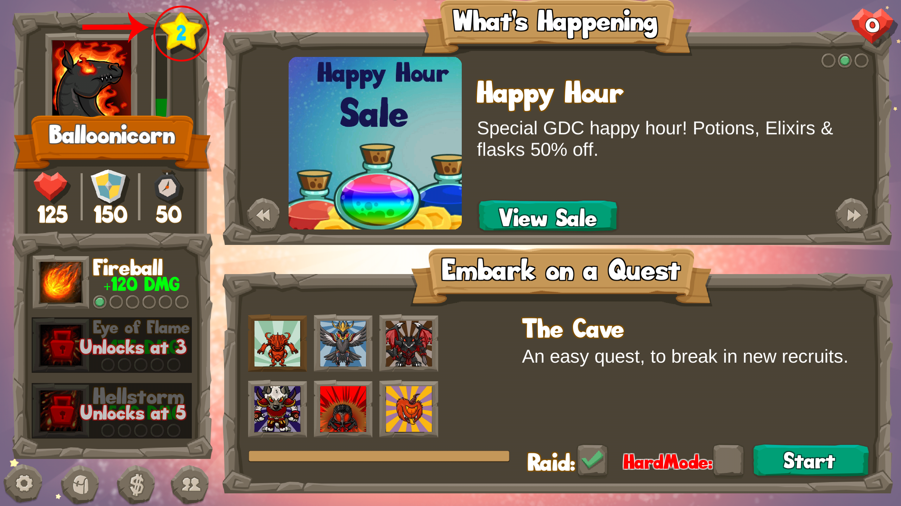
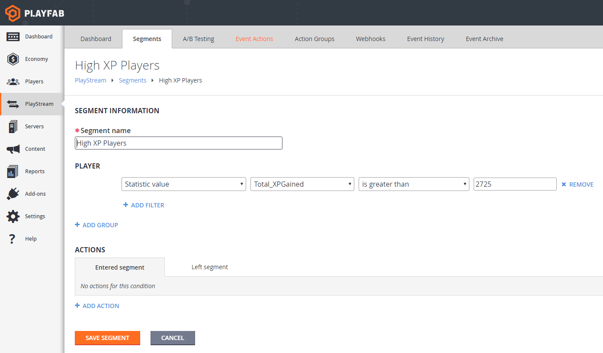
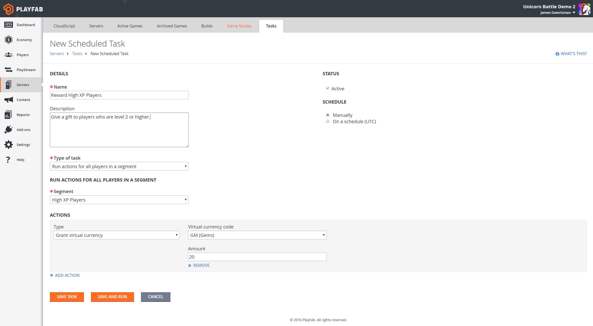
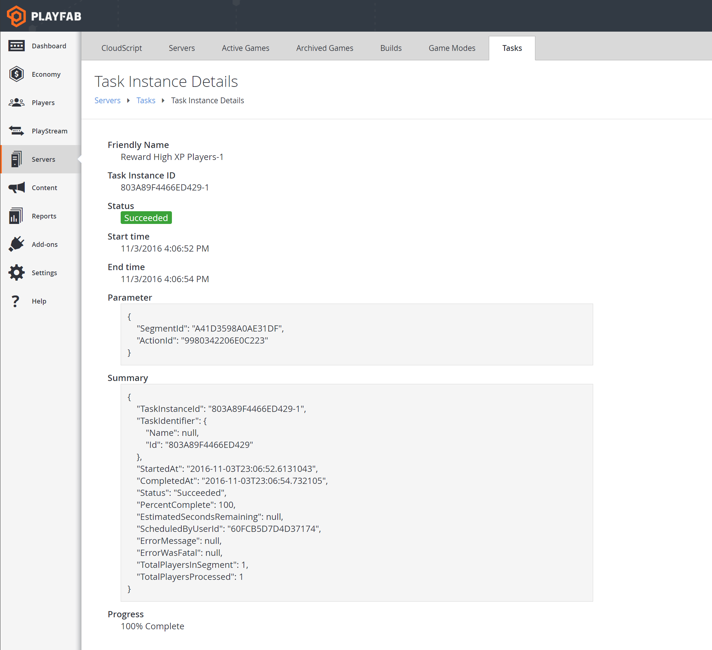
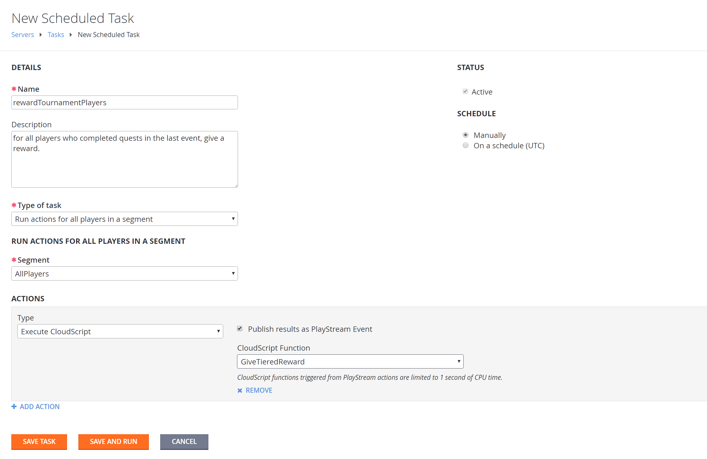
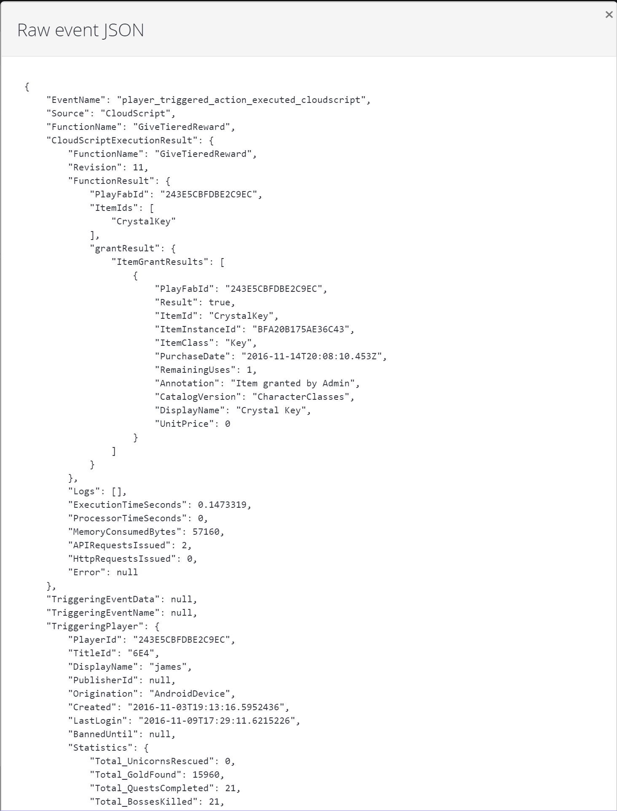

# Bulk Actions for an Entire Player Segment

This tutorial walks you through the steps needed to create a task to perform one or more actions on every player in a segment. A vital part of Live Operations for any game, this gives you a powerful set of tools for engaging with your players.

Examples might include:

- Give a special New Year’s gift to all players who logged in during the last 2 weeks.
- Reward players who spent money in the last week based on spending tiers, where the more money they spent, the more valuable the gift.
- Fixing corrupted player state for all players affected by a recent game bug.

In this tutorial, based on our “Unicorn Battle” sample app, we will grant a special gift to all players with more than 2,725 XP.

## Prerequisites

To run this tutorial, you will need to install the Unicorn Battle sample app. You can read more about it [in our blog](https://playfab.com/check-out-unicorn-battle/), or go directly to the [GitHub repository](https://github.com/PlayFab/UnicornBattle) and follow the instructions there.

  

You will want to play several battles in order to level up your character to at least level 2 which you reach at 2,725 XP points.



## Step 1 - Create the segment

The first step is to create the segment that defines the group of players who will be affected by this action. In this case, we need to create the “High XP” segment, defined as all players who have more than 2,725 XP.

Go to PlayStream -> Segments and click “New Segment”. Name the segment “High XP Players” and define it as players where the “Statistic Value” called “Total_XP Gained” is greater than 2725.



## Step 2 - Create a task for this segment

Select the "High XP Players" segment and click "RUN TASK …".


This will take you to the Create Task view in the Servers->Tasks tab, and will pre-populate various fields based on your selected segment.


## Step 3 - Add actions to the task

Next, you can finish setting up the task.

- Change the Name to “Reward High XP Players”
- Add a description, “Give a gift to players who are level 2 or higher”
- Click “ADD ACTION”
  - Type: “Grant virtual currency”
  - Virtual currency code: “GM” (short for gems)
  - Amount: 20
- Leave the scheduling as “Manually” for now
- Click “SAVE AND RUN” to run the task



## Step 4 - Monitor your task

The Tasks view will show you your running task. Initially the task status will be “InProgress” but it will quickly change to “Succeeded” since the segment is small.


Now, let's check out the task execution detail. Click on the completed task in the previously run tasks list. You will see important information such as how many players were processed, when the task started, how long it took to complete, with what parameters it was launched, who ran it if it was scheduled manually, etc. If the task is still in progress, you can check the task instance detail view for the progress and see the estimated time remaining.



To verify that the task ran successfully, navigate to the Players tab, and click on your player. Then click on the Event History tab. The most recent event in the list should be a “player_virtual_currency_balance_changed” event, showing your player’s gems increasing by 20. You can expand this event to see the details.


## What’s next

This tutorial has introduced you to the steps involved in performing an action for every player in a segment, but there’s a lot more you can do with tasks. Here are a few ideas for other things you can try:

### Schedule your tasks

You don’t need to run tasks manually; you can schedule a task to run automatically on a recurring basis. For example, you could create a segment of all players who played the game in the last 24 hours, then run a scheduled task each day to give those players an XP boost.


### Run CloudScript for each player

The most powerful use of bulk actions is running an arbitrary CloudScript function for each player. This CloudScript can do anything the PlayFab Server API can do -- grant items, currency, inspect and change player data, and so on.

For example, imagine you have an event leaderboard that resets every week, and you want to go through all players and give a reward based on the value of the last event before it reset. Here is an example using Unicorn Battle:

1. Create a new stat (Event_QuestsCompleted) that resets weekly and uses the aggregation method “Last”.

   

2. Create a new PlayStream action that increments this “Event_QuestsCompleted” stat whenever “Total_QuestsCompleted” is changed.

   

3. Write a CloudScript function to be called by a Bulk Action task which will go through players and give rewards based on the last value:

```javascript
// this function will be called as a bulk action by a scheduled task for players in a segment
handlers.GiveTieredReward = function (args, context) {
	var profile = context.playerProfile;

	var statVersion = 0;        // set to whatever version you need to use

	var getStatRequest = {};
	getStatRequest.PlayFabId = profile.PlayerId;
	getStatRequest.StatisticNameVersions = [{ "StatisticName": "Event_QuestsCompleted", "Version": statVersion }];

	try {
		getStatRequest.PlayerResult = server.GetPlayerStatistics(getStatRequest);
	} catch (e) {
	};

	if (getStatRequest.PlayerResult && getStatRequest.PlayerResult.Statistics.length > 0) {
		getStatRequest.lastScore = getStatRequest.PlayerResult.Statistics[0].Value
	}

	if (getStatRequest.lastScore && getStatRequest.lastScore > 2) {
		// give gift to all players with more than 2 quests completed in last event
		// in a real event we would want to use a lookup table of gifts
		// but here we are just hard-coding it
		var giftRequest = {};
		giftRequest.PlayFabId = profile.PlayerId;
		giftRequest.ItemIds = ["CrystalKey"];
		giftRequest.grantResult = server.GrantItemsToUser(giftRequest);
		return giftRequest;
	} else {
		return getStatRequest;
	}
}
```

4. Set the new CloudScript version live and create a new task that calls "GiveTieredReward" function for all players. Don't forget to Save And Run the task.

   

5. You should notice events from this task appear in the PlayStream event debugger.

   

6. You can click into any "Player Triggered Action Executed CloudScript" event (click on the time stamp) and see the detailed result of CloudScript execution for each player. which includes useful diagnostic information such as the snapshot of the player profile at the time of the CloudScript execution.

   
