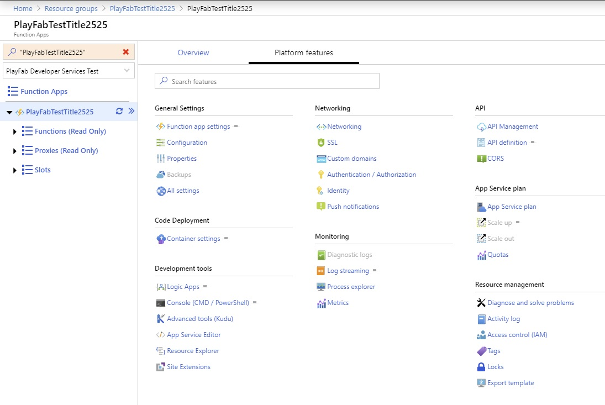

> [!NOTE]
> This feature is in private preview and intended for use by customers participating in the preview program.  We anticipate ongoing changes to it as we continue gathering feedback and optimizing for customer use.

# Debugging CloudScript using Azure Functions with the Azure portal 

If you are editing your Azure Functions using the [Azure portal](https://portal.azure.com), you can get logs directly in the portal.

To find the logsm you can use the following steps:
1) Open the [Azure portal](https://portal.azure.com)
2) Navigate to your Azure Functions app
3) Select Platform features 
4) Select Log Streaming under the Monitoring section
 
 

You will land on a screen that shows you the debug output:
 
