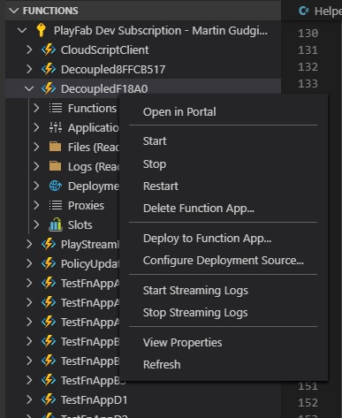
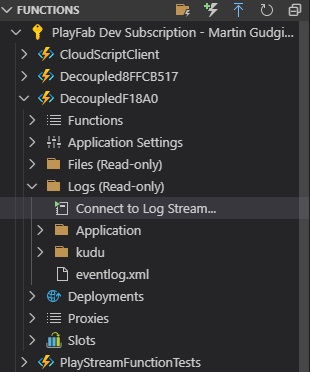

# Debugging CloudScript using Azure Functions with Visual Studio Code  

If you are using Visual Studio Code, you can use the Azure Functions extension to list your Azure Functions applications and there is a Start Streaming Logs option:

 

The logs then show up in the Terminal Window in VS Code as your function runs. You can also get the same under Logs using the Connect to Log Stream… option:

 
