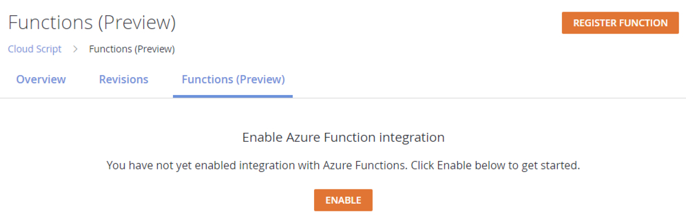
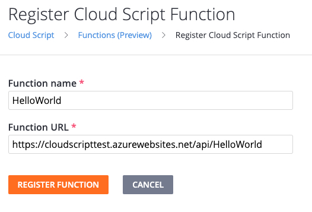
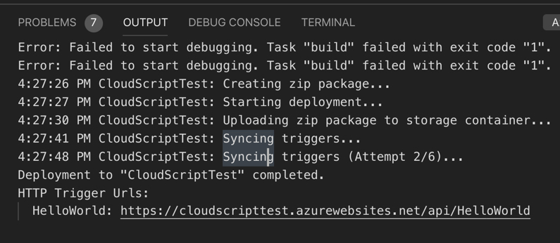
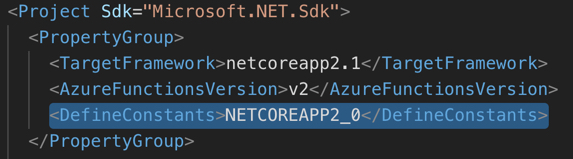
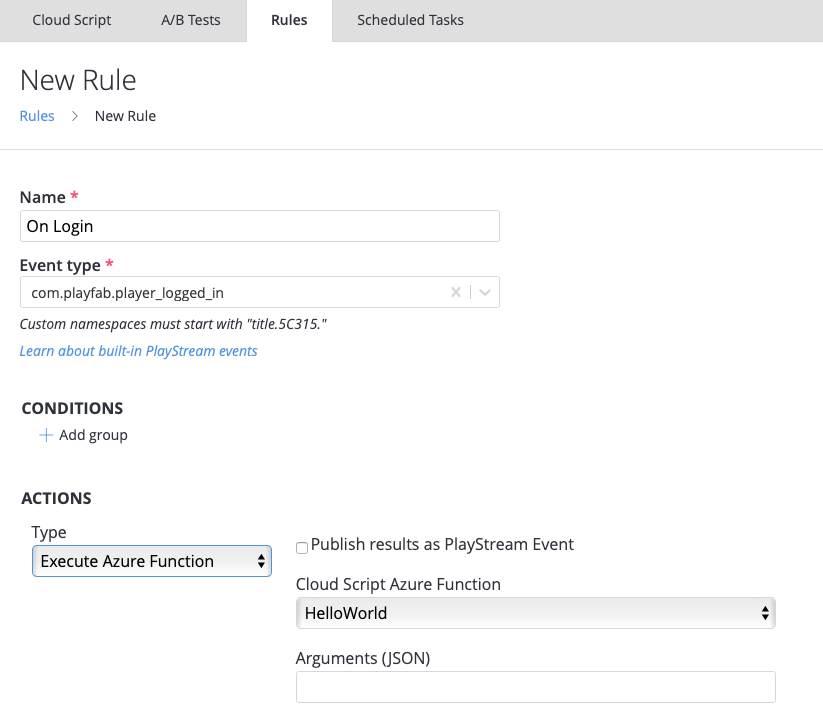

 
# Quickstart: Writing a PlayFab CloudScript using Azure Functions

In this quickstart, you will write a CloudScript using Azure Functions with Visual Studio Code, Azure Functions C# and Unity C#.  After finishing this guide you will be able to link your new CloudScript to rules, scheduled tasks or even call it from your client code.

## Prerequisites

There are a couple of steps needed to get started with PlayFab C# CloudScript.

- To begin visit the Visual Studio Code [QuickStart: Create an Azure Functions project using Visual Studio Code](https://docs.microsoft.com/azure/azure-functions/functions-create-first-function-vs-code?pivots=programming-language-csharp) and return here once you are completely setup. The following prerequisites are covering in their quickstart guide:
  - You must have an [Azure account](https://azure.microsoft.com/free/) already setup.  Signing up for an Azure Account is free.
  - You must have an [Azure Subscription setup](https://docs.microsoft.com/azure/billing/billing-create-subscription).
  - You must have an Functions App resource configured in the Azure Portal.
    - To minimize latency of your CloudScript using Azure Functions place them in either US-West or US-West 2 Azure regions.   
    - **Security Note:** From a security perspective you should make sure to only use a given function secret with PlayFab and not use it for calling the same function from any other source.
    - **Security Note:** For queued functions you should setup a distinct storage account for the queues used for the queue trigger.
- You must have a [PlayFab account](https://developer.playfab.com/signup). 
- PlayFab Azure Functions can only use the Azure Functions V2 runtime.

## Enable the Feature

To begin using this feature you need to enable it.  Visit Automation -> CloudScript tab -> Functions (Preview).

* Click the Enable button to turn on Game Manager pages that  allow you to register functions, hook them up to rules, tasks etc.



## Create an Azure Function

1. Following the Visual Studio Code getting started guide create a basic "HelloWorld" example function.  You can see how to do this by following the [Create your first function using Visual Studio Code guide](https://docs.microsoft.com/azure/azure-functions/functions-create-first-function-vs-code).  For a code example using PlayFab variables see the section below [PlayFab Function Context, Variables and using the Server SDKs](#playfabfunctioncontext).
2. Once your function has been created and deployed, click the Register Function button in the top right hand corner of the Functions (Preview) page.

3. Put the name and Function URL.  The URL can be found in the output of your deployment.


> [!TIP] 
> To learn more about deploying azure functions, see [Deploy Azure Functions from Visual Studio Code](https://code.visualstudio.com/tutorials/functions-extension/deploy-app).


## Using and Calling CloudScript using Azure Functions from your PlayFab Title

> [!NOTE]
>  The examples code within the this guide will be written in Unity C# & Azure Function C# code.

Now that your function is registered, you can now call that function from within your client.

```C#
//This snippet assumes that your game client is already logged into PlayFab.

using PlayFab;

private void CallCSharpExecuteFunction(){
    
    PlayFabCloudScriptAPI.ExecuteFunction(new ExecuteFunctionRequest(){
        EntityKey = new CloudScriptModels.EntityKey(){
            Id = [AuthenticationContext.Entity.Id], //Get this from when you logged in,
            Type = [Authenticationcontext.Entity.Type] //Get this from when you logged in
        }, 
        FunctionName = "HelloWorld", //This should be the name of your Azure Function that you created.
        FunctionParameter = new Dictionary<string,object>(){
            {"inputValue": "Test"}
        }, //This is the data that you would want to pass into your function.
        GeneratePlayStreamEvent:false, //Set this to true if you would like this call to show up in PlayStream
    }, (ExecuteFunctionResult result)=>{
        if(result.FunctionResultTooLarge){
            Debug.Log("This can happen if you exceed the limit that can be returned from an Azure Function, See PlayFab Limits Page for details.")
            return;
        }
        Debug.Log($"The {result.FunctionName} function took {result.ExecutionTimeMilliseconds} to complete");
        Debug.Log($"Result: {result.FunctionResult.toString()}");
    },(PlayFabError error)=>{
        Debug.Log($"Opps Something went wrong: {error.GenerateErrorReport()}");
    });

} 

```

### PlayFab Function Context, Variables and using the Server SDKs <a name="playfabfunctioncontext"></a>

One advantage of using CloudScript using Azure Functions is that the PlayStream Event and Player Profile context is automatically passed to the Azure Function. On invocation of the Cloudscript you receive the context and in what context the Function was called. For example, from PlayStream Action or directly from the client. This includes information such as the entity profile on whose behalf the CloudScripts was invoked and potentially the PlayStream events used to invoke the CloudScript.

There are a couple of steps that you need to do if you are coding Functions without our [PlayFab Visual Studio Code Extension]()https://github.com/PlayFab/vscode-playfab-explorer). 

1. You will need to install the PlayFab SDK via Package Manager. To do this open Terminal or CMD Console in Visual Studio Code and type: `dotnet add package PlayFabAllSDK`
2. We have created some helpers that will ship with the cSharpSDK.  
3. You need to edit your .csproj file and include `<DefineConstants>NETCOREAPP2_0</DefineConstants>` in your default PropertyGroup.

4. To use the context about how the CloudScript with executed see the [Using CloudScript context models tutorial](CloudScript-af-context.md) 

A hello world example is always nice,  see the below HelloWorld Sample that you can use as your first Azure Function. 

```C#
using System.Threading.Tasks;
using Microsoft.Azure.WebJobs;
using Microsoft.Azure.WebJobs.Extensions.Http;
using Microsoft.AspNetCore.Http;
using Microsoft.Extensions.Logging;
using Newtonsoft.Json;
using PlayFab.Samples;

namespace PlayFabCS2AFSample.HelloWorld
{
    public static class HelloWorld
    {
        [FunctionName("HelloWorld")]
        public static async Task<dynamic> Run(
            [HttpTrigger(AuthorizationLevel.Function, "get", "post", Route = null)] HttpRequest req,
            ILogger log)
        {
            FunctionExecutionContext<dynamic> context = JsonConvert.DeserializeObject<FunctionExecutionContext<dynamic>>(await req.ReadAsStringAsync());

            dynamic args = context.FunctionArgument;

            var message = $"Hello {context.CallerEntityProfile.Lineage.MasterPlayerAccountId}!";
            log.LogInformation(message);

            dynamic inputValue = null;
            if (args != null && args["inputValue"] != null)
            {
                inputValue = args["inputValue"];
            }

            log.LogDebug($"HelloWorld: {new { input = inputValue} }");

            return new { messageValue = message };
        }
    }
}
```

As you can see in the above, the CurrentPlayerId of the caller is available like in our traditional CloudScript implementation.  Parameters you have passed in the FunctionParameters field will be available in the *args*.

> [!NOTE]
> You will need to call this HelloWorld Azure Function via ExecuteFunction from an SDK.

## Azure Function Rules

Azure Functions can also be called by creating rules and scheduled tasks.  This works in the same way as our standard CloudScript.  To create a rule, go to Automation->Rules  or Automation->Scheduled Tasks. 

* Click **New Rule**
* Enter a name for your rule
* Select the event type that this rule will trigger on
* Add an action
* From the action dropdown select **Execute Azure Function**

A list of available Azure Functions that you've registered will be available in the drop-down list.



## Debugging your Azure Function

With Azure Functions, you can now test and debug your CloudScript code locally.  Here is a great guide on how to [test and debug your Functions](https://docs.microsoft.com/azure/azure-functions/functions-develop-local) locally.

Here are some highlights from the above document.

* Make sure that your Azure Functions Core Tools are installed.
* Configure your [Local Settings File](https://docs.microsoft.com/azure/azure-functions/functions-develop-vs-code?tabs=nodejs#local-settings-file)
* Set a break point in your code
* Select **F5** to start debugging
