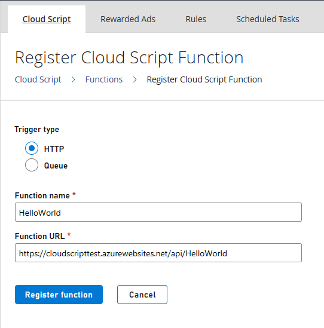
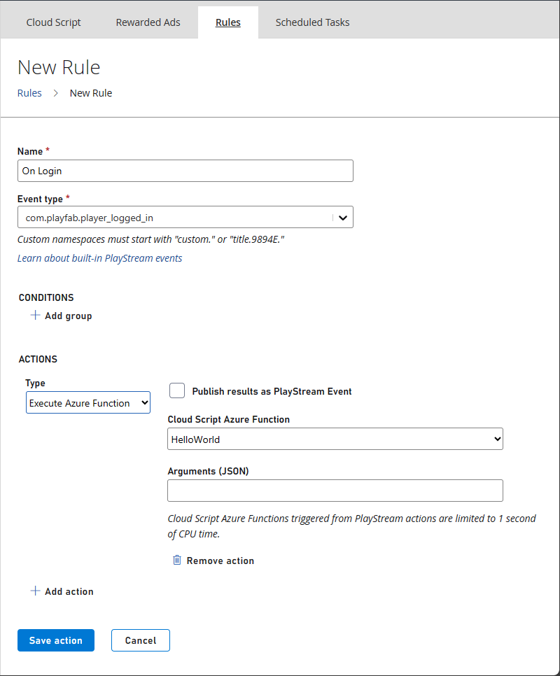

 
# Quickstart: Writing a PlayFab CloudScript using Azure Functions

In this quickstart, you write a CloudScript using Azure Functions with Visual Studio Code, Azure Functions C# and Unity C#. After finishing this guide, you'll be able to link your new CloudScript to rules, scheduled tasks or even call it from your client code.

## Prerequisites

There are a couple of steps needed to get started with PlayFab C# CloudScript.

- Visit the Visual Studio Code [QuickStart: Create an Azure Functions project using Visual Studio Code](/azure/azure-functions/create-first-function-vs-code-csharp?pivots=programming-language-csharp) and return here once you're set up. The following prerequisites are covered in their quickstart guide:
  - An [Azure account](https://azure.microsoft.com/free).  Signing up for an Azure Account is free
  - An [Azure Subscription](/azure/cost-management-billing/manage/create-subscription)
  - A Functions App resource configured in the Azure portal
    - To minimize latency of your CloudScript using Azure Functions place them in the *US-West*, *US-West 2*, or *US-West 3* Azure regions.
    - **Security Note:** From a security perspective, you should make sure to only use a given function secret with PlayFab and not use it for calling the same function from any other source.
    - **Security Note:** For queued functions, you should set up a distinct storage account for the queues used for the queue trigger.
- A [PlayFab](https://playfab.com/) account.

> [!NOTE]
> PlayFab Azure Functions can use the Azure Functions V2 runtime or greater, and .NET Core 2 or greater. We recommend that you use the latest version (currently Azure Functions V4 and .NET 6).

## Create an Azure Function

1. Create a basic "HelloWorld" example function. You can see how to do this by following the [Create your first function using Visual Studio Code guide](/azure/azure-functions/functions-create-first-function-vs-code).  For a code example using PlayFab variables, see the section below [PlayFab Function Context, Variables and using the Server SDKs](#playfabfunctioncontext).

    > [!IMPORTANT]
    > The "Create your first function using Visual Studio Code" guide instructs you to set the Authorization Level of your Azure Function to `Anonymous`. This is done to simplify testing.
    >
    > In a production environment, in most cases, you shouldn't use Anonymous authorization since it enables anyone to call your function endpoint. To properly secure your function in the PlayFab environment, we recommend that you use `Function` level authorization.
    >

2. After you create and deploy your function, go to  **Automation** > **Cloud Script** and select **Register Function** button in the top right hand corner of the page.

   
    
3. For **Name**, enter a human-friendly name for your function. For **Function URL**, enter the HTTP Trigger URL of the function. The URL can be found in the context menu of the Azure function resource as shown in "Run the function in Azure" section of [Quickstart: Create a function in Azure using Visual Studio Code](/azure/azure-functions/create-first-function-vs-code-csharp?pivots=programming-language-csharp#run-the-function-in-azure). If your Azure Function uses `Function` level authorization, the URL contains  the Authorization key.

For more information about deploying Azure functions, see [Deploy Azure Functions from Visual Studio Code](https://code.visualstudio.com/tutorials/functions-extension/deploy-app).


## Using and Calling CloudScript using Azure Functions from your PlayFab Title

The example code in this guide is written in Unity C# & Azure Function C# code.

Now that your function is registered, you can call that function from within using PlayFab APIs.

### Calling your function using HTTP requests from Visual Studio Code

Using the [REST Client extension](https://marketplace.visualstudio.com/items?itemName=humao.rest-client), you can invoke the function from within Visual Studio.

```http
@titleId =  ????? # Enter your title ID here
@baseUrl = https://{{titleId}}.playfabapi.com

###
# @name LoginWithCustomID
POST {{baseUrl}}/Client/LoginWithCustomID
Accept-Encoding: gzip
Content-Type: application/json

{
  "CustomId": "demo",
  "CreateAccount": true,
  "TitleId": "{{titleId}}"
}

@entityToken = {{LoginWithCustomID.response.body.$.data.EntityToken.EntityToken}}
@entity = {{LoginWithCustomID.response.body.$.data.EntityToken.Entity}}

###
# @name ExecuteFunction
POST {{baseUrl}}/CloudScript/ExecuteFunction
Accept-Encoding: gzip
Content-Type: application/json
X-EntityToken: {{entityToken}}

{
  "FunctionName": "HelloWorld"
}

###
# @name GetObjects
POST {{baseUrl}}/Object/GetObjects
Accept-Encoding: gzip
Content-Type: application/json
X-EntityToken: {{entityToken}}

{
  "Entity": {{entity}},
  "Objects": ["obj1"]
}

```

After pasting this code into a file in Visual Studio Code with the .http extension, you should be able to select _Send request_ under the _LoginWithCustomID_ function to get a player's entity token and then under _LoginWithCustomID_ to invoke your function. Invoking _GetObjects_ should show the object that your Azure function attached the player.

### Calling your function from Unity

You can use this code in Unity to invoke your function.

```c#
//This snippet assumes that your game client is already logged into PlayFab.

using PlayFab;
using PlayFab.CloudScriptModels;

private void CallCSharpExecuteFunction()
{
    PlayFabCloudScriptAPI.ExecuteFunction(new ExecuteFunctionRequest()
    {
        Entity = new PlayFab.CloudScriptModels.EntityKey()
        {
            Id = PlayFabSettings.staticPlayer.EntityId, //Get this from when you logged in,
            Type = PlayFabSettings.staticPlayer.EntityType, //Get this from when you logged in
        },
        FunctionName = "HelloWorld", //This should be the name of your Azure Function that you created.
        FunctionParameter = new Dictionary<string, object>() { { "inputValue", "Test" } }, //This is the data that you would want to pass into your function.
        GeneratePlayStreamEvent = false //Set this to true if you would like this call to show up in PlayStream
    }, (ExecuteFunctionResult result) =>
    {
        if (result.FunctionResultTooLarge ?? false)
        {
            Debug.Log("This can happen if you exceed the limit that can be returned from an Azure Function, See PlayFab Limits Page for details.");
            return;
        }
        Debug.Log($"The {result.FunctionName} function took {result.ExecutionTimeMilliseconds} to complete");
        Debug.Log($"Result: {result.FunctionResult.ToString()}");
    }, (PlayFabError error) =>
    {
        Debug.Log($"Opps Something went wrong: {error.GenerateErrorReport()}");
    });
}

```

### PlayFab CloudScript Context, Variables and Server SDKs <a name="playfabfunctioncontext"></a>

One advantage of using CloudScript using Azure Functions is that the PlayStream Event and Player Profile context is automatically passed to the Azure Function. On invocation of the CloudScript, you receive the context according to the function's invocation scenario. For example, the context is different depending on whether it was triggered by a PlayStream Action or called directly from the client. This includes information such as the entity profile on whose behalf the CloudScripts was invoked, and potentially the PlayStream events used to invoke the CloudScript.

1. You'll need to install the PlayFab SDK via Package Manager. To do this open Terminal or CMD Console in Visual Studio Code and type: `dotnet add package PlayFabAllSDK`
2. You need to include the [CS2AFHelperClasses.cs](https://github.com/PlayFab/PlayFab-Samples/blob/master/Samples/CSharp/AzureFunctions/CS2AFHelperClasses.cs) file that contains the implementation of `PlayFab.Samples`
3. Execution of a script can occur through several methods (APIs, Scheduled Tasks, PlayStream Event, Segment Entering and Exit method).  The context of the execution is important to implement your CloudScript. See the [Using CloudScript context models tutorial](CloudScript-af-context.md) for details on how to use the context of the script.

You can use the HelloWorld example below as your first Azure Function. It invokes an entity API and returns a greeting to the authenticated player. Classic server APIs can be invoked in a similar fashion; however, one would need to specify the title secret key in order to make the call. The secret key can be stored in [application settings](/azure/azure-functions/functions-how-to-use-azure-function-app-settings?tabs=portal#settings) and retrieved using `Environment.GetEnvironmentVariable()` method.

```c#
using PlayFab;
using PlayFab.Samples;
using PlayFab.DataModels;
using System.Collections.Generic;
using System.Threading.Tasks;

namespace PlayFabCS2AFSample.HelloWorld
{
    public static class HelloWorld
    {
        [FunctionName("HelloWorld")]
        public static async Task<dynamic> Run(
            [HttpTrigger(AuthorizationLevel.Function, "get", "post", Route = null)] HttpRequest req,
            ILogger log)
        {
            FunctionExecutionContext<dynamic> context = JsonConvert.DeserializeObject<FunctionExecutionContext<dynamic>>(await req.ReadAsStringAsync());

            dynamic args = context.FunctionArgument;

            var message = $"Hello {context.CallerEntityProfile.Lineage.MasterPlayerAccountId}!";
            log.LogInformation(message);

            dynamic inputValue = null;
            if (args != null && args["inputValue"] != null)
            {
                inputValue = args["inputValue"];
            }

            log.LogDebug($"HelloWorld: {new { input = inputValue} }");

            // The profile of the entity specified in the 'ExecuteEntityCloudScript' request.
            // Defaults to the authenticated entity in the X-EntityToken header.
            var entityProfile = context.CallerEntityProfile;

            var api = new PlayFabDataInstanceAPI(
                new PlayFabApiSettings
                {
                    TitleId = context.TitleAuthenticationContext.Id
                },
                new PlayFabAuthenticationContext
                {
                    EntityToken = context.TitleAuthenticationContext.EntityToken
                }
            );

            var apiResult = await api.SetObjectsAsync(
                new SetObjectsRequest
                {
                    Entity = new EntityKey
                    {
                        Id = entityProfile.Entity.Id,
                        Type = entityProfile.Entity.Type
                    },
                    Objects = new List<SetObject> {
                    new SetObject
                    {
                        ObjectName =  "obj1",
                        DataObject = new
                        {
                            foo = "some server computed value",
                            prop1 = "bar"
                        }
                    }
                }
                });

            return new { messageValue = message };
        }
    }
}
```

In the example, the `CurrentPlayerId` of the caller is available as it is in our traditional CloudScript implementation. Parameters that you pass in the `FunctionParameters` field are available in the *args*. But, unlike the Hello World example in [Create your first function using Visual Studio Code guide](/azure/azure-functions/create-first-function-vs-code-csharp), parameters are passed in the POST body instead of the query string.

To call the HelloWorld Azure Function from a PlayFab SDK use `ExecuteFunction`.

## Azure Functions in Automation Rules

Azure Functions can also be called by creating rules and scheduled tasks.  This works in the same way as our standard CloudScript.  To create a rule or scheduled task, go to **Automation** > **Rules**  or **Automation** > **Scheduled Tasks**. 

- Select **New Rule**
- Enter a name for your rule
- Select the event type that this rule triggers on
- Add an action
- From the action dropdown, select **Execute Azure Function**

A list of available Azure Functions that you've registered will be available in the drop-down list.



## Debugging your Azure Function

With Azure functions, you now have the option to debug your CloudScript locally or in the Azure portal. To learn more about portal debugging, see [Debugging CloudScript using Azure Functions with the Azure portal](debugging-with-CloudScript-AF-Azure.md). To learn how to set up local debugging, see [Local debugging for Cloudscript using Azure Functions](local-debugging-for-cloudscript-using-azure-functions.md).

## Execution limits

CloudScript calls to Azure Functions have timeout limits. If your webhook takes too long to execute, the request will time out in PlayFab. Make sure your code can execute fast enough to stay under the timeout limits.

| Source         | Action type   | Limit (seconds) |
| -------------- | ------------- | --------------: |
| PlayFab API    | HTTP request  |              10 |
| PlayStream V2  | HTTP request  |              10 |
| Scheduled task | HTTP request  |             4.5 |
| PlayStream V1  | HTTP request  |               1 |
| Queue function | Queue payload |               1 |
