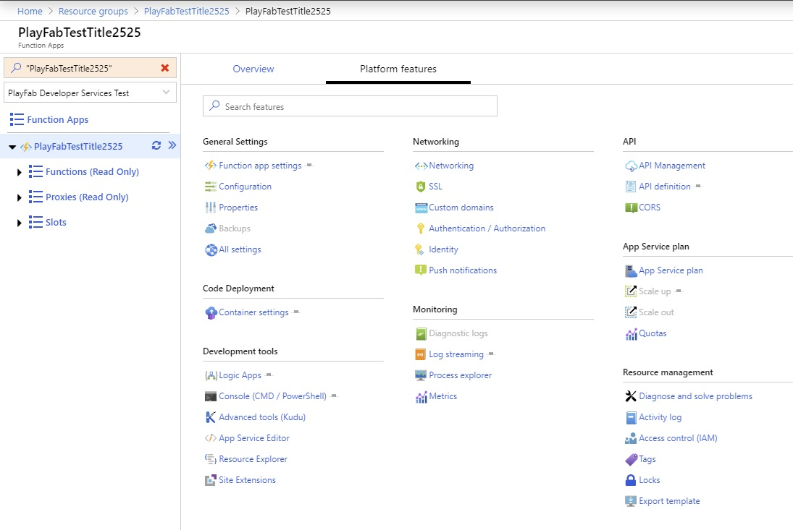
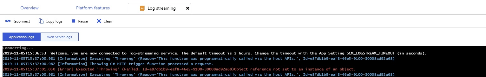

# Tutorial: Debugging CloudScript using Azure Functions with the Azure portal 

If you are editing your Azure Functions using the [Azure portal](https://portal.azure.com), you can get logs directly in the portal.

To find the logs you can use the following steps:
1) Open the [Azure portal](https://portal.azure.com)
2) Navigate to your Azure Functions app
3) Select Platform features 
4) Select Log Streaming under the Monitoring section
 
 

You will land on a screen that shows you the debug output:
 