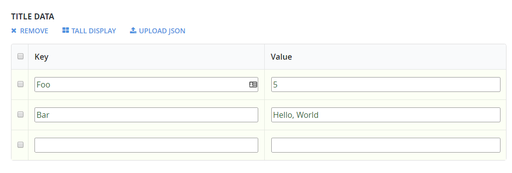

# ES6 features in CloudScript

The CloudScript runtime environment supports most of the modern ECMAScript 6 features. While a majority of these features are syntactical tricks, you can use them to improve and clean your CloudScript code.

A complete overview of ES6 features is available in this [Cheat Sheet](https://devhints.io/es6).

This tutorial shows several tricks you may use in your CloudScript.

> [!NOTE]
> Some of the features require **strict** mode. Enable this mode by placing the following code as the very first line of your CloudScript file:
> `use strict;`

## String interpolation

When composing messages for your players, you may want to use multi-line interpolated strings. Use the *back-tick symbol* to create an interpolated string. You may then insert data right into the string using `${ variable }` syntax.

This allows you to avoid string concatenation and improves code readability.

> [!NOTE]
> Back-tick strings are verbatim and may be multi-line. This means you have to keep an eye on *all indention*, as any extra space/tab will be captured into the string.

```javascript
function sendPushNotification(playerName, prizeAmount, newLevel) {
    let message = `Congratulations ${playerName}!
You have reached level ${newLevel}.
You get ${prizeAmount} coins for your efforts.`;
    // Use message variable and send push notification
    // ...
}
```

## New methods and arrow functions

ES6 brings *new* syntax for defining functions using the arrow operator `=>`. The snippet displayed below shows approximate translations for certain operator usages.

```javascript
// The following snippets:
const add = (a,b) => a+b;

const add = (a,b) => {
    return a+b;
}

// Both translate into something like
function add(a, b) {
    return a+b;
}
```

This operator, combined with the new `Array.findIndex` method, allows searching by predicate with the following well-looking, succinct code.

```javascript
const players = [...]; // Suppose this is an array of Player Profiles

// Search by predicate: find item in 'players' that has 'DisplayName' set to 'Bob':
const bobIndex = players.findIndex(p => p.DisplayName === 'Bob');
```

## Object assignment

The `Object.assign` method allows you to easily extend any object with a new set of properties and methods.

Having a large variety of usages, this method is particularly useful for extending a handlers object and creating groups of handlers.

```javascript
let TestHandlers = {
    TestLeaderboards : (args, ctx) => {
        // Test leaderboards code
    },
    TestPrizes : (args, ctx) => {
        // Test prizes code
    }
    // ...
}

let ProductionHandlers = {
    CleanUp : (args, ctx) => {
        // System clean up code
    },
    GrantTournamentAccess : (args, ctx) => {
        // Another useful production code
    }
    // ...
}

// Install both handler groups:
Object.assign(handlers, TestHandlers);
Object.assign(handlers, ProductionHandlers);

// Comment out the group to disable it but keep the relevant code
// Object.assign(handlers, SomeOtherHandlers);
```

This not only allows you to quickly enable and disable handler groups, but it also gives you a point to process your handlers and wrap them with useful code, such as exception handling.

The following code extends the previous snippet with automatic exception logging. As an example, we log the problem (which is not always useful), but you can extend the behavior to your taste.

```javascript
// Handlers installer wraps the handler to catch error
function installHandlers(handlersObject) {
    for (let property in handlersObject) {
        handlersObject[property] = wrapHandler(handlersObject,property)
    }
    Object.assign(handlers, handlersObject);
}

// Utility
function wrapHandler(obj, key) {
    if (obj.hasOwnProperty(key) && typeof obj[key] === 'function') {
        let original = obj[key]; // Take the original function
        return function() { // return a new function that
            try { // Wraps the original invocation with try
                return original.apply(null,arguments); // Do not forget to pass arguments
            } catch (error) { // If error occurs
                log.error(error); // We log it, but you may want to retry / do something else
                throw error; // Rethrow to keep the original behaviour
            }
        }
    } else { // If property is not a function, ignore it
        return obj[key];
    }
}

// Install handler groups:
installHandlers(TestHandlers);
installHandlers(ProductionHandlers);
```

## Getters

One may use "Getters" to encapsulate common API calls into a more syntactically pleasing look and feel. Consider the following **Title Data** state.

  

The following snippet shows how to retrieve `Foo` and `Bar` data from `TitleData` and then use them in a very straightforward way.

```javascript
'use strict'

// Define
let App = {
    get TitleData() {
        // Please, consider limiting the query by defining certain keys that you need
        return server.GetTitleData({}).Data;
    },
}

// Use
handlers.TestFooBar = () => {
    // Client code is clean and does not show the fact of calling any functions / making api request
    var titleData = App.TitleData; // Note that this implementation makes an API call every time it's accessed
    log.debug(titleData.Foo);
    log.debug(titleData.Bar);
}
```
