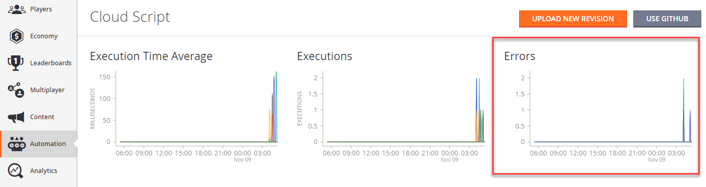

# Handling errors in CloudScript

This tutorial describes how to recognize and handle errors within your CloudScript handlers.

## Identifying

The first step is identifying the error. While every uncaught error is logged and available from the response to the caller (client), you can catch the error early by using a `try/catch` block.

Consider the following CloudScript snippet that produces and catches the error.

```javascript
"use strict";

handlers.GenerateError = () => {
    try {
        server.GetPlayerStatistics({
            PlayFabId : "non-existing-player-id"
        });
    } catch (ex) {
        let error = ex.apiErrorInfo.apiError.error; // In this case - "InvalidParams"
        let errorCode = ex.apiErrorInfo.apiError.errorCode; // In this case : 1000
    }
}
```

Notice how the error codes were extracted within the catch block? Consult our [Global API method error codes documentation](../../../api-references/global-api-method-error-codes.md) for a complete list of errors.

> [!NOTE]
> The error code on its own is sufficient to identify the error.

## Logging

Any unhandled error is added to the response, allowing the client to process the problem.

At the same time, it creates a CloudScript error entry and adds it to the total statistics available on your CloudScript dashboard.

  

To force-log the exception in the form of a JSON string, use error logging via the `log` object.

```javascript
"use strict";

handlers.GenerateError = () => {
    try {
        server.GetPlayerStatistics({
            PlayFabId : "non-existing-player-id"
        });
    } catch (ex) {
        log.error(ex);
    }
}
```

Finally, you can write title/player events for later processing through analytics.

```javascript
"use strict";

handlers.GenerateError = () => {
    try {
        server.GetPlayerStatistics({
            PlayFabId : "non-existing-player-id"
        });
    } catch (ex) {
        server.WriteTitleEvent({
            EventName : 'cs_error',
            Body : ex
        });
    }
}
```

## Recovery

It's not always possible to recover from errors. Issues such as `InvalidArguments` leave you with no option but to report the problem back to the player.

There are a subset of errors where a retry strategy can be applied. *Retry-able* error types are described in the [Global API Method Error Codes](../../../api-references/global-api-method-error-codes.md).

We ask that you *make sure* you meet the following requirements when applying a retry strategy:

- With each retry, the delay between retries should *increase* exponentially. This increases your chances for a successful call, and prevents your game from spamming the PlayFab server (which will result in *more* rejected calls).

- You should apply this retry strategy *selectively*, only using it for those codes that are worth retrying.

## CloudScript timeout error

The execution time of CloudScript API calls is limited to 4 seconds.

If the execution time exceeds 4 seconds, an `InternalServerError` is raised and the PlayStream Event writes a Logs object similar to the following:

```
    "Logs":[
        {
        "Level":"Error",
        "Message":"PlayFab API request failure",
        "Data":{
            "request":{
                "PlayFabId":"9437A5ADDAE3012D"
            },
            "error":"Timeout",
            "api":"/Server/GetPlayerSegments"
        }
        }
    ]
```

 If you encounter this error, you can:
 - break your CloudScript into smaller code segments which will run in under 4 seconds.
 - Switch to [CloudScript using Azure Functions](../cloudscript-af/quickstart.md), which has longer timeout limits in some cases. You can view the limits in the [quickstart guide](../cloudscript-af/quickstart.md#execution-limits).
