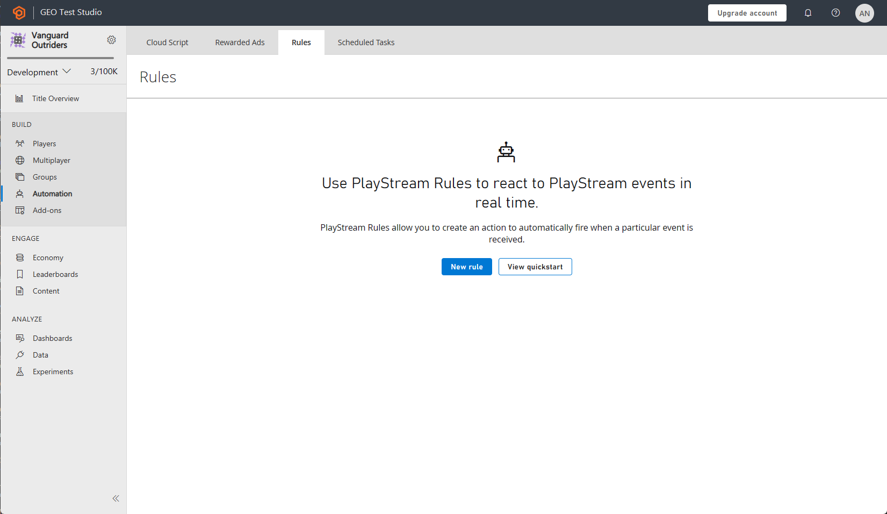
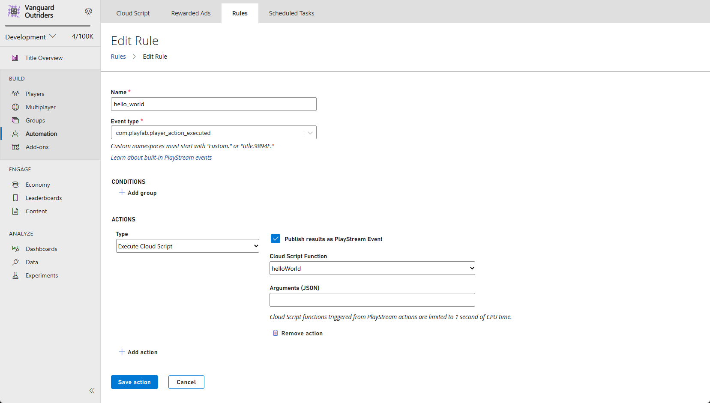
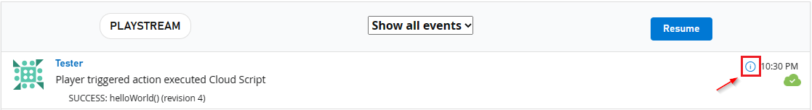
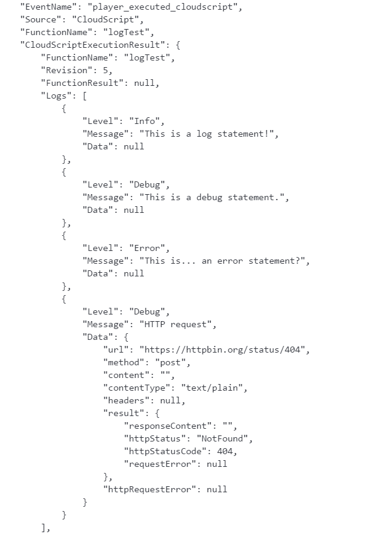

# Writing custom CloudScript

CloudScript is one of PlayFab's most versatile features. It allows client code to request execution of any kind of custom server-side functionality you can implement, and it can be used with virtually *anything*. In addition to explicit execution requests from client or server code, CloudScript can be executed in response to PlayStream events (by creating a *rule*) or as part of a scheduled task.

> [!NOTE]
> [CloudScript using Azure Functions](../cloudscript-af/quickstart.md) improves on what made CloudScript great with more supported languages and better debugging workflows.

This tutorial covers writing your CloudScript code. See the [CloudScript quickstart](quickstart.md) for help with uploading your CloudScript files to your title.

> [!NOTE]
> This tutorial demonstrates Unity code samples, but CloudScript works similarly for all SDKs.

Prerequisites for this tutorial:

- [**Unity** environment set up with the PlayFab **Unity SDK**](../../../sdks/unity3d/quickstart.md)
  - The title ID is set in the `PlayFabSharedSettings` object.
  - The project can successfully log in a user.

## Getting started: helloWorld

Our `helloWorld` example works on a brand new title, with no modifications in Game Manager. The default CloudScript file for a new title includes a handler called `helloWorld`. It utilizes a few basic features, input parameters, logging, currentPlayerId, and return parameters.

The following sample shows the default `helloWorld` function code (minus comments).

```javascript
// CloudScript (JavaScript)
handlers.helloWorld = function (args, context) {
    var message = "Hello " + currentPlayerId + "!";
    log.info(message);
    var inputValue = null;
    if (args && args.hasOwnProperty("inputValue"))
        inputValue = args.inputValue;
    log.debug("helloWorld:", { input: inputValue });
    return { messageValue: message };
}
```

### Deconstruct the code

The handler object is pre-defined in the PlayFab CloudScript environment. You should add any of your CloudScript functions to this object.

- `helloWorld` is a function made available to your title and SDKs, because it's defined in the handler object.

- `args` is an arbitrary object which comes from the caller. It's parsed from  JSON, and can contain any data formatted in any way.

See **FunctionParameter** in the next section.

> [!WARNING]
> You should treat this object with zero trust. A hacked client or malicious user can provide *any* information here in *any* format.

- `Context` is an advanced parameter. In this example, it's *null*. This parameter is server-controlled and safe.

- `currentPlayerId` is a global variable, which is set to the PlayFabId of the player requesting this call. This parameter is server-controlled and safe. **Note:** When using ExecuteEntityCloudScript API this parameter is null unless the entity has a MasterPlayerID in its entity chain.

- `log.info`: `log` is a global object. It's primarily used for debugging your CloudScript. The `log` object exposes the following methods: `info`, `debug`, and `error`. There are more details later in this tutorial.

- `return`: any object you return is serialized as JSON, and returned to the caller. You may return any JSON serialize-able object with any data you wish.

> [!WARNING]
> It is your responsibility if your CloudScript returns secret data to your clients. A hacked client or malicious user can examine the returned data, *even* if you don't display it to the user in regular game play.

## Executing CloudScript functions from a Unity game client

Calling a CloudScript function from within a client is straightforward. You first have to create an `ExecuteCloudScriptRequest`, and set the `ActionId` property to the name of the CloudScript function you wish to execute (in this case it would be `helloWorld`), then send the object to PlayFab via our API.

> [!NOTE]
> You can only call CloudScript methods attached to the handlers JavaScript object.

To execute CloudScript methods, you'll need the following lines of code in your client.

```csharp
// Build the request object and access the API
private static void StartCloudHelloWorld()
{
    PlayFabClientAPI.ExecuteCloudScript(new ExecuteCloudScriptRequest()
    {
        FunctionName = "helloWorld", // Arbitrary function name (must exist in your uploaded cloud.js file)
        FunctionParameter = new { inputValue = "YOUR NAME" }, // The parameter provided to your function
        GeneratePlayStreamEvent = true, // Optional - Shows this event in PlayStream
    }, OnCloudHelloWorld, OnErrorShared);
}
// OnCloudHelloWorld defined in the next code block
```

### Deconstruct the code

[ExecuteCloudScriptRequest](xref:titleid.playfabapi.com.client.server-sidecloudscript.executecloudscript#executecloudscriptrequest) is the request type for any call to [PlayFabClientAPI.ExecuteCloudScript](xref:titleid.playfabapi.com.client.server-sidecloudscript.executecloudscript).

- `ExecuteCloudScriptRequest.FunctionName` is a string. The value should match the name of the function defined in CloudScript. In this case, `helloWorld`.

- `ExecuteCloudScriptRequest.FunctionParameter` can be any object, able to be serialized to JSON. It becomes the first args parameter in the `helloWorld` function (refer to the args in the previous section).

- `ExecuteCloudScriptRequest.GeneratePlayStreamEvent` is optional. If true, an event is posted to PlayStream, which you can view in Game Manager, or utilize for other PlayStream triggers.

Depending on the language, the final part of the `ExecuteCloudScript` line involves making the request to the PlayFab CloudScript server, and the *Result* and *Error* handling part, specific for the language.

For example, in Unity, JavaScript, or AS3, Error and Result handling is provided using callback functions.

The following is an example of error handling methods.

```csharp
private static void OnCloudHelloWorld(ExecuteCloudScriptResult result) {
    // CloudScript returns arbitrary results, so you have to evaluate them one step and one parameter at a time
    Debug.Log(JsonWrapper.SerializeObject(result.FunctionResult));
    JsonObject jsonResult = (JsonObject)result.FunctionResult;
    object messageValue;
    jsonResult.TryGetValue("messageValue", out messageValue); // note how "messageValue" directly corresponds to the JSON values set in CloudScript
    Debug.Log((string)messageValue);
}

private static void OnErrorShared(PlayFabError error)
{
    Debug.Log(error.GenerateErrorReport());
}
```

## Intermediate Overview: Globals and advanced arguments

CloudScript is a set of JavaScript functions compiled with V8 and hosted on PlayFab's servers. It has access to any server API listed in the [PlayFab API reference documentation](../../../api-references/index.md), along with a *logger*, the PlayFab ID of the player making the CloudScript request, and any information included with the request, all in the form of preset objects.

CloudScript functions themselves are properties of a global handlers object. The following table shows a complete list of these predefined variables.

| Name                | Use                                                                                                                                                                                                                                                                                                                                                              |
| :------------------ | :--------------------------------------------------------------------------------------------------------------------------------------------------------------------------------------------------------------------------------------------------------------------------------------------------------------------------------------------------------------- |
| **server**          | Has access to all server-side API calls listed in the [PlayFab API reference documentation](../../../api-references/index.md). They can be called (synchronously) like so: `var result = server.AuthenticateUserTicket(request);`                                                                                                                                |
| **http**            | Performs synchronous HTTP requests, like so: `http.request(url, method, content, contentType, headers, logRequestAndResponse)`. The `headers` object contains properties corresponding to various headers and their values. `logRequestAndResponse` is a boolean that determines whether the title should log any errors in the request as part of the response. |
| **log**             | Creates log statements and adds them to the response. Logs have three levels: `log.info()`, `log.debug()`, and `log.error()`. All three levels take a message string, along with an optional object containing extra data to include with the log. For example, `log.info('hello!', { time: new Date() });`                                                      |
| **currentPlayerId** | PlayFab ID of the player who triggered the CloudScript call.                                                                                                                                                                                                                                                                                            |
| **handlers**        | Global object that contains all CloudScript functions for your title. Functions can be added or called through this object. For example, `handlers.pop = function() {};`, `handlers.pop();`.                                                                                                                                                            |
| **script**          | Global object that contains `Revision` and `titleId`. `Revision` represents the **Revision Number** for the currently executing CloudScript, and `titleId` represents the ID for the current title.                                                                                                                                                     |

In addition, all handler functions are passed two parameters, detailed below.

| Name        | Use                                                                                                                                                                                                                                                                                                                                                                                                                                              |
| :---------- | :----------------------------------------------------------------------------------------------------------------------------------------------------------------------------------------------------------------------------------------------------------------------------------------------------------------------------------------------------------------------------------------------------------------------------------------------- |
| **args**    | First parameter to a handler function. An object representation of the `FunctionParameter` field of an `ExecuteCloudscript` request.                                                                                                                                                                                                                                                                                                             |
| **context** | Second parameter to a handler function. Additional information about the request when it is triggered by a PlayStream event action, including the [data from the event](../../../api-references/events/index.md) that triggered the action (context.playStreamEvent) and the [profile data](xref:titleid.playfabapi.com.client.accountmanagement.getplayerprofile#playerprofilemodel) for the player associated with it. (context.playerProfile) |

CloudScript functions can be called through the `ExecuteCloudScript` API, or by a preset PlayStream event action.

Full details about the response to `ExecuteCloudScript` can be found in the [ExecuteCloudScriptResult](xref:titleid.playfabapi.com.client.server-sidecloudscript.executecloudscript#executecloudscriptresult).

## Intermediate: FunctionParameter and args

In the previous section, we described how to populate the `request.FunctionParameter`, and view that info in the `args` parameter. The [CloudScript quickstart](quickstart.md) demonstrates how to upload new CloudScript.

 Putting both together, we can provide another example of how to pass arguments from client to CloudScript. Take the previous example, and modify the CloudScript code and your client code as shown below.

```javascript
handlers.helloWorld = function (args) {
    // ALWAYS validate args parameter passed in from clients (Better than we do here)
    var message = "Hello " + args.name + "!"; // Utilize the name parameter sent from client
    log.info(message);
    return { messageValue: message };
}
```

```csharp
// Build the request object and access the API
private static void StartCloudHelloWorld()
{
    PlayFabClientAPI.ExecuteCloudScript(new ExecuteCloudScriptRequest()
    {
        FunctionName = "helloWorld", // Arbitrary function name (must exist in your uploaded cloud.js file)
        FunctionParameter = new { name = "YOUR NAME" }, // The parameter provided to your function
        GeneratePlayStreamEvent = true, // Optional - Shows this event in PlayStream
    }, OnCloudHelloWorld, OnErrorShared);
}

private static void OnCloudHelloWorld(ExecuteCloudScriptResult result) {
    // CloudScript returns arbitrary results, so you have to evaluate them one step and one parameter at a time
    Debug.Log(JsonWrapper.SerializeObject(result.FunctionResult));
    JsonObject jsonResult = (JsonObject)result.FunctionResult;
    object messageValue;
    jsonResult.TryGetValue("messageValue", out messageValue); // note how "messageValue" directly corresponds to the JSON values set in CloudScript
    Debug.Log((string)messageValue);
}

private static void OnErrorShared(PlayFabError error)
{
    Debug.Log(error.GenerateErrorReport());
}
```

After making these changes, you can now easily send and receive data between CloudScript and your clients.

> [!NOTE]
> It is important to point out that any data coming from your clients is susceptible to hacking and exploitation.

You will always want to validate input parameters *prior* to updating your back end. The process for validating input parameters will vary from title to title, but the most basic validation will check to ensure inputs are within acceptable ranges and periods.

## Intermediate: Calling the server APIs

As mentioned before, within CloudScript methods, you have access to the full set of Server API calls. This enables your cloud code to act as a dedicated server.

Common server tasks:

- Update player statistics and data.
- Grant items and currency.
- Randomly generate game data.
- Securely calculate battle results and more...

See the Server APIs listed in our [PlayFab API Reference documentation](../../../api-references/index.md) for required parameters and object structures.

The following example is from within a potential CloudScript handler.

```javascript
// CloudScript (JavaScript)
//See: JSON.parse, JSON.stringify, parseInt and other built-in javascript helper functions for manipulating data
var currentState; // here we are calculating the current player's game state

// here we are fetching the "SaveState" key from PlayFab,
var playerData = server.GetUserReadOnlyData({"PlayFabId" : currentPlayerId, "Keys" : ["SaveState"]});
var previousState = {}; //if we return a matching key-value pair, then we can proceed otherwise we will need to create a new record.

if(playerData.Data.hasOwnProperty("SaveState"))
{
    previousState = playerData.Data["SaveState"];
}

var writeToServer = {};
writeToServer["SaveState"] = previousState + currentState; // pseudo Code showing that the previous state is updated to the current state

var result = server.UpdateUserReadOnlyData({"PlayFabId" : currentPlayerId, "Data" : writeToServer, "Permission":"Public" });

if(result)
{
    log.info(result);
}
else
{
    log.error(result);
}
```

## Advanced: PlayStream event action

A CloudScript function can be configured to run in response to a PlayStream event. 

1. In any browser:
   - Visit the **PlayFab Game Manager**.
   - Find your **Title**.
   - Under **Build** in the sidebar, go to the **Automation** tab.
   - Go to the **Rules** tab.

The page will look like the example provided below.

     

2. Use the **New Rule** button to create a new rule.
   - Give the new **Rule** a name. 
   - Select an **Event type** that will be used as a trigger for a condition or an action.
   - To make the **Rule** trigger a CloudScript function, add an **Action** with the button in that section.
   - Then select the option in the **Type** drop-down menu.
   - Select the **helloWorld** function in the **Cloud Script Function** drop-down menu.
   - Select the **Save action** button.

     

3. This **Rule** is now set to trigger on any event of your selected type. To test it:
   - Check the **Publish results as PlayStream Event** box.
   - Save the **Action**.
   - Then trigger an event.
   - In the **PlayStream Monitor**, a new event that corresponds to the CloudScript execution should be present which contains the appropriate information.
   - For more information on checking a PlayStream event in the debugger, see the following section [Advanced: Debugging CloudScript](#advanced-debugging-cloudscript).

   > [!NOTE]
   > Event actions can only use the live revision when calling CloudScript functions. If you cannot find the **helloWorld** function in the drop-down, this is the most likely reason.

## Advanced: Debugging CloudScript

> [!NOTE]
> Debugging is much easier with [CloudScript using Azure Functions](../cloudscript-af/index.md). Learn more on how to use [local debugging for CloudScript using Azure Functions.](../cloudscript-af/local-debugging-for-cloudscript-using-azure-functions.md)

### Logging

One of the most important tools for debugging code is *logging*. Our CloudScript provides a utility for performing the function.

This takes the form of the `log` object, which can log any message desired using the `Info`, `Debug`, and `Error` methods.

Additionally, the HTTP object will log any errors it comes across while making requests by setting the `logRequestAndResponse` parameter. While setting these logs up is simple, accessing them takes *a bit* of finesse.

Here is an example of a CloudScript function that uses all 4 types of logs.

```javascript
handlers.logTest = function(args, context) {
    log.info("This is a log statement!");
    log.debug("This is a debug statement.");
    log.error("This is... an error statement?");
    // the last parameter indicates we want logging on errors
    http.request('https://httpbin.org/status/404', 'post', '', 'text/plain', null, true);
};
```

To run this example, add this function to your live revision before proceeding.

The `logTest` function can be called using `ExecuteCloudScript` as shown below.

```csharp
// Invoke this on start of your application
void Login() {
    PlayFabClientAPI.LoginWithCustomID(new LoginWithCustomIDRequest {
        CreateAccount = true,
        CustomId = "Starter"
    }, result => RunLogTest(), null);
}

void RunLogTest() {
    PlayFabClientAPI.ExecuteCloudScript(new ExecuteCloudScriptRequest {
        FunctionName = "logTest",
        // duplicates the response of the request to PlayStream
        GeneratePlayStreamEvent = true
    }, null, null);
}
// Logs evaluated in next code block
```

Setting `GeneratePlayStreamEvent` makes the CloudScript function call generate a PlayStream event, which includes the contents of the response. To find the contents of a PlayStream event:

- Go to either the **Game Manager** home page for your **Title** or its **PlayStream** tab.
- The **PlayStream Debugger** will display events as they come in.
- When they arrive, select the small blue **Info** icon in the top right corner of the event, as shown below.

     

Selecting this will display the raw JSON of the event, which is detailed for each event [here](../../../api-references/events/index.md). An example of this JSON can be seen in the following example.

- If we add the `LogScript` MonoBehavior to the scene, running the game will yield this in PlayStream.

     

The result of an `ExecuteCloudScript` call includes a field called `Logs`, which is a list of log objects generated by the CloudScript function.

You can see the three log calls, as well as the log from the invalid HTTP request. The HTTP request log also makes use of the `Data` field, unlike the log calls.

This field is a JavaScript object that can be populated by any information relevant to the log statement. Calls to log can make use of this field as well, using the second parameter, as indicated below.

```javascript
handlers.logTest = function(args, context) {
    log.info("This is a log statement!", { what: "Here on business." });
    log.debug("This is a debug statement.", { who: "I am a doctor, sir" });
    log.error("This is... an error statement?", { why: "I'm here to fix the plumbing. Probably.", errCode: 123 });
};
```

These calls will all populate the `Data` field in the result with their second parameter.

Since the logs are included in the result, the client-side code can respond to log statements. The error in the `logTest` function is forced, but the client code can be adapted to respond to it.

```csharp
void RunLogTest()
{
    PlayFabClientAPI.ExecuteCloudScript(
        new ExecuteCloudScriptRequest
        {
            FunctionName = "logTest",
            // handy for logs because the response will be duplicated on PlayStream
            GeneratePlayStreamEvent = true
        },
        result =>
        {
            var error123Present = false;
            foreach (var log in result.Logs)
            {
                if (log.Level != "Error") continue;
                var errData = (JsonObject) log.Data;
                object errCode;
                var errCodePresent = errData.TryGetValue("errCode", out errCode);
                if (errCodePresent && (ulong) errCode == 123) error123Present = true;
            }

            if (error123Present)
                Debug.Log("There was a bad, bad error!");
            else
                Debug.Log("Nice weather we're having.");
        }, null);
}
```

If this code is run, the output should indicate the presence of the error. Realistic error responses might be to display the error in the UI, or save a value in a log file.

## Advanced: Errors

In development, CloudScript errors will often not be manually triggered - as in the case of `log.error`.

Fortunately, the response to [ExecuteCloudScript](xref:titleid.playfabapi.com.client.server-sidecloudscript.executecloudscript) contains an [ExecuteCloudScriptResult](xref:titleid.playfabapi.com.client.server-sidecloudscript.executecloudscript#executecloudscriptresult) which includes a [ScriptExecutionError](xref:titleid.playfabapi.com.client.server-sidecloudscript.executecloudscript#scriptexecutionerror) field. Adapting the last example from the logging section, we might use it as shown below.

```csharp
void RunLogTest() {
    PlayFabClientAPI.ExecuteCloudScript(new ExecuteCloudScriptRequest {
        FunctionName = "logTest",
        // handy for logs because the response will be duplicated on PlayStream
        GeneratePlayStreamEvent = true
    }, result => {
        if(result.Error != null) {
            Debug.Log(string.Format("There was error in the CloudScript function {0}:\n Error Code: {1}\n Message: {2}"
            , result.FunctionName, result.Error.Error, result.Error.Message));
        }
    },
    null);
}
```

In the event that some error occurred, this code would display it in the log.
