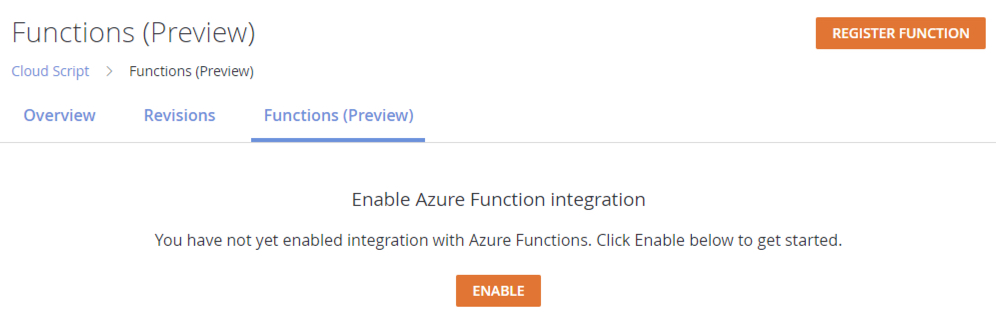
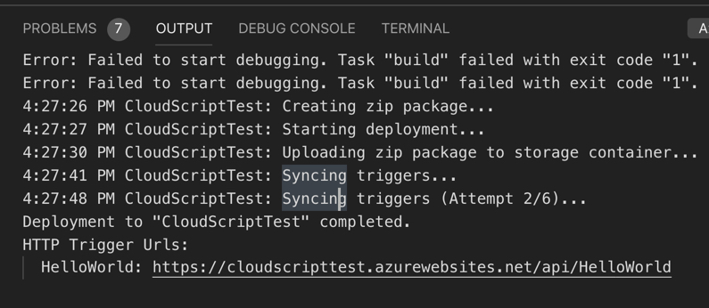
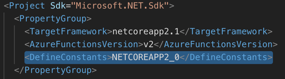
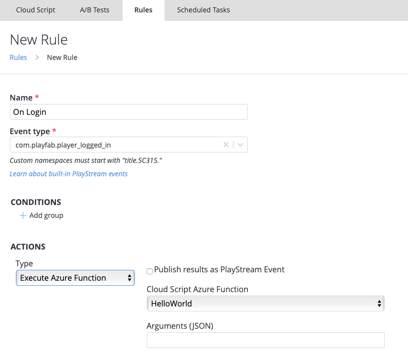

# PlayFab C# CloudScript using Azure Functions

> [!IMPORTANT]
> This feature is currently in **Private Preview**.  
>
> It is provided to give you an early look at an upcoming feature and to allow you to provide feedback while it is still in development.  
>
> Access to this feature is restricted to select titles. If you are interested in trying it, please contact us at [helloplayfab@microsoft.com](mailto:helloplayfab@microsoft.com).

C# CloudScript is a new feature that grants you event-driven compute on demand.  In order to do this we leverage Azure Functions and provide you with a tight integration via Visual Studio Code.  

Using Azure Functions to run cloud code that is bound to a PlayFab title gives you the power of C# and strongly typed code. In addition, it also gives you the ability to leverage any number of Azure features such as CosmosDB.

### Early Access
PlayFab C# CloudScript is still in development.  API contract changes may be necessary in order to deliver the optimal experience for customers.  We *do not* recommend shipping a game to the public which relies on this feature until it is in Public Preview.

### Pricing
Currently access to C# CloudScript is free from within PlayFab. However, in order to use this feature you **must** bring your own Azure Subscription.  This means, that usage charges will apply to your Azure Subscription the same as if you used Azure Functions without a PlayFab integration. For more information about [Azure Function pricing](https://azure.microsoft.com/pricing/details/functions/) visit the Azure Site. In addition, it is worth noting that Azure Functions does come with a certain amount of free usage with a paid subscription.

### Prerequisites
There are a couple of steps needed to get started with PlayFab C# CloudScript.

* You must have an [Azure account](https://azure.microsoft.com/free/search/?&ef_id=EAIaIQobChMIhqGcsOTk5AIVF6rsCh0RIAJQEAAYASAAEgK6OfD_BwE:G:s&OCID=AID2000128_SEM_fNqQIgDa&MarinID=fNqQIgDa_306007172569_azure_e_c__46775454899_kwd-295407966859&lnkd=Google_Azure_Brand&gclid=EAIaIQobChMIhqGcsOTk5AIVF6rsCh0RIAJQEAAYASAAEgK6OfD_BwE) already setup.  Signing up for an Azure Account is free.
* You must have an [Azure Subscription setup](https://docs.microsoft.com/azure/billing/billing-create-subscription), Subscriptions can be cancelled at any time. Visit [Cancel Azure Subscription](https://docs.microsoft.com/azure/billing/billing-how-to-cancel-azure-subscription) for more info.
* You must have a [PlayFab account](https://developer.playfab.com/signup). 
* You must have the C# CloudScript feature enabled for your title. Please contact [helloplayfab@microsoft.com](mailto:helloplayfab@microsoft.com) to request access while in Private Preview.
* You will need access to the Beta PlayFab SDKs while this feature is in Private Preview.  You can also request access to these SDKs via [helloplayfab@microsoft.com](mailto:helloplayfab@microsoft.com).
* While we do support all languages that Azure Functions support, our documentation only focuses on C# at this time.
* PlayFab Azure Functions use V2 of Azure Functions, so please be sure to use the V2 runtime.

### Getting Started
There are two ways to get started with C# CloudScript using Azure Functions.  The easiest and quickest way is to use Azure Functions right out of the box.  To get started with Azure Functions with either Visual Studio Code or Visual Studio visit their [getting started guide](https://docs.microsoft.com/azure/azure-functions/) and return here once you are completely setup.

The second is to use our [beta Visual Studio Code Extension](https://aka.ms/cs2af-vscode).  Access is restricted to this resource, so you must also request access to it from [helloplayfab@microsoft.com](mailto:helloplayfab@microsoft.com).  

What is the the difference between the two?  The main difference is that our Visual Studio Code Extension provide some easy ways to registers and unregister functions with your PlayFab title. However, you do not need the extension to do this as there is a user interface for it in [Game Manager](https://developer.playfab.com/login).  We will cover more about this below.

>Note: In this guide, we will focus only on the first scenario for using Azure Functions out of the box. And that you will be using Visual Studio Code.

### Enable the Feature
Once you have gained access to the feature, you need to enable it.  Visit Automation -> CloudScript tab -> Functions (Preview).

* Click the Enable button to turn on the various pieces of Game Manager that will allow you to register functions, hook them up to rules, tasks etc.



### Create an Azure Function
1. We first need you to create a basic "HelloWorld" example function.  You can see how to do this by following the [Create your first function using Visual Studio Code guide](https://docs.microsoft.com/azure/azure-functions/functions-create-first-function-vs-code).  For a code example using PlayFab variables see the section below **(PlayFab Function Context, Variables and using the Server SDKs)**
2. Once your function has been created and deployed, click the Register Function button in the top right hand corner of the Functions (Preview) page.

3. Put the name and Function URL.  The URL can be found in the output of your deployment.
    
> Tip: Click to [learn more about deploying azure functions](https://code.visualstudio.com/tutorials/functions-extension/deploy-app) 


### Using and Calling C# CloudScript from your PlayFab Title.
In order to use the function you just created from the PlayFab SDK.  You will need to download one of our BetaSDKs.  These are gated SDKs, and you will need to request access to them via [helloplayfab@microsoft.com](mailto:helloplayfab@microsoft.com).  Once you have access to the [Beta SDKs](https://github.com/PlayFab?utf8=%E2%9C%93&q=beta&type=&language=) you can download the one specificly for the environment you are making your game in.  

> Note: The examples code within the this guide will be written in Unity C# & Azure Function C# code.

Now that your function is registered, and you have the Beta SDK installed, you can now call that function from within your SDK.

Calling the C# CloudScript is virtually identical to the way you call our traditional CloudScript.  

```C#
//This snippet assumes that your game client is already logged into PlayFab.

using PlayFab;

private void CallCSharpExecuteFunction(){
    
    PlayFabCloudScriptAPI.ExecuteFunction(new ExecuteFunctionRequest(){
        EntityKey = new CloudScriptModels.EntityKey(){
            Id = [AuthenticationContext.Entity.Id], //Get this from when you logged in,
            Type = [Authenticationcontext.Entity.Type] //Get this from when you logged in
        }, 
        FunctionName = "HelloWorld", //This should be the name of your Azure Function that you created.
        FunctionParameter = new Dictionary<string,object>(){
            {"inputValue": "Test"}
        }, //This is the data that you would want to pass into your function.
        GeneratePlayStreamEvent:false, //Set this to true if you would like this call to show up in PlayStream
    }, (ExecuteFunctionResult result)=>{
        if(result.FunctionResultTooLarge){
            Debug.Log("This can happen if you exceed the limit that can be returned from an Azure Function, See PlayFab Limits Page for details.")
            return;
        }
        Debug.Log($"The {result.FunctionName} function took {result.ExecutionTimeMilliseconds} to complete");
        Debug.Log($"Result: {result.FunctionResult.toString()}");
    },(PlayFabError error)=>{
        Debug.Log($"Opps Something went wrong: {error.GenerateErrorReport()}");
    });

} 

```
### PlayFab Function Context, Variables and using the Server SDKs
Like our previous CloudScript, some data will be automatically passed to the Azure Function that tells you information about who called the Function and in what context the Function was called (eg. PlayStream Action, or Called From the client). 

There are a couple of steps that you need to do if you are coding Functions without our Visual Studio Code Extension. 

1. You will need to install the PlayFab SDK via Package Manager. To do this open Terminal or CMD Console in Visual Studio Code and type: `dotnet add package PlayFabAllSDK`
2. We have created some helpers that will ship with the cSharpSDK,  they are in beta.  If you have access to the beta repository, then you can get the cloudscript project.  If not, you can copy the file *PlayFabFunctionContexts.cs* from the [pf-af-samples](https://github.com/PlayFab/pf-af-samples) repository.
3. You need to edit your .csproj file and include `<DefineConstants>NETCOREAPP2_0</DefineConstants>` in your default PropertyGroup.


A hello world example is always nice,  see the below HelloWorld Sample that you can use as your first Azure Function.

```C#
using System.Net.Http;
using System.Threading.Tasks;
using Microsoft.Azure.WebJobs;
using Microsoft.Azure.WebJobs.Extensions.Http;
using Microsoft.Extensions.Logging;
using PlayFab;
using PlayFab.Plugins.CloudScript;

namespace PlayFabCS2AFTests.HelloWorld
{
    public static class HelloWorld
    {
        [FunctionName("HelloWorld")]
        public static async Task<dynamic> Run(
            [HttpTrigger(AuthorizationLevel.Anonymous, "get", "post", Route = null)] HttpRequestMessage req,
            ILogger log)
        {
            /* Create the function execution's context through the request */
            var context = await FunctionContext<dynamic>.Create(req);
            var args = context.FunctionArgument;

            var message = $"Hello {context.CurrentPlayerId}!";
            log.LogInformation(message);

            dynamic inputValue = null;
            if (args != null && args["inputValue"] != null)
            {
                inputValue = args["inputValue"];
            }

            log.LogDebug($"HelloWorld: {new { input = inputValue} }");

            return new { messageValue = message };
        }
    }
}

```
As you can see in the above, the CurrentPlayerId of the caller is available like in our traditional CloudScript implementation.  Parameters you have passed in the FunctionParameters field will be available in the *args*.

>Note: You will need to call this HelloWorld Azure Function via ExecuteFunction from an SDK.

### Azure Function Rules
Azure Functions can also be called by creating rules and scheduled tasks.  This works in the same way as our standard CloudScript.  To create a rule, go to Automation->Rules  or Automation->Scheduled Tasks. 

* Click **New Rule**
* Enter a name for your rule
* Select the event type that this rule will trigger on
* Add an action
* From the action dropdown select **Execute Azure Function**

A list of available Azure Functions that you've registered will be available in the drop down list.



### Debugging your Azure Function
With Azure Functions, you can now test and debug your CloudScript code locally.  Here is a great guide on how to [test and debug your Functions](https://docs.microsoft.com/azure/azure-functions/functions-develop-local) locally. 

Here are some highlights from the above document.

* Make sure that your Azure Functions Core Tools are installed.
* Configure your [Local Settings File](https://docs.microsoft.com/azure/azure-functions/functions-develop-vs-code?tabs=nodejs#local-settings-file)
* Set a break point in your code
* Selct **F5** to start debugging
