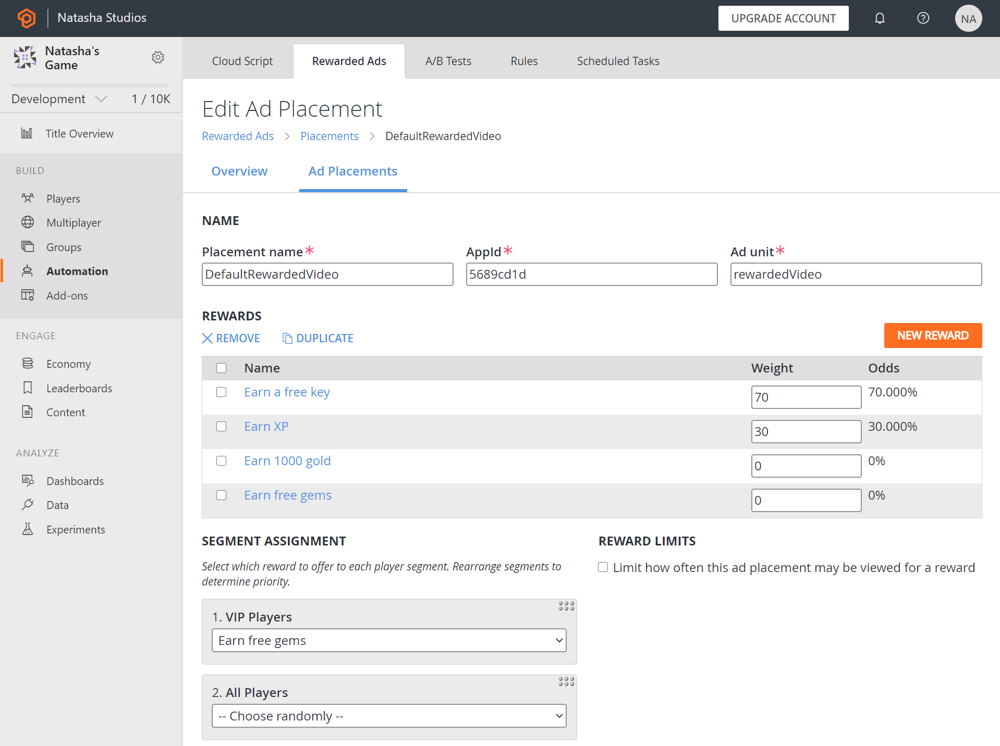

# Quickstart: Set up an Ad placement
Rewarded ads are a way of incentivizing your players to watch video ads in exchange for an reward. Each ad with its associated rewards is considered an ad placement. In this quickstart you will set up an ad placement and configure rewards for it. 

## Prerequisites
* A [PlayFab developer account](https://developer.playfab.com/en-US/my-games).
* An Application ID and Advertising Unit type from your ad provider. 

## Set up an Ad placement 
In the **Rewarded Ads** tab, the first thing you'll see is the main dashboard for your ads. Here you'll find basic KPIs for your ads, along with a graph showing your recent ad events (they also show up in the [PlayStream Debugger](../playstream-events/index.md). At the top, select **Placements**.

Ad placements are the most fundamental part of the system. Think of a single placement as an "ad position": the type of ad that will be displayed (banner, video, etc.) and at what point in the game the player will see it (level interstitial, as a result of clicking on a "show me an ad", etc).

In the upper right corner, select **New Ad Placement**. Name your placement whatever you like, and enter the Application ID and Advertising Unit type from your ad provider. If you're uncertain as to where to locate the Application ID and Advertising Unit type for your specific provider, let us know and we can work with you to identify them.

## Add rewards
Now you'll need to add your specific rewards. For each possible reward for this placement, select **New Reward**. Give your reward a name and enter any description text and asset package URL you want returned to the client when the specific reward is given. Then, under **Actions**, select **Add Action**. Just as you can with regular [PlayStream ](../playstream-events/index.md) actions, you can take a number different actions right now - running a Cloud Script handler, granting items, etc. Usually, you'll be granting virtual currency or items here, but if you want to make use of the other action types it'll all be processed the same way it is for a normal PlayStream action trigger.

After you have a couple of rewards defined, give each one a weight to set up the random distribution. If you've defined [Segments](../../analytics/segmentation/index.md) for your title, you can also set overrides in the **Segment Assignment** tool below **Rewards**. For example, if you have a certain group of players that you want to always get a specific reward, set that segment to that reward in the assignment list. The segment assignments are in priority order, so the first segment that matches one for the current player is the one that is used. The following example defines an ad placement that provides free gems 0% of the time, bonus experience points 30% of the time and a "key" item 70% of the time.

 

In the example we use **Segment Assignment** to provide rewards in a priority order. If the player is in the "High XP Players" group, the normal random selection is made. But if the player is in the "VIP players" segment, we grant that player the "gems" reward.

> [!TIP] 
> Consider creating a segment for players who are watching an ad for the first time, and grant them one of your more desirable rewards. This can help incentivize your players to continue engaging with rewarded ads, and lead to a higher retention rate overall. 

Finally, you have the option to limit the number of times the player can be rewarded for an ad. In our example, we limited this to 4 times per day, per player (daily resets on this counter occur at 00:00 UTC). You can have the limit reset daily, hourly, or every two hours. 

## Retrieving the Ad Placements

After defining at least one ad placement, you can query for a list of available placements using Client/GetAdPlacements. Specify an Identifier in the call to ensure that you only get information on the given placement. To filter for a specific placement, you can use either the name you defined for it (above), or the PlayFab-generated unique identifier for the placement (which you can see in the URL, in the example above). Otherwise, all available placements for which the player has a valid reward, including the reward for the player, the number of views currently remaining, and the time to reset the view limit are returned in an `AdPlacementDetails` object.
When you have selected an ad placement in the client code, make sure to save the `PlacementId` and `RewardId`. You'll be using those for the next two stages.

## Reporting Ad Activity

We define four activity states for an ad - "Opened", "Closed", "Start", and "End". As you use Rewarded Ads, make sure you're calling Client/ReportAdActivityRequest to update the activity state every time your ad SDK reports a state change. 

## Rewarding Ad Activity

When your ad SDK reports that the ad view has successfully completed, call Client/RewardAdActivity to trigger the reward. This call requires the `PlacementId` and `RewardId` returned by Client/GetAdPlacements. It first checks that the reward is valid, then processes it for the player. Items are granted immediately, and the call then returns a complete set of changes made to the player by the Grant Item, Grant Virtual Currency, and Increment Player Statistic actions.

Finally, it's important to note that the reward ID is not bound to the player as part of the call to GetAdPlacements. Based on the weightings you've provided, calling GetAdPlacements multiple times might cause the reward to change. The call to `RewardAdActivity` only requires that the reward be valid for the player, not that it was the last one returned from GetAdPlacements. 
