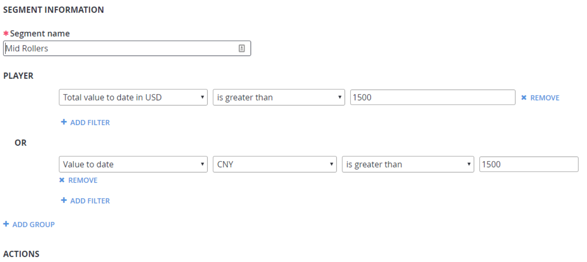

# Getting a player's Value-to-Date (VTD)

Player profiles now track the total amount spent by a player as both a total across all currencies converted to **USD** in the field **totalValueToDateInUSD** and a **Dictionary** field named **valuesToDate** of **Currency**, and total spent in that **Currency**. Both totals are expressed in **cents** or **centesimal**.

Along with this, there are two new segment predicates, **TotalValueToDate** (**Total value to date in USD** in the **UI**) and **ValueToDate** (**Value to date** in the **UI**).

## Examples

1. Create a segment of all players who have purchased more than **15 USD** in any currency.

     

2. Create a segment of all players who have spent more more than **15 USD** in any currency *or* **15 Chinese Yuan**.

     

## Player profile details

The player profile model now contains the following fields:

```json
// JSON
{
    totalValueToDateInUSD: [nullable uint]
    valuesToDate: [Dictionary string, uint]
}
```

The following **JSON** shows the fields with example values:

```json
// JSON
{
    …
    totalValueToDateInUSD: 1700
    valuesToDate: [{ "USD", 1200 }, { "EUR", 320 }]
    …
}
```
