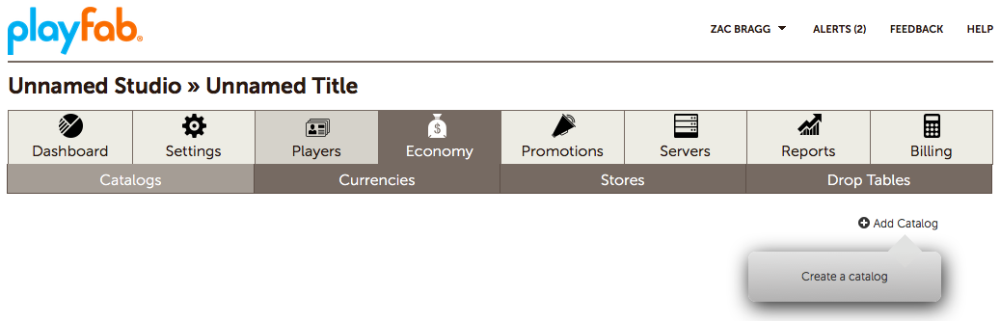
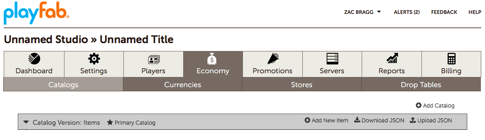
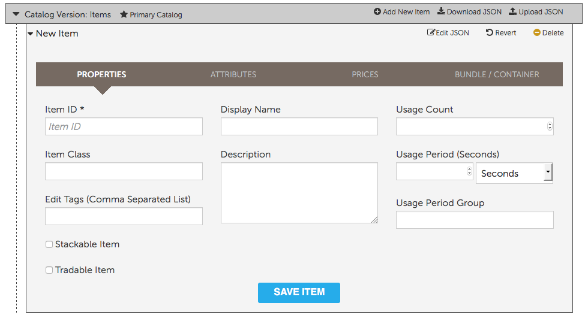
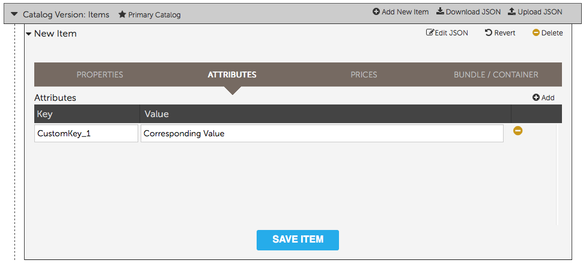
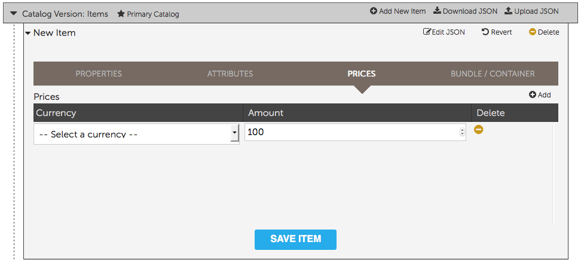
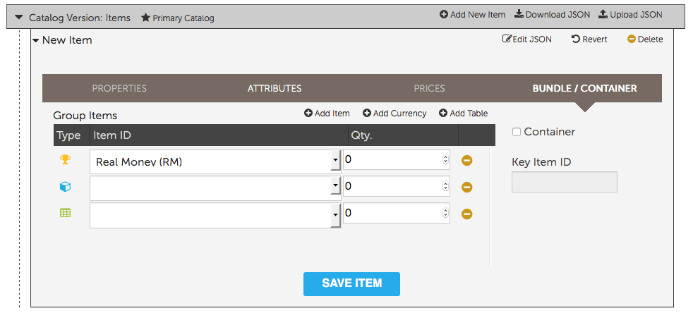
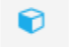

# Catalogs

This tutorial describes the **Catalogs** tab in the **Economy** section in **Game Manager**. You can use catalogs to define items that the player can purchase or that you can reward to a player.

## What is a catalog?

Many games offer the player items for purchase such as a shield, a level-unlock, or a power-up. These items are specified in a catalog in units of either virtual currency or real money.

Before the player can purchase an item from any catalog, you must create the items that you want to populate it.

The catalog **APIs** support many strategies for item purchasing, such as simple real money or virtual currency purchases of items, triggered item grants based on buying another item, locked (with a potentially purchasable key) and unlocked boxes, random result tables, and non-purchasable items that are granted based on events within a game.

> [!NOTE]
> In catalogs, the currency type of **RM** is reserved for Real Money, which is in cents USD. $1.99 is represented as **RM 199**.

## Field reference

This section describes each field you see in the **Catalogs** tab. When you first create a title, you have no catalogs. You won't see any fields in the **Catalogs** tab until you create a catalog, as shown in the example provided following this section.

The fields are presented in groups, which you will encounter as you select the tab. Any values you see in the examples provided are those created by following the step-by-step instructions for creating a catalog.

### Add catalog fields

These are the fields you encounter after you select **Add Catalog** from the main **Catalogs** tab. The field, **Catalog Version (Name)**, is required.

  

- **Catalog version (Name)**
  This required field is the name of your catalog that is shown in the **Catalogs** tab as the **Catalog Version**.

### Add new item fields

These are the fields you encounter after you select **Add New Item** in the **Catalog**.

  

### Add new item, PROPERTIES fields

These are the fields in the **PROPERTIES** section of a new **Catalog Item**. **Item ID** is the only required field.

- **Item ID**:
  This required field is the unique identifier for the item within the **Catalog**. The item ID must be unique within the **Catalog**, but you can have multiple versions containing items with the same item ID.

- **Display Name**:
  This optional field is the name displayed for the **Catalog item**. One common usage is when you want to offer the item in your in-game store. Display names do not need to be unique.

- **Usage Count**:
  This optional field is the number of times an item can be used by a player, using the **ConsumeItem Client-API** call. For example, the item could be a reward doubler that can be used three times.

- **Item Class**:
  This optional field is identifier that you can use to help manage your **Catalog Items**.

- **Description**:
  This optional field is the description for the **Catalog Item**. One common usage is when you want to offer the item in your in-game store.

- **Usage Period (Seconds)**:
  This is the period of time between when the item is created, and when the item is auto-revoked. For example, your **Catalog Item** could be an XP boost that is active for 30 minutes after the player receives it.

  > [!NOTE]
  > You can specify the period in seconds, minutes, hours, days, weeks, months, or years.

- **Edit Tags (Comma Separated List)**:
  This optional field contains tags that you can use to organize your **Catalog Items**. Like the field name implies, the tags are text strings, separated by commas.

- **Usage Period Group**:
  This optional field is identifies a group of items where their usage period values are accumulated, and they share the result. When the specified period has elapsed, all of the items in the group are removed. This can be used to recharge a player’s power-ups if they purchase another power-up of the same type before their current ones have expired.

- **Stackable Item checkbox**:
  Marking an item as **Stackable** allows only one item of this type in the inventory and increments the quantity count of the item.

- **Tradeable Item checkbox**:
  Marking an item as **Tradeable** makes it tradeable via the trade **API** calls.

### Add new item, ATTRIBUTES fields

These are the field in the **ATTRIBUTES** section of a new **Catalog Item**. Attributes are Key Value Pairs (KVPs). Only the key is required for each attribute.

- **Key**:
  This required field is the index to the **Attribute Value**.

- **Value**:
  This optional field is the value of the attribute. If this is not set, the value is *null*.

### Add new item, PRICES fields

These are the field in the **PRICES** section of a new **Catalog** item.

- **Currency**:
  Specifies the **Currency** used for the item's cost. Real money (RM) is always available as it's built into PlayFab.

- **Amount**:
  This required field represents the units of currency for the item's cost.

### Add new item, BUNDLE/CONTAINER

These are the field in the **BUNDLE/CONTAINER** section of a new **Catalog** item.

- **Container**:
  Select this checkbox to specify that the **Item** is a **Container**. This means the items within it are not immediately granted upon purchase, but must be unlocked to grant their contents. If this checkbox is *unselected*, the item is a bundle that can grant virtual currency, other items, or random items from a drop table when purchased or granted.

- **Key Item ID**:
  If **Container** is selected, and this field has a value, players can only unlock the **Container** and add the contents to their inventory if they already *have* an item with this item ID in their inventory. Unlocking the **Container** consumes the referenced item.

  If **Container** is selected *but this field has no value*, players can unlock the **Container** at any time to add the **Container Items** to their inventory. **Keyless Containers** are useful for granting specific rewards to players, since it requires a player action to acknowledge receipt of the item, instead of adding it directly to the player’s inventory.

The following icons indicate the type of **Item** in the **Bundle/Container**.

- The **Item** is an **Item**
  

- The **Item** is a **Currency**
  

- The **Item** is a **Table**
  

### Add new item, BUNDLE/CONTAINER, Add Item

These are the fields in the **BUNDLE/CONTAINER, Add Item** section of a new **Catalog** item.

- **Item ID**:
  Identifies the item, by **Catalog Item ID**, to add to the **Bundle/Container**. Although the current **Item** appears in the list, you cannot select it and save the **Bundle/Container**, as that would cause an infinite loop.

- **Qty.**:
  Specifies how many of the item in **Item ID** to add to the **bundle/container**. You must specify a value greater than **0** (zero), otherwise the item is not added to the **bundle/container**.

### Add new item, BUNDLE/CONTAINER, Add Currency

These are the fields in the **BUNDLE/CONTAINER, Add Currency** section of a new catalog item.

- **Item ID**:
  Identifies the currency, by **Currency Code**, to add to the **Bundle/Container**.

- **Qty.**:
  Specifies how many of the item in Item ID to add to the **Bundle/Container**. You can specify a value of **0** (zero) or more.

### Add New Item, BUNDLE/CONTAINER, Add Table

These are the field in the **BUNDLE/CONTAINER, Add Table** section of a new **Catalog Item**.

- **Item ID**:
  Identifies the drop table, by **Table ID**, to add to the **Bundle/Container**.

- **Qty.**:
  Specifies how many of the drop tables in **Item ID** to add to the **Bundle/Container**. You can specify a value of **0** (zero) or more.

## Example of Catalog creation

To create a **Catalog**:

1. Select **Economy**.

2. Go to **Catalog**.
3. Select to **Add Catalog**.

4. Give your **Catalog** a **Name** (like *My Catalog*)
5. Select the **CREATE CATALOG** button.
6. Set the **Catalog** as the primary **Catalog** by selecting the **Primary Catalog** button.
7. Add a new **Item**.
8. Select the **Add New Item** button, and then expand the **New Item** to set its properties.
     - Add some properties, such as:
         - **ItemID** (e.g. **shield_level_5**).
         - **Display Name** (e.g. **Level 5 Shield**).
         - **Description** (e.g. **Strong defense against projectile attacks**).
9. Set a price by selecting the **Prices** tab and then th **Add** button.
10. Set the **Currency** to **Gold**, (See [Currencies](../economy/currencies.md)).
. Then set the **Amount** (e.g. **250**) and **Save** the **Item**.
11. If you want your **Item** to have a **Real Money** (**RM**) cost, then set that **Value** as well.
12. Repeat Steps 4 – 8 for each new **Item** you wish to create.

> [!NOTE]
> You can also save and upload **Catalogs** as **JSON** files through the Game Manager or the **GetCatalogItems** and **SetCatalogItems APIs**, respectively.

## Uploading a catalog

To upload a a **JSON** file to create a catalog, perform the following steps:

- Select your **Game** in **Game Manager**.
- Select **Economy**.
- Select **Catalogs**.
- Select **Upload JSON**.
- Select your **JSON** file and select **Upload**.

> [!NOTE]
> The **JSON** code in **ExampleCatalog.json** represents the catalog you just created.
