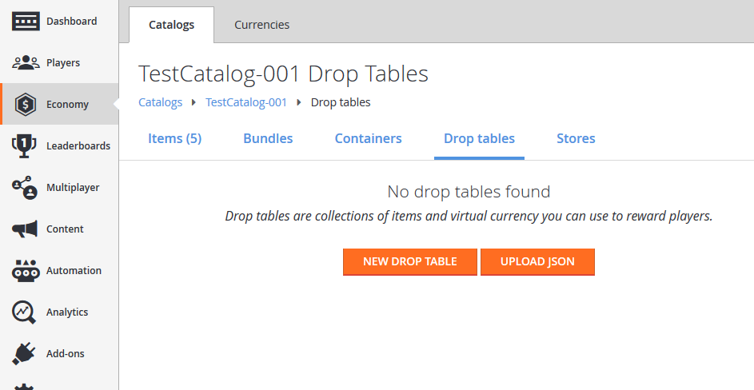
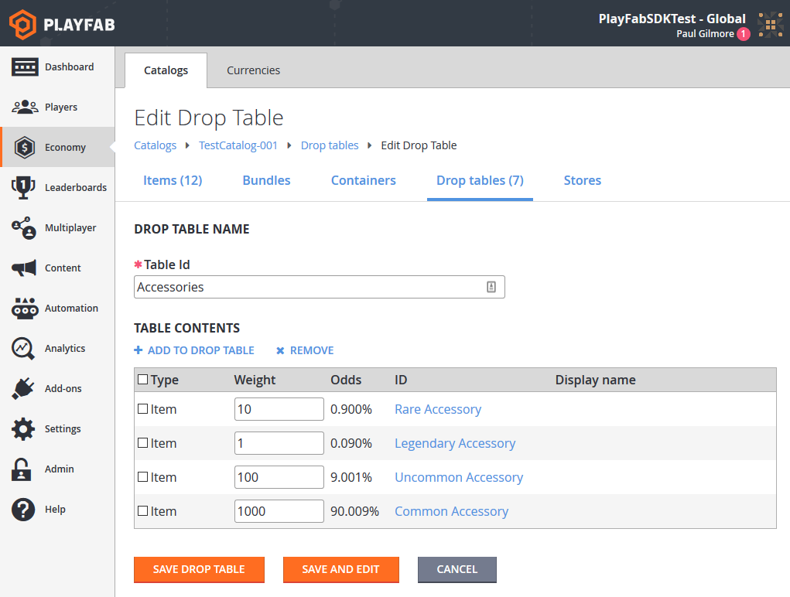
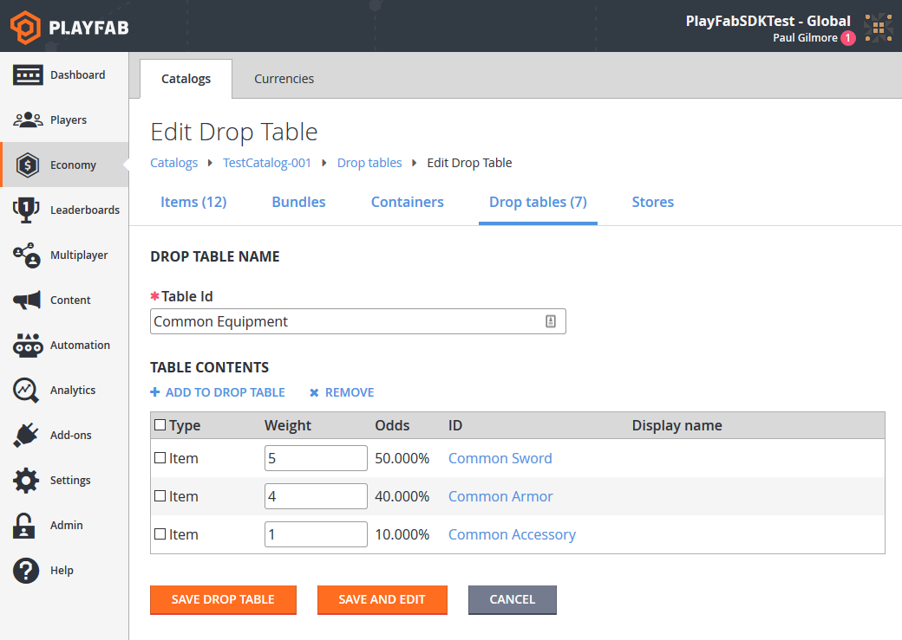
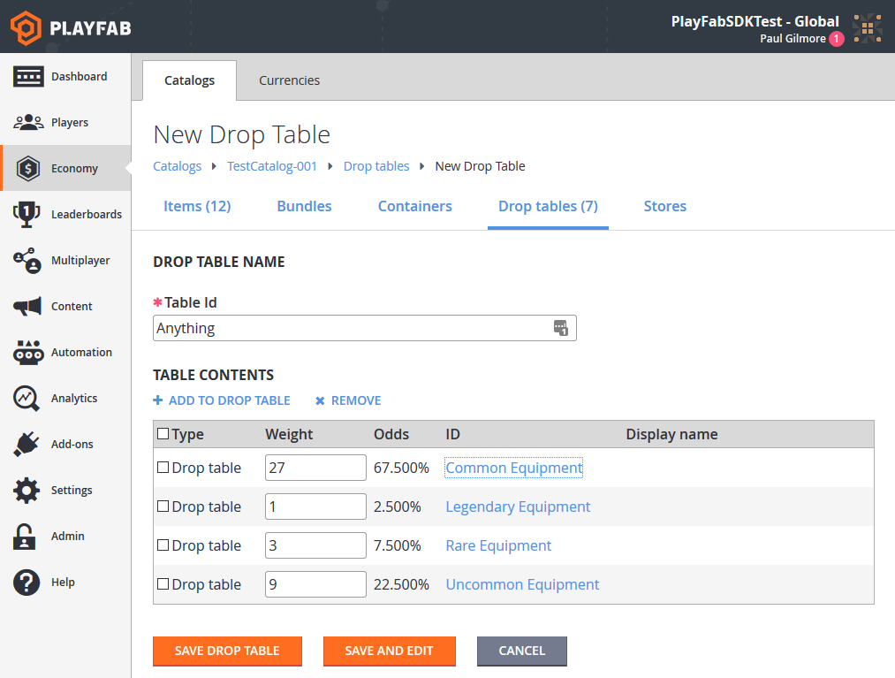
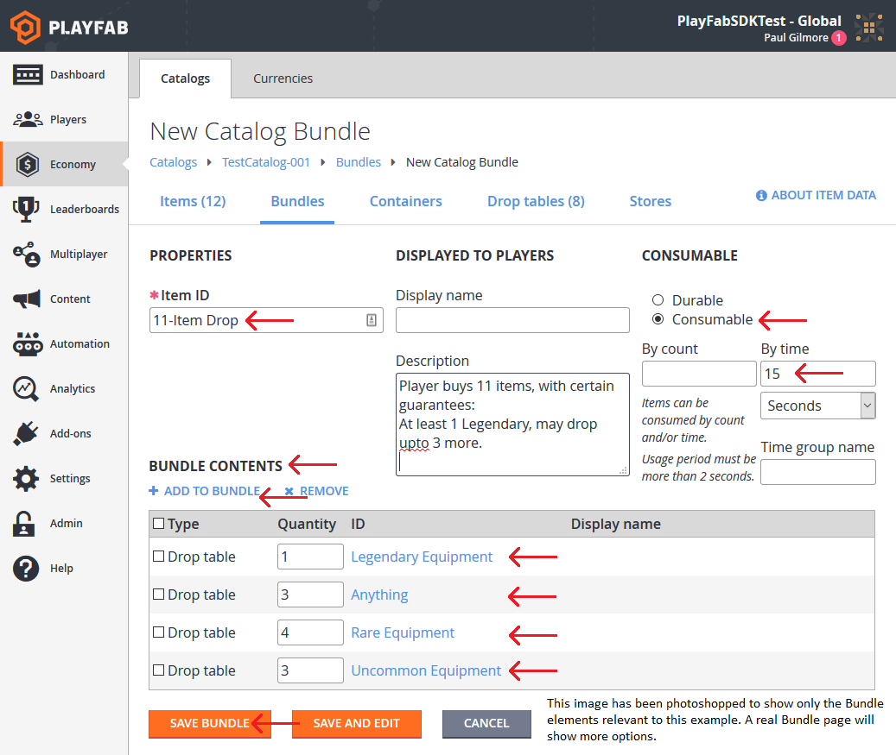

# Drop Tables

This tutorial shows you the steps fpr creating **Drop Tables** using the **PlayFab Game Manager**. 

**Drop Tables** allow you to randomly generate [inventory items](../../data/playerdata/player-inventory.md), and *sequential* **Drop Tables** can provide some randomness to **Player** rewards.

## Requirements

- We assume that you are already  familiar with [Catalogs](catalogs.md), [Inventory](../../data/playerdata/player-inventory.md), and [Game Manager](../../config/gamemanager/quickstart.md). 
- You must have a primary **Catalog**, which contains standard, non-**Bundle**/non-**Container** items.
- You must have defined at least one **Virtual Currency** which you will use as "free" in-**Game Currency**.

You may use your own set of **Items**, but our goal is to create an overlapping categorization of **Items**. As an example, we'll use the following table of **Items**:

|                   | Accessory                 | Armor                | Sword           |
|-------------------|:--------------------------|:---------------------|:----------------|
| **Common**        | Common Accessory          | Common Armor         | Common Sword    |
| **Uncommon**      | Uncommon Accessory        | Uncommon Armor       | Uncommon Sword  |
| **Rare**          | Rare Accessory            | Rare Armor           | Rare Sword      |
| **Legendary**     | Legendary Accessory       | Legendary Armor      | Legendary Sword |

Once you have set up a similar set of **Items** to work with in your **Catalog**, let's build the **Drop Tables**.

## Building Drop Tables

**In Game Manager**: 

- Navigate to your **Title**.

- Select **Economy** from the menu on the left.
- Go to the **Catalogs** tab.
- Go to the **Drop Tables** column.

Your screen should be similar to this example.

  

1. Begin building **Drop Tables** on each of your **Item** descriptors.  Our first categorization is **Equipment Type**, so we will create a new **Drop Table** called **Accessories**.

     - Select the **New Drop Table** button.
     - Select **Accessories**.
     - Select **Add Drop Table**.
     - A pop-up should appear. Select from these items:
        - **Common Accessory**
        - **Uncommon Accessory**
        - **Rare Accessory**
        - **Legendary Accessory**

2. Adjust the weights for the **Items** according to **Rarity**:

     - Common: **1000**
     - Uncommon: **100**
     - Rare: **10**
     - Legendary: **1**

The weights indicate how frequently they should drop in comparison to one another.  For our example shown here, you will drop approximately **1000 Commons** for every **Legendary**.

3. Save the **Drop Table**.

  

With **Accessories** completed, do the same for **Armors** and **Weapons**.

Our other categorization is by **Rarity**, so we'll create an alternate set of tables starting with **Common Equipment**.

1. Select the **New Drop Table** button.
     - Select **Accessories**.
     - Select **Add Drop Table**.
     - A pop-up should appear.  Select from these **Items**:
        - **Common Accessory**
        - **Uncommon Accessory**
        - **Rare Accessory**
        - **Legendary Accessory**

2. Adjust the weights for **Items** according to how the **Common Equipment** options will be in that slot:
     - Common Accessory: **1**
     - Common Armor: **4**
     - Common Sword: **5**

3. Select the **Save Drop Table** button to save your changes.

  

## Using Drop Tables

You can access **Drop Tables** directly by using one of the two **Server API** methods:

- [GetRandomResultTables](xref:titleid.playfabapi.com.server.playeritemmanagement.getrandomresulttables)
- [EvaluateRandomResultTable](xref:titleid.playfabapi.com.server.playeritemmanagement.evaluaterandomresulttable)

Using the **Server API** method, you can read the raw **Drop Table** data which we just entered into **Game Manager**.

> [!NOTE]
> It does *not* roll random **Values** or award results. This would let you read the data and parse the information however you see fit.

### Option 1

```csharp
public void ReadDropTableData() {
    PlayFabServerAPI.GetRandomResultTables(new GetRandomResultTablesRequest() {
        TableIDs = new List<string> { "Accessories", "Common Equipment" }
    }, result => {
        Debug.Log("Complete getting drop tables");
    }, error => {
        Debug.LogError(error.GenerateErrorReport());
    });
}
```

The result handler will receive the structure information we input above, formatted as [GetRandomResultTablesResult](xref:titleid.playfabapi.com.server.playeritemmanagement.getrandomresulttables#getrandomresulttablesresult).

Alternately, you can let **PlayFab** evaluate the table *for* you, and give you a single **Item** result. Doing so returns the **itemId** that can be used to generate a single **Item**, rolled according to the weights provided.

You can then make a second call which creates the **Item** and gives it to the **Player**.

### Option 2

```csharp
public void Grant(string playFabId, string tableId) {
    // First, roll a random number and evaluate the drop table
    PlayFabServerAPI.EvaluateRandomResultTable(new EvaluateRandomResultTableRequest()
    {
        TableId = tableId
    }, result => OnRandomResultTableResponse(result, playFabId), OnError);
}

public void OnRandomResultTableResponse(EvaluateRandomResultTableResult tableResult, string playFabId) {
    // Second, take the result and grant it to the player
    PlayFabServerAPI.GrantItemsToUser(new GrantItemsToUserRequest {
        PlayFabId = playFabId,
        ItemIds = new List<string> { tableResult.ResultItemId }
    }, result =>
    {
        // Handle Result
    }, OnError);
}

public void OnError(PlayFabError error) {
    Debug.LogError(error.GenerateErrorReport());
}
```

**Option 1** allows you to load the data once, cache it, and perform the roll *yourself* on your own **Game Server**. This has lower latency due to fewer calls to **PlayFab**, and allows you to customize the rolls based on **Game**-specific logic.

**Option 2** lets **PlayFab** do more of the work, but remember - multiple **API** calls means *higher* latency.

## Advanced Drop Table usage (Setting up a Loot Crate)

**Drop Tables** can be linked from **Bundles** and **Containers**. **Bundles** are a great option for **Virtual Currency Stores**, where a single purchase yields a stack of random **Items**.

For example, let's say we have an **11 Item Bundle** with specific drop rules. In this case, it is a customer-facing selling point that we will guarantee one **Legendary Item**. We'll also *restrict* it, so that the **Player** can't get *too* lucky, and receive **11 Legendaries**.

## New Drop Table

Let's build a **Drop Table** that can literally drop *anything*. We'll actually call it **Anything**, give it *other* **Drop Tables** as its options, and have the appropriate weights.

  

At this point, we're done with **Drop Tables**, and we're going to navigate to **Bundles**. In a **Catalog** screen, **Bundles** is in another column next to **Drop Tables**.

  

This **Bundle** area uses several features:

- All **Items** of *any* kind must have an **Item ID**.
- A **Bundle** counts as its own **Item**, and its contents are delivered at the same time it is granted. For this reason, we're making the **Bundle** itself consumable, and it expires 15 seconds after delivery.
- We add different **Drop tables** in different quantities to ensure that **11 Items** are delivered, but different **Items** roll on different **Tables**.
  - First, we guarantee at least **1 Legendary item**, so the first slot will roll on **Legendary Equipmen**t.
  - The next 3 slots roll on **Anything**, which can roll additional **Legendaries**, or roll crappy common equipment. These rolls will define a *good* roll vs. a *bad* one, as these 3 **Items** can vary wildly.
  - Finally, we fill in the remaining slots with guaranteed **Rares** and **Uncommons**, ensuring that an **11 Item** roll is not *too* good or bad.

## Conclusion

A **Drop Table** generates a single **Item** randomly from a list of potential **Items** and weights. **Bundles** and **Containers** can be one of the simplest ways to deliver one or more **Items** to a **Player** using **Drop Tables**.

You can manually use a **Drop Table** from a [Custom Game Server](../../multiplayer/servers/custom-game-servers.md) or [CloudScript](../../automation/cloudscript/writing-custom-cloudscript.md), using one of the two **Server API** methods:

- [GetRandomResultTables](xref:titleid.playfabapi.com.server.playeritemmanagement.getrandomresulttables)

- [EvaluateRandomResultTable](xref:titleid.playfabapi.com.server.playeritemmanagement.evaluaterandomresulttable)
