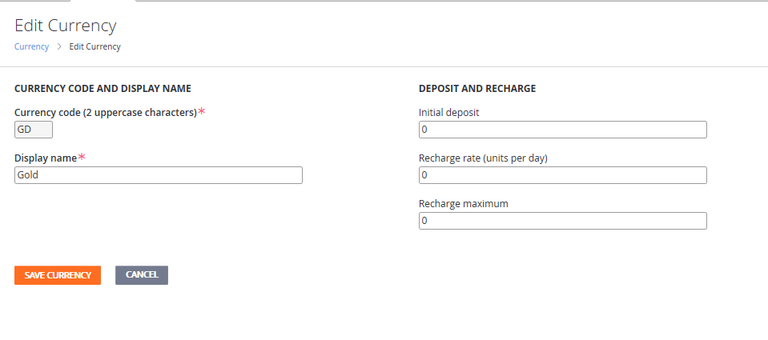
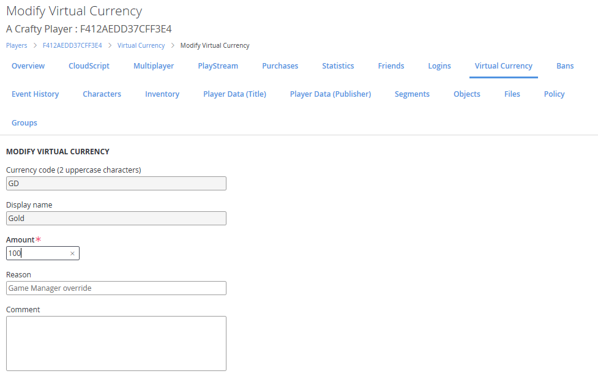

# Items quickstart

In this quickstart tutorial, you will:

- Set up a virtual currency for your game.
- Add an item to your in-game catalog.
- Purchase an item in-game using virtual currency.
- Set up a virtual currency for your game.

PlayFab supports a robust game economy with multiple currencies and items.

To access these features:

1. Go to **Economy** and select currencies.
2. Select **New Currency** and change these fields:

   - **Currency code** (2 uppercase characters): **GD**.
   - **Display name**: **Gold**.
3. Select **Save Currency**.

Now you can give players virtual currency directly. Since it can be dangerous to give clients the ability to call **AddUserVirtualCurrency**, let's add money using the Game Manager:

1. Go to the player's **Virtual Currency** tab.
2. Select the **GD** currency.
3. Change the amount to **100**.
4. Select **Save virtual currency**.

Now the player has 100 gold. What can you do with it? Buy an item!

## Adding an item to your in-game catalog

No sense having money if you can't spend it. Let's create a catalog, (which is a collection of items). You can create catalogs that correspond to the platforms on which you're releasing your game, or major version numbers - whatever you like.

> [!TIP]
> We don't recommend creating multiple catalogs to differentiate types of items, as you can filter items effectively using classes, tags, and stores.

To make a catalog with an item:

1. Go to **Economy** and select **Catalogs**.
2. Create a new catalog named **main**. An item with the ID of **One** is added automatically.
3. Select **One** and change these fields:

   - **Item ID**: **apple**.
   - **Display name**: **Perfectly normal apple**.

At the bottom of the form is the **Prices** section, where you define how much an item costs in your game's virtual currency.

1. Set the apple's price in gold (**GD**) to **5**.
1. Select **Save item**.

## Purchase an item using virtual currency

Let's get the catalog and attempt to make a purchase.

1. In your game, call **GetCatalogItems:
    CatalogVersion**: **main**.
2. Verify that you see an **apple** with a **GO** price of **5**.
3. Call **PurchaseItem** to buy the apple.

   - **CatalogVersion: main**.
   - **ItemId: apple**.
   - **VirtualCurrency: GO**.
   - **Price: 5**.
4. Last, call **GetUserInventory** and take a look at the player inventory. You should see an apple!

> [!NOTE]
> You can also check the player's **PlayStream** tab, where you should see a **Player vc item purchased** event. The player's **Inventory** tab will also show the apple. In addition, you can revoke the item or grant yourself *more* apples on the **Inventory** tab.

If you check the player’s virtual currency, they should only have 95 gold left.
