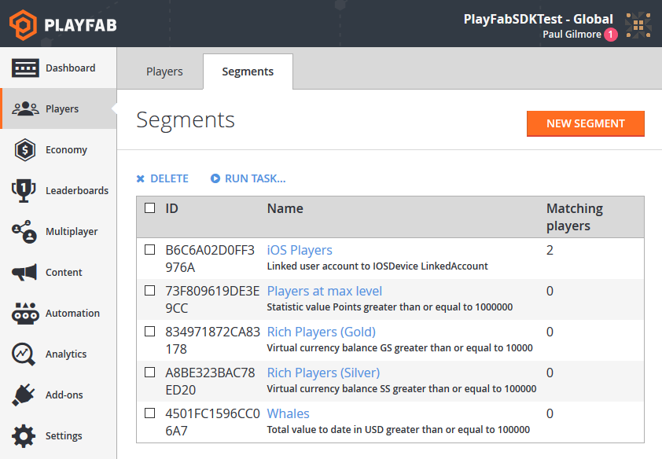
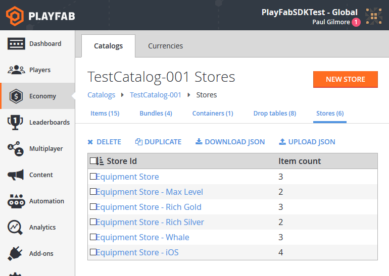
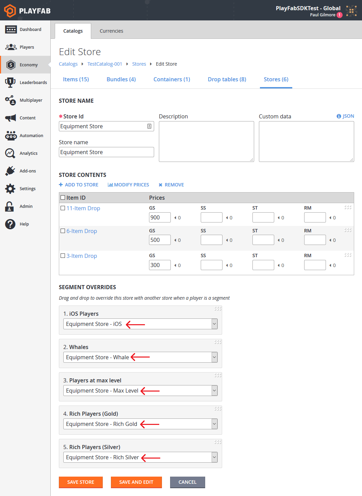

# Custom stores for player segments

In our [Stores and Sales](stores-and-sales.md) tutorial, we demonstrate how to set up a store and make a few items available to a player at special or alternate prices.

In our [Player segmentation quickstart](../../analytics/segmentation/quickstart.md), we provide an example of how to group your players into segments, based on player information or behavior.

This tutorial describes how to *combine* these features, and produce alternate stores available *only* to players from defined player segments.

1. Let's begin with some example segments. In the screen shot shown below, we have provided some segments that are segmented-store-testing friendly.

  

2. Next, we'll reuse the **Equipment Store** created in the [Stores and Sales](stores-and-sales.md) tutorial, and add player segmentation. To do this, you must create each store separately, and give it an identifiable name. Each store should have content that is customized for that segment.

> [!TIP]
> Using the **DUPLICATE** feature on the **Stores** screen, you can duplicate stores quickly, and then modify the **Store Id**, **Store name**, and other parameters to make the new store unique.  

The following screen shot, shows our customized stores.

  

3. Finally, edit the **Equipment Store**, and fill in the **SEGMENT OVERRIDES** section at the bottom (this section is *only visible* if there are defined player segments).

  

## Best Practices for store segmentation

- Store segmentation is public information:
  - There are many ways for players to gain information about alternate stores.
  - Players naturally transition between segments, and they'll see those changes when they transition.
  - Players discuss content on forums, community sites, wikis, etc.
  - In the PlayFab API, store information is *public* unless you disable those APIs with our [API Access Policy](../../config/gamemanager/api-access-policy.md).
  - You should assume that players will be aware of other stores and their details.

- Provide varying content, *not* varying pricing:
  - Players will feel cheated if:
    - Prices go up or down when they transition segments.
    - Prices described on wikis are different than their own.
  - The only exception to the pricing rule would be *first time* purchases:
    - You must secure the client API methods with our [API Access Policy](../../config/gamemanager/api-access-policy.md) to prevent multiple purchases, or make repurchasing less meaningful through game design.

- Content should be relevant to the segment:
  - Whales are willing to spend large amounts of real money, and are therefore likely to buy more expensive bundles, if the value is worthwhile.
  - First time buyers may be given an option which is a particularly good deal, but can *only* be (usefully) obtained once.
  - End game players may only be interested in a specific subset of items.
