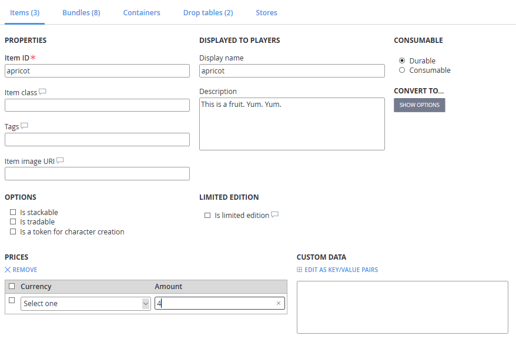
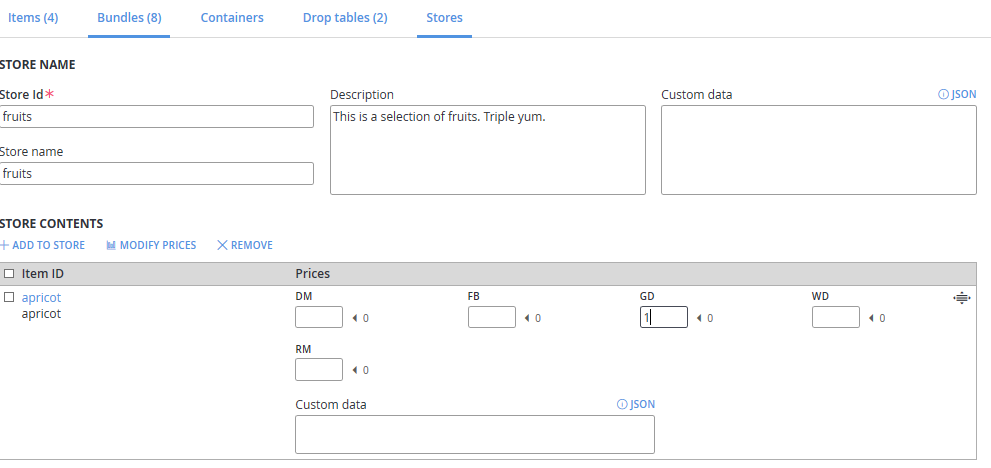

# Stores quickstart

This stores quickstart gets you started with creating and using stores with PlayFab.

In this quickstart tutorial, you will:

- Create a store with a discounted price.
- Buy an item from the store.  

Buying items out of the Catalog is supported, but it's not how most games structure their purchases. Whether you're making an idle clicker, an RPG, an FPS, or an endless runner, you probably have vendors in your game where players can buy weapons, armor, or running shoes.

Our solution for this is **Stores**, a subset of your catalog with prices you can override. Stores also enable sale prices, price overrides for segments, and some amazing functionality in PlayStream (we'll get to that later).

First, let's add some Items to sell in your catalog:

1. Go to **Economy** and select **Catalogs**.
2. Select your **main** catalog.
3. Select **New Item** a few times, and create some items:

    - **Apricot** with a **GD** cost of **4**.
    - **Pear** with a **GD** cost of **3**.
    - **Grape** with no **GD** cost (don't select any prices).

> [!TIP]
> You don't have to assign a virtual currency price to items in a catalog for them to appear in a store.

You should now have a few items with prices. Let's create a store to sell them to the player.

1. Go to the **Stores** tab in the **main** catalog.
2. Select **New store** and give it an ID of: **fruits**.
3. Select **Add To Store**. A popup shows all items, bundles, and containers in the current catalog.
4. Select the **Add** button next to a few items to add them to your store.

You should see your items listed in the store, but they're not valid until they have at least one price.

The little static number (e.g. **<5**) next to the price text box is the original catalog price. You only have to enter a price for *one* box in each row, but you can enter as many prices as you want.

If you don't enter any price for an item, it will be removed from the store. If a store item doesn't have a price in a currency, it can't be bought using that currency. Store prices can be higher than catalog prices, and zero is a valid price for an item.

> [!TIP]
> You can drag-and-drop the rows to rearrange the order of the items.

1. Next, add some **GD** prices to your items, but make them lower than the catalog prices:

    - **Apricot: 4**.
    - **Pear: 2**.
    - **Grape: 1**.

2. Select **Save Store** when you're done.

Next we're going to buy an item. You have a store, now let's purchase something.

1. In your game, call **GetStoreItems** and get your store.

    - **CatalogVersion: main**.
    - **StoreId: fruits**.

2. Verify you received an object with the list of items in the store and their prices, in the order you selected.
3. In your game, call **PurchaseItem** and give it the currency and store price of the item you want to buy:

    - **CatalogVersion: main**.
    - **StoreId: fruits**.
    - **ItemId: pear**.
    - **VirtualCurrency: GO**.
    - **Price: 2**.

4. Look in your player's **Inventory** tab for the pear, and check their virtual currency to verify that they only spent 2 gold. You will see events in the PlayStream debugger showing the purchase flow from the store. The player's **Inventory** tab also shows the purchase.

> [!TIP]
> If you don't specify the **StoreId** when calling **PurchaseItem**, the purchase is attempted against the catalog price.

Stores are the best way to let players purchase items in your game. You can use the Game Manager to change the order of items and adjust prices at any time.

Using segments, you can even give special prices to certain players without touching your game code.
