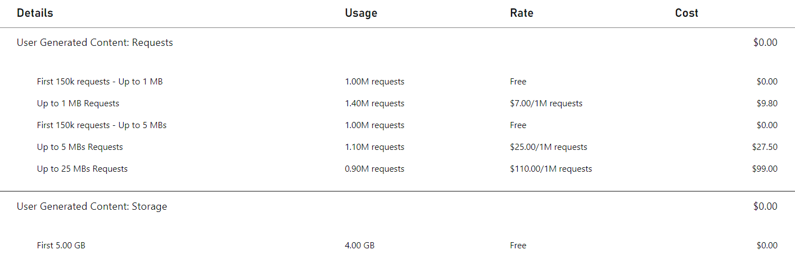

# UGC Pricing Meters

> [!IMPORTANT]
> This feature is currently in public preview. It is provided to give you an early look at an upcoming feature, and to allow you to provide feedback while it is still in development.

PlayFab User Generated Content has two categories of consumption-based meters - Requests and Storage. This page outlines and defines those meters, including how it is measured and calculated. For more information on PlayFab's pricing model, see [PlayFab Pricing Overview](../../pricing/pricing-overview.md).

> [!NOTE]
> General usage of PlayFab UGC may contribute toward other PlayFab meters, like PlayStream Events.

## Requests
The request meters are determined by the response size of any UGC API calls or CDN requests. For each of the three PlayFab plans, there are five different rates, depending on the size:

> [!NOTE]
> Please contact us if you are planning on storing content larger than 100 MBs.

## Storage
The storage meter is determined by the total size of all content (both files and images). There is a single rate for this meter - **$0.11 per GB**.

This includes content associated with items that haven't been published, and items that aren't visible via the public catalog. For more information on how items can be hidden from the public catalog, see [Item Visibility](./item-visibility.md).

## Included Meters
There are a set of included meters for all PlayFab customers, regardless of the selected plan:

Meter | Included Amount
--- | :---:
Up to 1 MB Requests | 1 Million requests
Up to 5 MB Requests | 1 Million requests
Storage | 5 GB

> [!NOTE]
> Studios in Development Mode are required to enter payment information before enabling UGC, and overages will be charged based on the rates above.

## Example Bill
Let's walk through an example customer's UGC consumption and look at their monthly bill. Let's start with a single user. This user goes to the content discovery page and searches for 'dinosaurs'. 10 results are displayed to the user, each with a title and thumbnail image. The user selects a piece of content, which displays the full metadata, including the description, ratings, and 4 more images. The user decides the content looks interesting enough, so they select the download button.

Now let's see what meter consumption this scenario just drove:
* This user goes to the content discovery page and searches for 'dinosaurs'. 10 results are displayed to the user, each with a title and thumbnail image.
  * The `SearchItems` call returned 10 items with the base metadata, resulting in a single **Up to 1 MB Request**.
  * Each of the 10 thumbnails are requested from the CDN. Let's pretend 5 of these are just under 1 MB, and 5 are just over 1 MB. This results in 5 **Up to 1 MB Requests** and 5 **Up to 5 MBs Requests**.
* The user selects a piece of content, which displays the full metadata, including the description, ratings, and 4 more images.
  * The `GetItem` call returned a single item with the full metadata, resulting in a single **Up to 1 MB Request**
  * The `GetRatings` call returned a single item's ratings, resulting in a single **Up to 1 MB Request**
  * Each of the 4 images are requested from the CDN. These are higher quality images, so let's pretend 2 of these are just under 5 MBs, and 2 are just over 5 MBs. This results in 2 **Up to 5 MBs Requests** and 2 **Up to 25 MBs Requests**.
* The user decides the content looks interesting enough, so they select the download button.
  * This content is requested from the CDN. This is a large piece of content, so let's pretend it is 20 MBs. This results in a single **Up to 25 MBs Requests**.

Meter | Request Count
--- | ---
Up to 1 MB | 8
Up to 5 MBs | 7
Up to 25 MBs | 3
Up to 50 MBs | 0
Up to 100 MBs | 0

Now let's pretend this title has 10 thousand users that perform this exact same scenario once a day in a 30-day month (300 thousand times) - this is roughly the same as a single user performing this exact same scenario on average once every 9 seconds. The would result in the following meter consumption:

Meter | Request Count
--- | ---
Up to 1 MB | 2.4 million
Up to 5 MBs | 2.1 million
Up to 25 MBs | 0.9 million
Up to 50 MBs | 0
Up to 100 MBs | 0

Let's also pretend this is the only title leveraging UGC in the studio, and the title has 4 GB of UGC stored (which is fully covered by the 5 GB included, so no charges are incurred on the **Storage** meter). If this were the total consumption at the end of the month, here is what the final UGC bill would look like:

## Additional resources
* For the most up-to-date view of prices per meter, see [PlayFab.com/Pricing](https://playfab.com/pricing/)
* See [Consumption Best Practices](../../pricing/consumption-best-practices.md) to learn how to maintain the lowest rate of meter usage and cost for your game
