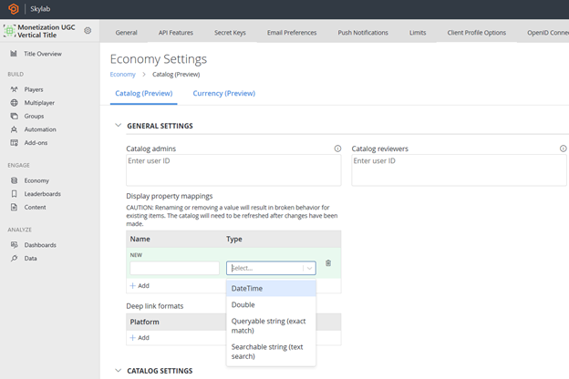

# SearchItems

> [!IMPORTANT]
> This feature is currently in public preview. It is provided to give you an early look at an upcoming feature, and to allow you to provide feedback while it is still in development.  

The `SearchItems` API executes a search against the public Catalog using the provided search parameters and returns a paged list of items.

At its most basic, the `Search` parameter is a plain-text fuzzy search against the **Title**, **Description**, **Keywords**, and **Searchable String Display Properties** fields. However `Filter`, `OrderBy`, and `Select` are OData Query additions that can be used to alter the search parameters. Search results can be filtered and ordered by any field in the search document (barring Title and Description).

More information on the OData Query Syntax can be found [here](https://www.odata.org/getting-started/basic-tutorial/#queryData )

An example `SearchItems` request:
```csharp
{
  "Search": "Pirates",
  "Filter": "Tags/any(t:t eq 'desert') and ContentType eq 'map'",
  "OrderBy": "lastModifiedDate asc",
  "ContinuationToken": "abc=",
  "Count": 2,
  "ConfigurationName": "SearchConfigurationA",
  "ExpandReferencedItems": false
}
```

A sample response:
```csharp
{
    "code": 200,
    "status": "OK",
    "data": {
        "Items": [
            {
               <item metadata> 
            }
        ],
      "PartialExpandedResults": false,
      "ContinuationToken": "MTA="
    }
}
```

## Display Properties

Searches, filters, and orderings can be also done on specific `DisplayProperties` fields that are configured for custom search.  Titles can configure their custom search and filter properties in the [*Display Properties Mappings* setting](/gaming/playfab/features/commerce/ugc/settings#display-properties) in Game Manager.



When you add a field to `DisplayProperties`, it will create a new index for you in the database. Only documents added or updated after index creation will be included. If you need the Display Property to apply to all items you will need to republish the entire catalog.

`DateTime`, `Double`, and `Queryable String` display properties are **queryable**, these properties can be used in Filter and OrderBy statements.

`Searchable String` display properties are **searchable**, these properties will be queried with fuzzy search against the `Search` field. Searchable properties cannot be used in Filter and OrderBy statements.

Titles are limited to 5 display properties of each type.

> [!WARNING]
> Display property mappings are stored as an indexed list of key-value pairs. Deleting existing display property mappings can shift indexes and break the behavior of all remaining properties. It is suggested to add an additional property rather than deleting or editing an existing one and you should avoid deleting property mappings unless absolutely necessary

## Filter

The Filter parameter allows you to filter the collection of items returned by the search request. The expression specified with filter is evaluated against each Catalog Item in the results, and only items where the expression evaluates to true are included.

Filter supports OData logical operators and precedence using parenthesis:

- Equal: ‘eq’
- Not Equal: ‘ne’
- Greater Than: ‘gt’
- Greater than or Equal: ‘ge’
- Less than: ‘lt’
- Less than or Equal: ‘le’
- Logical And: ‘and’
- Logical Or: ‘or’
- Logical Negation ‘not’

Filter does not support arithmetic operators or string functions.  

The following are a number of Filter examples:

#### Filtering by ContentType
```json
  "Filter": "ContentType eq 'Sword'"
```

#### Filtering with Conjunctions
```json
  "Filter": "rating/average gt 1 and rating/average lt 4"
```

#### Filtering with null values
OData supports a `null` type for filtering
```json
"Filter": "rating eq null"
```
The above request returns all items with no reviews

#### Filtering by Creator ID
To filter by a specific creator, you should use the syntax `title_player_account!<ID>`
```json
  "Filter": "creatorId eq 'title_player_account!C88F55C6A734B1DC'"
```

#### Filtering by Array fields
Filter also supports `any()` for filtering against arrays. For example: `alternateIds/any(a: a/value eq ‘StoreOfferId’)`
```json
  "Filter": "tags/any(t: t eq 'featured')"
```

#### Filtering with Arrays and null checks
The filter below will check for any items that have a contents field with non-null values
```json
  "Filter": "contents/any(content: content ne null)"
```

> [!NOTE]
> By default, Search will **NOT** return contents for items unless specified with a [Select](/gaming/playfab/features/commerce/ugc/search#select) statement. If the above query is run without a `"Select": "contents"`` statement, it will correctly apply the filter but all returned Search results will have empty content fields

#### Filtering by Display Properties
Filtering can only be done with **queryable** Display Properties
```json
  "Filter": "DisplayProperties/DifficultyRating ge 5"
```

## OrderBy

`OrderBy` is a comma-separated list used to sort search results.

```json
  "OrderBy": "rating/average asc"
```
When using order sorting you can pass a secondary property to break sorting ‘ties’

```json
  "OrderBy": "rating/average asc, rating/totalCount desc"
```

If you don’t pass in a secondary value, catalog items do have an internal ‘score’ attribute that used for breaking ties, however that scoring is arbitrary and inconsistent (it’s based on the storage order in the underlying database and is constantly changing as items are added and removed).  

`OrderBy` supports a handful of OData properties for ordering:
- asc
- desc

If you don't specify a direction, the default is ascending. If there are null values in the field, null values appear first if the sort is `asc` and last if the sort is `desc`.

The following are a number of OrderBy examples:

#### Sorting by Title
Use the `title/<LANG>` parameter combined with `asc` or `desc` to indicate order preference.
```json
  "OrderBy": "title/en-GB asc"
```
Use `NEUTRAL` to order by the neutral strings
```json
  "OrderBy": "description/NEUTRAL desc"
```

#### Sorting by Display Properties
Sorting can only be done with **queryable** Display Properties
```json
  "OrderBy": "DisplayProperties/DifficultyRating desc"
```

## Select

By Default, Search returns a rich set of item metadata:

- `Id`
- `Type`
- `AlternateIds`
- `Title` **(NEUTRAL or `Accept-Language` locale)**
- `Description` **(NEUTRAL or `Accept-Language` locale)**
- `Keywords` **(NEUTRAL or `Accept-Language` locale)**
- `ContentType`
- `Images` **(Thumbnail only)**
- `Tags`
- `CreationDate`
- `LastModifiedDate`
- `CreatorEntityKey` (`CreatorId` in earlier API versions)
- `DisplayProperties`

Only the neutral strings used in title and description are returned by default. If a Thumbnail image exists, it is returned by default. Each item is limited to only one image of a "Thumbnail" type.

Using `Select `additional fields can optionally be returned within the paged search results, including content metadata (contents), images, StartDate, EndDate and the full set of localized strings in title and description. Note that if the select field is left empty, the search results will be a subset of the full document metadata, to facilitate faster load times.

This request would return the default item metadata **in addition** to the content and images:
```json
"Select": "contents,images"
```

Selecting `title`, `description`, and/or `keywords` will return the full set of localized string data:
```json
"Select": "title,description,keywords"
```

## Localization

A locale can be passed into the `Accept-Language` header. This will cause all `Title`, `Description`, `Keywords` fields to return the locale by default or NEUTRAL if the item doesn't have that localization.

## Limits

We are limiting the complexity of search filter queries that can run in any given request. Expensive queries can be rejected and titles should ensure that they are not attempting overly complicated queries. The following are examples of queries close to maximum complexity:

* `contentType eq 'testType' and tags/any(t: t eq 'blue') or tags/any(t: t eq 'green') or tags/any(t: t eq 'violet')`
* `contents/any(c: c/minClientVersion gt '1.2.3' and c/maxClientVersion lt '4.5.6')`
