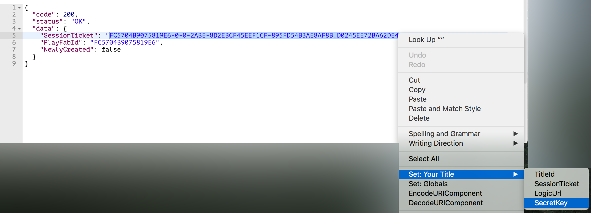

# Executing the PlayFab API via Postman

## Postman Overview

Knowing how to manually call the Web API methods is invaluable when you are trying to integrate PlayFab with your game. If a function isn’t working out quite how you expect, being able to call it in a tool that shows you the specific response data and any error messages is a powerful way to debug those calls. There are a number of tools out there that make it easy to interact directly with a Web API, but one that we really like is the Postman Chrome plugin.

This tutorial will guide you through setting up and using Postman.

### Disclaimer

Postman is an HTTP Request tool useful to intermediate and advanced users. Before using it, you should be very familiar with the topics covered in our tutorial [Getting started with PlayFab](getting-started-with-playfab.md).

### Initial Setup

1. Get [Google Chrome](http://google.com/chrome).
2. Get [Postman](https://www.getpostman.com/), the free Chrome plugin. After you have Postman, you should see a screen similar to the following:

     

3. Download our Postman [JSON collection](https://api.playfab.com/downloads/postman) (right-click, Save link as...), Click Import (on the top, black bar), and drag the saved JSON file into Postman:

     

4. Add your environment variables.

     

Postman environments are a way to save key-value pairs which can be automatically injected into any portion of the HTML call. If you have a look through our collection, you will see {{____}} variables in most of them. These act as a time saver as well as an easy way to switch between different environments.

### PlayFab Environment Variables

- **{{TitleId}}** - The unique identifier that corresponds to your PlayFab title. Found in the [GameManager](https://developer.playfab.com/) -> Settings.
- **{{SecretKey}}** - Found in the [GameManager](https://developer.playfab.com/) -> Settings and used to authenticate Server API calls.
- **{{SessionTicket}}** - Provided in response to any [successful login call](https://api.playfab.com/documentation/client#Authentication). This is used to authenticate most Client API calls.
- **{{PlayFabId}}** - Provided in response to any [successful login call](https://api.playfab.com/documentation/client#Authentication).
- **{{CharacterId}}** - Returned from [GetAllUsersCharacters](xref:titleid.playfabapi.com.client.characters.getalluserscharacters).
- **{{PrimaryCatalogName}}** - Found in the [GameManager](https://developer.playfab.com/) -> Economy -> Catalogs.

1. If you already have an account, select [Client\LoginWithPlayFab](xref:titleid.playfabapi.com.client.authentication.loginwithplayfab) (from the left hand Postman menu), update the body JSON with your credentials (or - highly recommended - add them as {{}} variables and use that) and hit Send.

   -OR-

   Create a new player account by selecting [Client\RegisterPlayFabUser](xref:titleid.playfabapi.com.client.authentication.registerplayfabuser), (from the left hand Postman menu), update the body JSON with your credentials as above, and hit Send.

   In either case, after sending the request you should receive an HTTP Status Code 200 (success) response, with a fresh SessionTicket

     

   > [!NOTE]
   > PlayFab SessionTickets will expire after 24hrs. After that point, you will need to re-authenticate and update your environment variable.

2. Copy your SessionTicket and paste it into the corresponding environment variable. Postman also provides a convenient shortcut to this - just select the full text of the ticket (everything in the quote marks), right click, select “Set: [Environment]” for the environment you created to store your variables, and click on SessionTicket.

     

And that’s all you need to know to fully exercise the PlayFab suite of back-end functions via Postman!

If you run into problems or questions, start by looking at our [support resources](https://community.playfab.com/).

Have fun!
